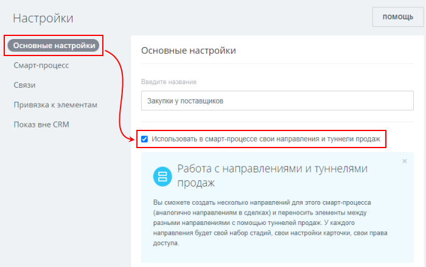
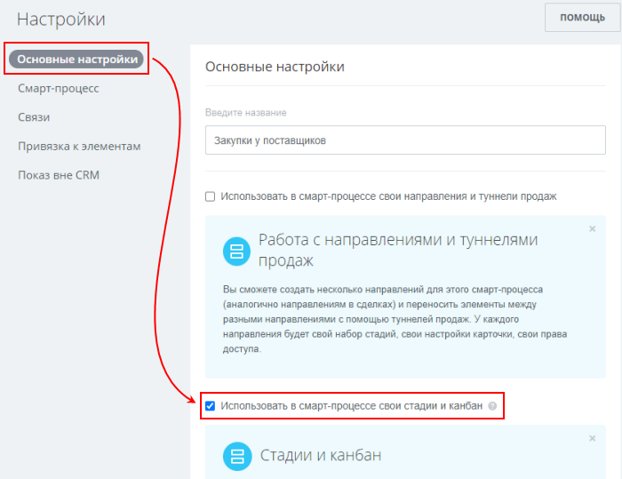
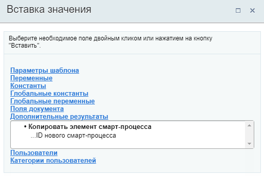

# Копировать элемент смарт-процесса

**Навигация**
- [← Оглавление курса](index.md)
- [← Предыдущий: 20862 — Копировать сделку](lesson_20862.md)
- [Следующий: 7399 — Ожидание стадии сделки →](lesson_7399.md)

Официальная страница урока: https://dev.1c-bitrix.ru/learning/course/index.php?COURSE_ID=57&LESSON_ID=23594

Действие создаёт элемент смарт-процесса по данным из текущего элемента смарт-процесса. Доступно только в бизнес-процессах (БП) **смарт-процессов**.

**Примечание:** О работе со смарт-процессами в Битрикс24 читайте в статье [helpdesk.bitrix24.ru](https://helpdesk.bitrix24.ru/open/13315798/)

#### Описание параметров

- **Название смарт-процесса** – укажите название создаваемого элемента. По умолчанию установлено значение `{=Document:TITLE} (Копия)`, где {=Document:TITLE} – название текущего документа, в котором запущен БП;
- **Перенести в направление** – выберите направление из списка. Параметр доступен если в настройках смарт-процесса включено использование в смарт-процессе своих
  			направлений и туннелей продаж
                      
  		;
- **Начальная стадия** – выберите начальную стадию из списка. Параметр доступен если в настройках смарт-процесса включено использование своих
  			стадий и канбан
                      
  		;
- **Ответственный** – укажите ответственного за создаваемый элемент.

#### Пример настройки:

В секции **Дополнительные результаты** формы Вставка значения станет доступен **ID нового смарт-процесса**.

