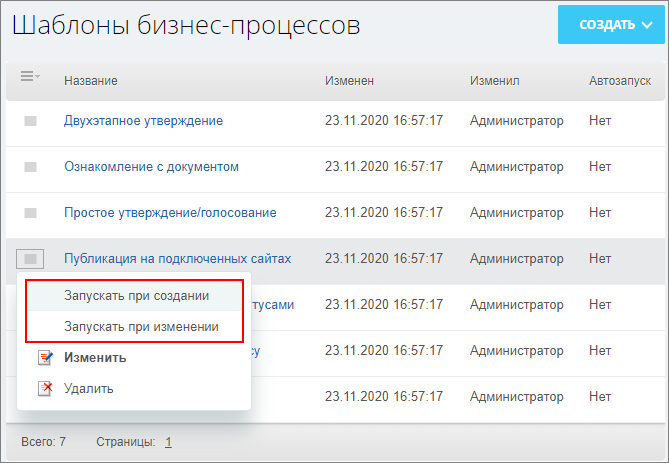
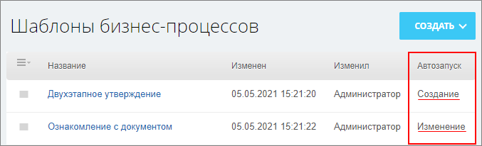
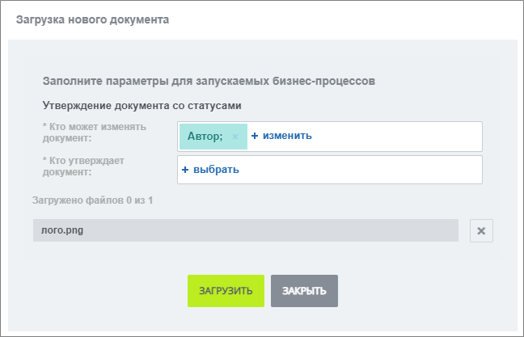
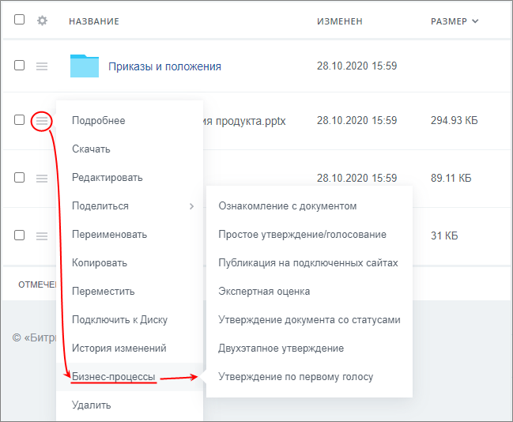
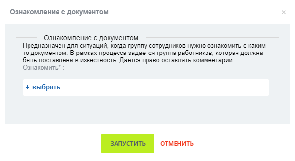
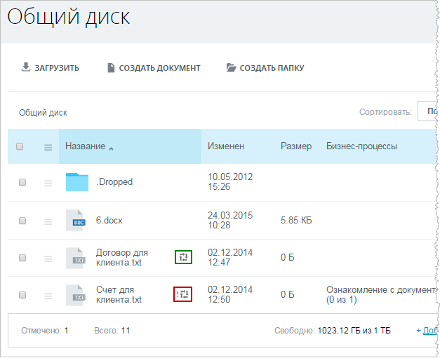
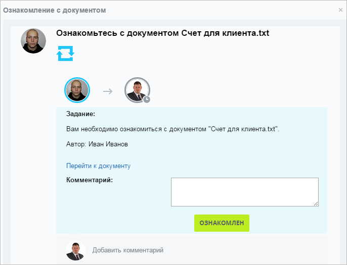

# Бизнес-процессы документов

**Навигация**
- [← Оглавление курса](index.md)
- [← Предыдущий: 7290 — Создание шаблонов типовых бизнес-процессов](lesson_7290.md)
- [Следующий: 2363 — Бизнес-процессы ленты новостей →](lesson_2363.md)

Официальная страница урока: https://dev.1c-bitrix.ru/learning/course/index.php?COURSE_ID=57&LESSON_ID=2362

Давайте посмотрим как настроить автозапуск и запуск вручную для бизнес-процессов (БП) документов в коробочной версии *Битрикс24*.

**Важно!**Для работы с бизнес-процессами на портале у пользователя должен быть определенный уровень доступа. Если вы не можете работать с бизнес-процессами на портале, обратитесь к **Администратору портала**.

### Настройка автозапуска для БП документов

Настройка выполняется на странице **Бизнес-процессы** (меню настроек в разделе Диск &gt; Общий диск):

- открываем
  			список
                      
  		 бизнес-процессов;
- на странице **Шаблоны бизнес-процессов** в меню действий выбираем способ
  			автоматического запуска
                      
  		 – **Запускать при создании** или **Запускать при изменении**;
- статус запуска бизнес-процесса отобразится в колонке
  			Автозапуск
                      
  		.
  **Примечание:** Например, установим автоматический запуск бизнес-процесса **Утверждение документа со статусами** при создании и тогда сотрудник, загружая файл в данный раздел документов, должен
  			указать
                      
  		 все необходимые параметры запуска бизнес-процесса.

### Запуск БП вручную

Чтобы запустить вручную бизнес-процесс для некоторого документа:

- В меню действий документа выберите пункт **Бизнес-процессы**, а затем в предложенном списке
  			найдите
                      
  		 необходимый бизнес-процесс (например, **Ознакомление с документом**);
- Укажите необходимые параметры запуска и нажмите кнопку
  			Запустить
                      
  		.

Бизнес-процесс запустится и начнет выполняться в соответствии со своим шаблоном и произведенными настройками.

### БП сотрудника

Каждому сотруднику отображается список запущенных им бизнес-процессов с помощью анимированных иконок в колонке **Название** после названия файла в списке документов. Если вы участвуете в бизнес-процессе, то рядом с анимированной иконкой увидите

			восклицательный знак

                    

		.

Выполнение назначенных заданий по бизнес-процессу осуществляется на закладке

			Бизнес-процессы

                    

		 личной страницы.
