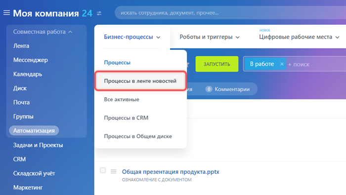
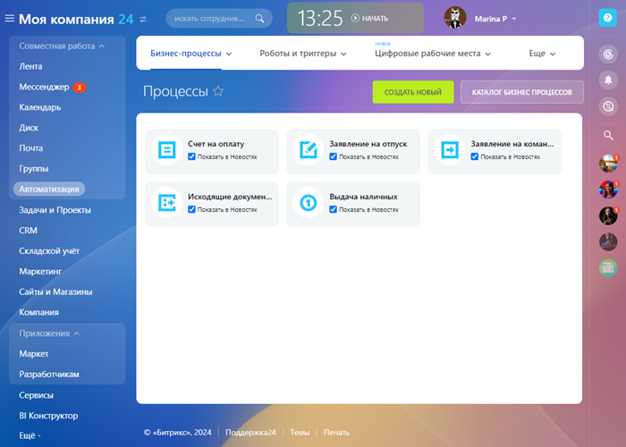
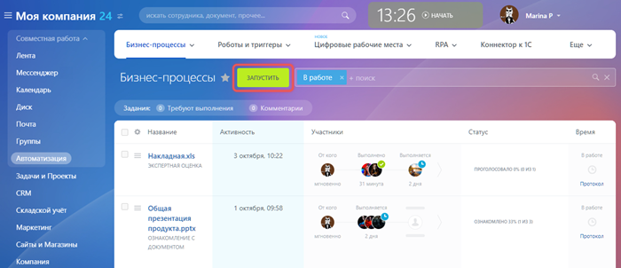
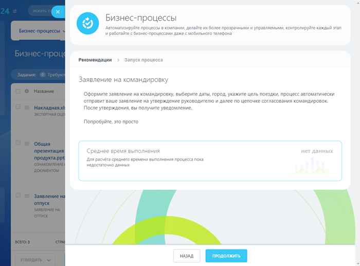
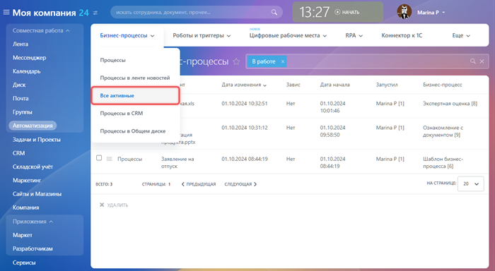
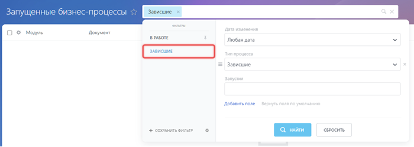

# Бизнес-процессы ленты новостей

**Навигация**
- [← Оглавление курса](index.md)
- [← Предыдущий: 2362 — Бизнес-процессы документов](lesson_2362.md)
- [Следующий: 3837 — Журнал выполнения бизнес-процесса →](lesson_3837.md)

Официальная страница урока: https://dev.1c-bitrix.ru/learning/course/index.php?COURSE_ID=57&LESSON_ID=2363

Запускаем бизнес-процессы ленты новостей.

### Описание

Бизнес-процессы ленты новостей предназначены для автоматизации деятельности организации. По умолчанию продукт предлагает пять типовых

			бизнес-процессов

                    Если вы не можете работать с БП ленты новостей на портале — обратитесь к Администратору портала.

		:

1. Счет на оплату
2. Заявление на отпуск
3. Заявление на командировку
4. Исходящие документы
5. Выдача наличных

В облачном Битрикс24 администратор может менять и копировать эти БП. А начиная с тарифа Профессиональный —

			создавать собственные

                    Другие пользователи тоже могут создавать бизнес-процессы. Для этого администратор должен дать им права доступа.

		.

Работа с БП происходит через пункт меню Автоматизация. Далее в выпадающем меню выберите пункт Процессы в ленте новостей:

### Задания

В публичной части Битрикс24 перейдите в раздел Автоматизация. Откроется страница Бизнес-процессы &gt; Процессы. Здесь собраны запущенные вами процессы и задания, которые вам нужно выполнить.

Для поиска необходимых бизнес-процессов используйте фильтр. Например, чтобы посмотреть только список заданий — установите фильтр «Требуют выполнения».

Получить более подробную информацию о задании можно кликнув на название процесса. Откроется слайдер с описанием задания, протоколом и ссылкой на элемент списка.

Подробнее о заданиях мы рассказываем в уроке [Задания бизнес-процессов](lesson_5276.md).

### Процессы в ленте новостей

На странице Процессы в ленте новостей (Бизнес-процессы &gt; Процессы в ленте) пользователь просматривает и запускает бизнес-процессы, к которым у него есть доступ.

Здесь же администратор указывает, какие из них запускать прямо из

			ленты

                    В ленте новостей для вас отображаются те процессы, для которых у вашей группы пользователей есть права доступа. Если вам не доступна работа с БП организации на портале — обратитесь к администратору портала.

		. Отвечает за это опция Показывать в Новостях.

### Запустить процесс

Запустить бизнес-процесс можно со страницы Бизнес-процессы &gt; Процессы. Для этого используйте кнопку Запустить над списком:

Далее выберите нужный бизнес-процесс. В результате откроется слайдер, где вам нужно заполнить данные для запуска:

Подробнее о запуске бизнес-процесса рассказываем в статье на [helpdesk.bitrix24.ru](https://helpdesk.bitrix24.ru/open/21290196/).

### Все активные

На странице **Все активные** (Бизнес-процессы &gt; Все активные) отображается список активных запущенных БП. На этой странице вы можете отслеживать выполнение запущенных БП и контролировать зависшие.

Обычный пользователь видит только те, которые запустил сам. Администратор портала видит все процессы, запущенные на портале, и удаляет их в случае зависания.

Чтобы найти все зависшие бизнес-процессы, используйте пресет фильтра «Зависшие».

