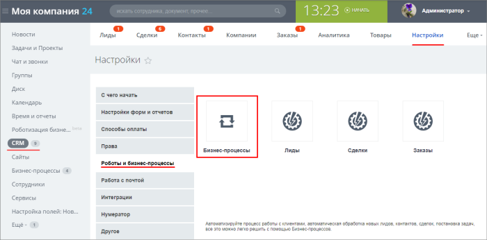
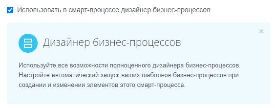
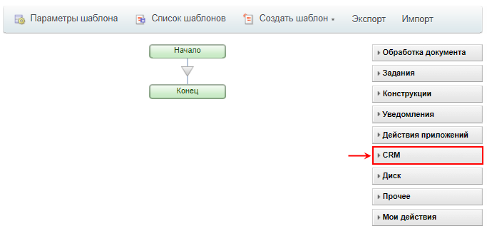
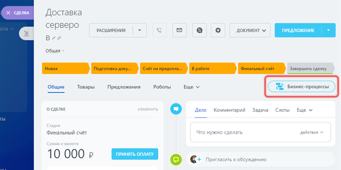
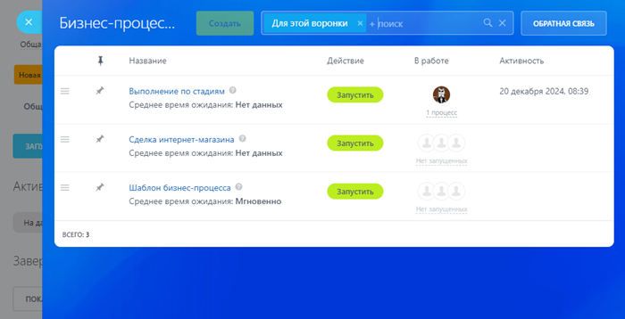

# Бизнес-процессы в CRM

**Навигация**
- [← Оглавление курса](index.md)
- [← Предыдущий: 4516 — Бизнес-процессы в Универсальных списках](lesson_4516.md)
- [Следующий: 2752 — Настройки для бизнес-процессов организации →](lesson_2752.md)

Официальная страница урока: https://dev.1c-bitrix.ru/learning/course/index.php?COURSE_ID=57&LESSON_ID=23662

Работа с бизнес-процессами (БП) в CRM коробочной версии Битрикс24.

### Настройки бизнес-процессов

Переход к

			шаблонам

                    **Шаблон бизнес-процесса** представляет собой последовательность шагов (действий) от начального к конечному, которые будут выполняться один за другим. Необходимо таким образом и в таком порядке составить шаги (действия), чтобы реализовать нужный алгоритм и получить необходимый результат.

[Подробнее](https://dev.1c-bitrix.ru/learning/course/index.php?COURSE_ID=57&CHAPTER_ID=05042)...

		 бизнес-процессов в CRM выполняется по пути Автоматизация &gt; Бизнес-процессы &gt; Процессы в CRM или через раздел CRM CRM &gt; Настройки &gt; Роботы и бизнес-процессы &gt; Бизнес-процессы:

В любом варианте откроется страница со списком сущностей CRM. Для каждой из них есть две кнопки: **Добавить шаблон** (создание нового шаблона БП) и **Список шаблонов** (посмотреть весь список шаблонов БП). Создание бизнес-процессов доступно для следующих

			сущностей CRM

                    На скриншоте **Реестр документов** – это смарт-процесс.

		:

- [Лид](https://helpdesk.bitrix24.ru/open/1357950/)
- [Контакт](https://helpdesk.bitrix24.ru/open/5491741/)
- [Компания](https://helpdesk.bitrix24.ru/open/5493389/)
- [Сделка](https://helpdesk.bitrix24.ru/open/5493461/)
- [Коммерческое предложение](https://helpdesk.bitrix24.ru/open/5450649/)
- [Счета (новые)](https://helpdesk.bitrix24.ru/open/14795982/) (с версии crm 21.1300.0)
- [Смарт-процессы](https://helpdesk.bitrix24.ru/open/13315798/)
  **Примечание:** В настройках смарт-процесса должна быть включена опция
  			Использовать в смарт-процессе дизайнер бизнес-процессов
                      
  Подробнее о работе со смарт-процессами в статье [helpdesk.bitrix24.ru](https://helpdesk.bitrix24.ru/open/13315798/).
  		, чтобы он был доступен для использования в бизнес-процессах. Для **каждого** смарт-процесса с включенной опцией отобразится отдельная строка в этом списке с названием смарт-процесса и возможностью создавать шаблоны.

### Особенности создания шаблонов

В дизайнере бизнес-процессов для сущностей CRM присутствует одноименный раздел с действиями, в основном доступными только для CRM:

Набор доступных действий различен для каждой сущности. Некоторые отображаются только для Сделок, а некоторые только для Смарт-процессов, и т.д.

Описание работы с этими действиями находится в главе курса [Действия &gt; CRM](https://dev.1c-bitrix.ru/learning/course/index.php?COURSE_ID=57&CHAPTER_ID=07943).

### Запуск бизнес-процесса

Бизнес-процессы для элементов CRM запускаются аналогично другим БП: автоматически при изменении или при добавлении элемента. Также можно запустить вручную из списка элементов или из карточки элемента.

Чтобы запустить вручную из списка, откройте меню элемента и выберите Новый бизнес-процесс.

В карточке элемента нажмите кнопку Бизнес-процессы.

В обоих вариантах откроется слайдер со списком шаблонов бизнес-процессов. Чтобы запустить бизнес-процесс, нажмите на название шаблона.

### Дополнительно

- [Автозапуск бизнес-процессов](https://helpdesk.bitrix24.ru/open/1434597/);
- [Видео-курс о бизнес-процессах](https://helpdesk.bitrix24.ru/open/3092117/).
