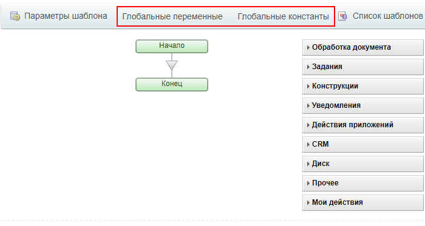
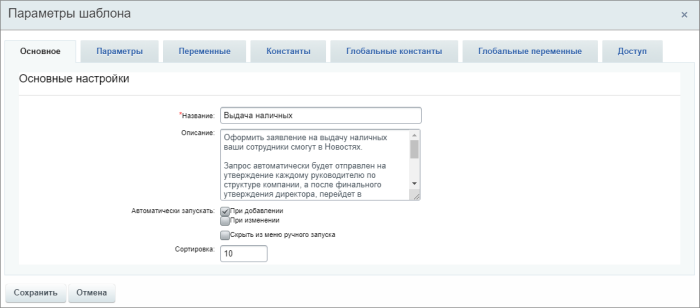
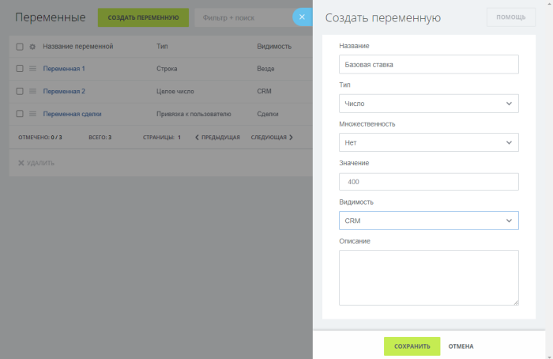
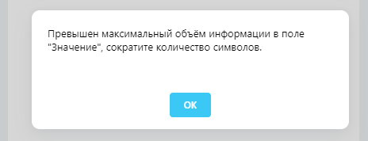
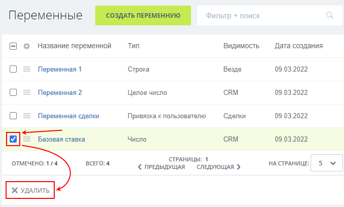

# Глобальные переменные и константы

**Навигация**
- [← Оглавление курса](index.md)
- [← Предыдущий: 12409 — Из чего состоит визуальный конструктор](lesson_12409.md)
- [Следующий: 24826 — Проверьте себя →](lesson_24826.md)

Официальная страница урока: https://dev.1c-bitrix.ru/learning/course/index.php?COURSE_ID=57&LESSON_ID=23718

В системе возможно хранение значений, доступных во всех процессах.

### Глобальные переменные и константы

На контекстной панели

			визуального конструктора

                    Контекстная панель визуального конструктора состоит из набора кнопок:

[Подробнее](lesson_12409.md)...

		 расположены две кнопки: **Глобальные переменные** и **Глобальные константы**. По нажатии на кнопку открывается слайдер со списком глобальных переменных или констант соответственно.

> **Глобальные переменные** используются для хранения данных и могут быть
>
> 			изменены
>
>
>
>                     Например, действием **Изменение глобальных переменных**. Действие позволяет изменить значения глобальных переменных.
>
> [Подробнее](lesson_23418.md)...
>
>
>
> 		. Доступны сразу во **всех** шаблонах бизнес-процессов (c учётом настроек видимости).
> В продукте с версии 21.500.0 модуля Бизнес-процессы.

> **Глобальные константы** используются для хранения данных и имеют постоянное (неизменяемое) значение. Доступны сразу во **всех** шаблонах бизнес-процессов (c учётом настроек видимости).

## Глобальные переменные и константы до версии дизайнера бизнес-процессов 21.400.0

До версии дизайнера бизнес-процессов 21.400.0 глобальные переменные и константы были расположены в форме параметров шаблона бизнес-процесса:

Процесс создания был полностью аналогичен созданию переменных и констант шаблона.

Подробнее о параметрах шаблона в уроке [Настройка параметров шаблона](lesson_3816.md).

**Примечание**: Глобальные константы и переменные также используются в [роботах в CRM](https://helpdesk.bitrix24.ru/open/14922854/).

### Процесс создания

Процесс создания одинаков для глобальных переменных и констант, поэтому рассмотрим его на примере создания глобальной переменной.

По нажатии на кнопку **Глобальные переменные** открывается слайдер со списком всех,

			доступных

                    Зависит от параметра переменной **Видимость**.

		 в этом процессе, глобальных переменных. Нажмем на кнопку **Создать переменную** – откроется слайдер с параметрами:

- **Название** – название глобальной переменной;
- **Тип** – тип переменной из списка;
- **Множественность** – является ли переменная множественной (имеет несколько значений);
- **Значение** – значение переменной;
- **Видимость** – где использовать переменную:
  В *1С-Битрикс: Управление сайтом* доступен только вариант видимости **Везде**.

  - **Везде** – переменная доступна во всех процессах (CRM, списки, диск и т.д.);
  - **CRM** – переменная доступна только в процессах CRM (БП сделок, лидов, счетов и т.д.);
  - **[Сущность CRM]** – переменная доступна только в процессах выбранной сущности CRM (например, только в сделках или только в счетах). Для выбора в списке всегда будет доступна только та сущность CRM, для которой открыт шаблон бизнес-процесса.
- **Описание** – произвольный текст для описания переменной.

**Внимание:** Параметры **Тип**, **Множественность** и **Видимость** задаются только при создании глобальной переменной / константы и станут недоступны для изменения после сохранения.

С версии 23.200.0 модуля Бизнес-процессы добавлена валидация значений и опций. В случае, если переменная / константа не могут быть сохранены, отображается подсказка с пояснением

			причины

                    Например, если превышен максимальный объем информации:

		.

### Удаление

Групповое удаление

                    С версии модуля Бизнес-процессы **21.700.0**.

		 глобальных переменных и констант выполняется из списка:

- Отметьте в списке глобальные переменные / константы, которые требуется удалить;
- Нажмите кнопку **Удалить** под списком.

Отдельную переменную / константу можно удалить через меню элемента списка.
