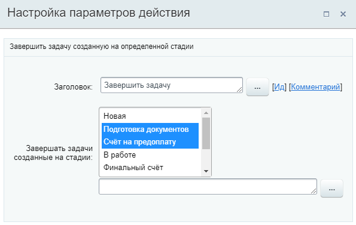

# Завершить задачу

**Навигация**
- [← Оглавление курса](index.md)
- [← Предыдущий: 20762 — Забронировать ресурс](lesson_20762.md)
- [Следующий: 3778 — Запись события в crm →](lesson_3778.md)

Официальная страница урока: https://dev.1c-bitrix.ru/learning/course/index.php?COURSE_ID=57&LESSON_ID=24418

Действие позволяет завершить [задачи](https://helpdesk.bitrix24.ru/open/17962166/), созданные на определенной стадии сделки.

Действие доступно в шаблонах бизнес-процессов [Лидов](https://helpdesk.bitrix24.ru/open/1357950/), [Сделок](https://helpdesk.bitrix24.ru/open/5493461/), [Коммерческих предложений](https://helpdesk.bitrix24.ru/open/5450649/), [Счетов](https://helpdesk.bitrix24.ru/open/14795982/) и [Смарт-процессов](https://helpdesk.bitrix24.ru/open/13315798/).

**Важно!** Действие не завершает задачи, созданные

			вручную

                    Например, созданные из карточки сделки самостоятельно.

		. Будут завершены задачи, созданные роботами или бизнес-процессами.

#### Описание параметров

- **Завершать задачи созданные на стадии** – выберите стадии, задачи которых нужно завершить. В списке стадий доступен
  			множественный выбор
                      Зажмите **Ctrl** + клик левой кнопкой мыши.
  		, а также вставка через форму «Вставка значения».

#### Пример настройки:

В результате выполнения действия будут закрыты все задачи, созданные на стадиях Подготовка документов и Счет на предоплату.
