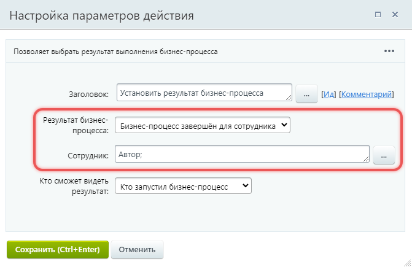
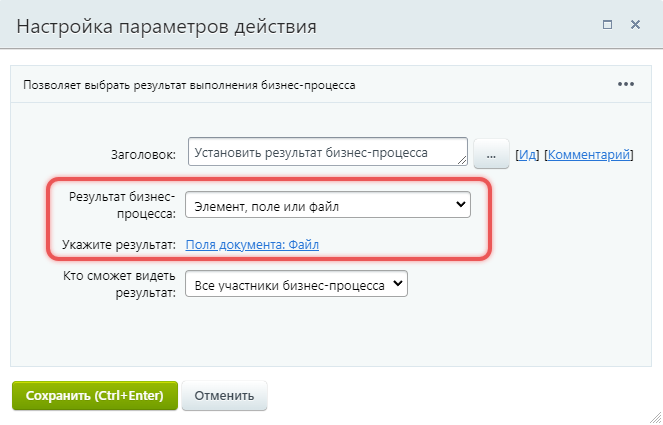
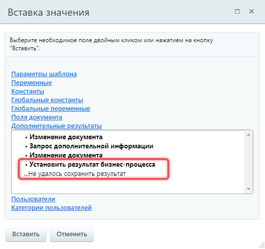
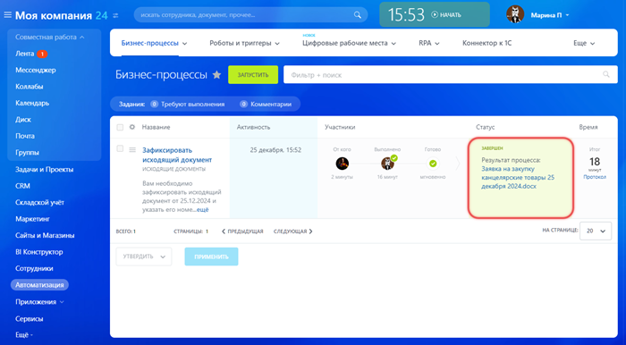
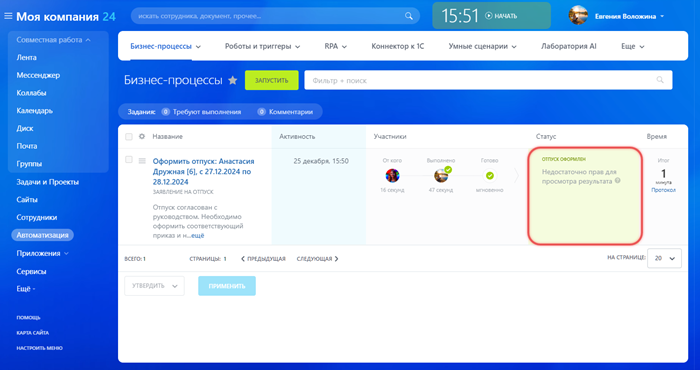

# Установить результат бизнес-процесса

**Навигация**
- [← Оглавление курса](index.md)
- [← Предыдущий: 26986 — Создать групповой чат](lesson_26986.md)
- [Следующий: 3811 — Установка прав →](lesson_3811.md)

Официальная страница урока: https://dev.1c-bitrix.ru/learning/course/index.php?COURSE_ID=57&LESSON_ID=25348

Система выводит результат для каждого завершенного бизнес-процесса. Увидеть его можно в списке процессов на странице *Автоматизация &gt; Бизнес-процессы &gt; Процессы* . Результат фиксируется автоматически или действием Установить результат бизнес-процесса.  В действии можно выбрать, что будет результатом выполнения бизнес-процесса, например, документ или сотрудник.

Подробнее об автоматическом результате в статье на [Хелпдеске](https://helpdesk.bitrix24.ru/open/23384622/).

#### Описание параметров

**Результат бизнес-процесса** — укажите, какой тип результата показывать.

- Бизнес-процесс завершен для сотрудника — результат покажет, для какого сотрудника завершен процесс. В поле Сотрудник нажмите на *Три точки (...)* и выберите пользователя. Например, это может быть автор бизнес-процесса.
  
- **Элемент, поле или файл** — выберите результат процесса из списка полей документа. Например, поле с файлом.
  

**Кто сможет видеть результат** — выберите, кому будет доступен результат процесса.

- Кто запустил бизнес-процесс — результат увидит сотрудник, который запустил процесс, его руководитель и администратор
- Все участники бизнес-процесса — результат увидят сотрудники, которые участвовали в процессе
- Другие сотрудники — можно выбрать пользователей, которые увидят результат

#### Дополнительные результаты действия

Действие возвращает дополнительный результат, если не удалось сохранить результат процесса.

#### Как выглядит результат

Результат бизнес-процесса отображается в списке процессов *Автоматизация &gt; Бизнес-процессы &gt; Процессы* в колонке Статус.

Если доступ к результату ограничен, пользователь увидит сообщение «Недостаточно прав для просмотра результата».

