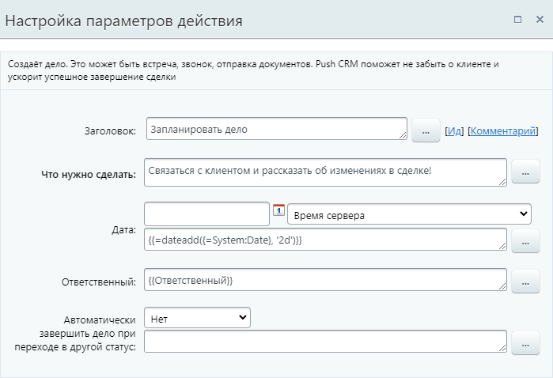
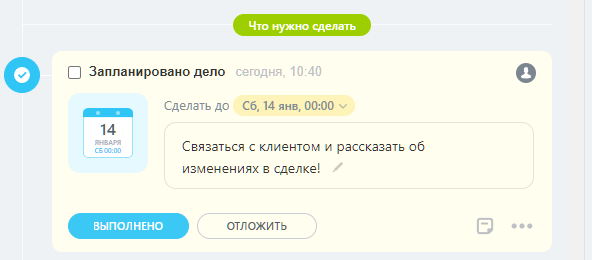
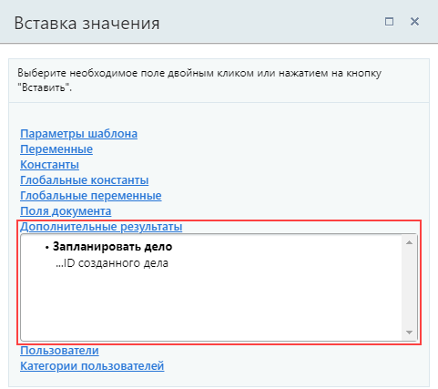

# Запланировать дело

**Навигация**
- [← Оглавление курса](index.md)
- [← Предыдущий: 3778 — Запись события в crm](lesson_3778.md)
- [Следующий: 20764 — Изменить компанию →](lesson_20764.md)

Официальная страница урока: https://dev.1c-bitrix.ru/learning/course/index.php?COURSE_ID=57&LESSON_ID=25718

Действие cоздаёт

			дело

                    Планируйте любое дело, которое связано с клиентом в карточке элемента.

Подробнее на [helpdesk.bitrix24.ru](https://helpdesk.bitrix24.ru/open/16745098/).

		. Это может быть встреча, звонок или отправка документов. Созданное задание привязано к элементу, в котором запущен бизнес-процесс, и отображается в таймлайне элемента и в

			представлении «Дела»

                    В представлении «Дела» сделки автоматически распределяются на стадии в зависимости от срока дел внутри элемента.

Подробнее на [helpdesk.bitrix24.ru](https://helpdesk.bitrix24.ru/open/16440664/)

		.

**Примечание**. Ранее применялись отдельные действия для разных типов дел (задание, запланировать встречу и запланировать звонок). Теперь любой тип создаётся одним действием **Запланировать дело**.

### Описание параметров

- **Что нужно сделать** — укажите подробную информацию о деле для ответственного
- **Дата** — задайте срок выполнения дела (дату и время). По умолчанию в качестве значения подставляется функция [settime](lesson_4912.md#settime) для указания точного времени: `=settime({=System:Date}, 12, 0)`. Такая запись создаст дело на текущую дату на 12:00. Откорректируйте параметры функции или укажите дату и время другим способом: через иконку календаря, форму Вставка значения или функцией [калькулятора выражений](href=)
  Обратите внимание, что в карточках CRM значения полей типа «Дата/время» всегда подстраиваются под часовой пояс пользователя. Поэтому выбор часового пояса в настройках действия не повлияет на отображаемый срок выполнения созданного дела.
- **Ответственный** — укажите пользователя, которому требуется поставить задание. Например, ответственного за Сделку / Лид
- **Автоматически завершать дело при переходе в другой статус** — при выборе данной опции дело будет считаться завершенным, как только статус Лида / Сделки изменится

В результате выполнения действия в секции **Дополнительные результаты** формы **Вставка значения** станет доступен **ID созданного дела**.

### Пример

Например, пусть будет создано дело «связаться с клиентом» с крайним сроком через 2 дня от текущей даты.

Созданное задание в списке:

### Результаты выполнения действия

Результаты выполнения этого действия можно получить с помощью формы Вставка значения &gt; Дополнительные результаты.

Доступно:

- ID созданного дела

