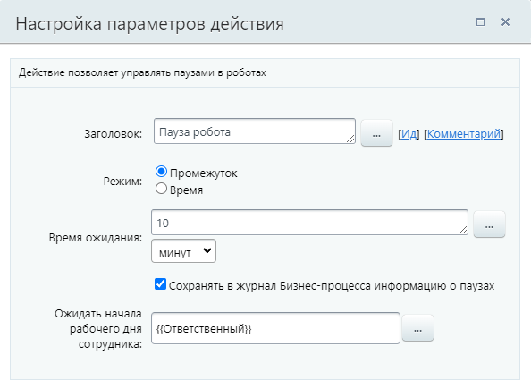
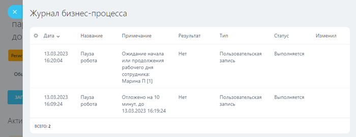

# Пауза робота

**Навигация**
- [← Оглавление курса](index.md)
- [← Предыдущий: 3807 — Пауза в выполнении](lesson_3807.md)
- [Следующий: 20828 — Получить информацию о сотруднике →](lesson_20828.md)

Официальная страница урока: https://dev.1c-bitrix.ru/learning/course/index.php?COURSE_ID=57&LESSON_ID=25792

Действие позволяет отложить выполнение следующего действия на заданное время и при этом дополнительно ожидать начала рабочего дня сотрудника.

Действие доступно с версии **22.400.0** модуля Бизнес-процессы и объединяет в себе два простых действия: [Пауза в выполнении](lesson_3807.md) и [Ожидание рабочего дня сотрудника](lesson_25812.md).

В этом уроке мы не будем рассматривать действие подробно. Все подробности и нюансы можно посмотреть в описаниях действий по ссылкам выше.

#### Описание параметров

- **Режим**:

  - Промежуток — задайте паузу в секундах, минутах, часах или днях. В облаке минимальное значение — 5 минут. В коробочных продуктах минимальное значение зависит от настроек модуля Бизнес-процессы, параметр [Минимальное время ожидания для действий](https://dev.1c-bitrix.ru/user_help/service/bizproc/settings.php)
  - Время — укажите конкретное время старта. Выберите часовой пояс:

    - Серверное время: для облачных Битрикс24 в зоне RU — UTC+3:00 (Московское время), для коробочных версий — время сервера, на котором установлен продукт
    - Локальное время: часовой пояс пользователя, запустившего процесс

**Сотрудник** — укажите сотрудника, чей рабочий день будет ожидать бизнес-процесс. Бизнес-процесс возобновит работу как только указанный сотрудник начнет или продолжит рабочий день

#### Пример настройки

В шаблоне бизнес-процесса сделок в параметрах действия задана пауза на 10 минут и указан **Ответственный** с помощью формы

			«Вставка значения»

                    При работе с бизнес-процессом в параметрах действий, параметрах шаблона и настройках статуса есть возможность указывать как собственный текст (заданный вручную), так и использовать различные переменные значения (поля документа и прочие данные, которые могут меняться и поэтому не задаются вручную). Для подстановки таких переменных значений используется специальная форма **Вставка значения**.

[Подробнее](lesson_12383.md)...

		.

Таким образом, бизнес-процесс встанет на паузу на 10 минут и, затем, будет ожидать рабочего дня ответственного за сделку сотрудника.

В

			журнал

                    При разработке и использовании уже готовых процессов бывает необходимо узнать подробности выполнения того или иного процесса / действия. Для этого в системе предусмотрен журнал выполнения бизнес-процессов (лог).

[Подробнее](lesson_3837.md)...

		 бизнес-процесса действие сначала добавляет запись о паузе, а по окончании паузы — запись об ожидании рабочего дня сотрудника:

