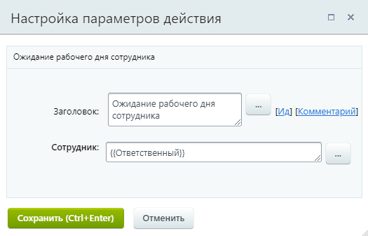
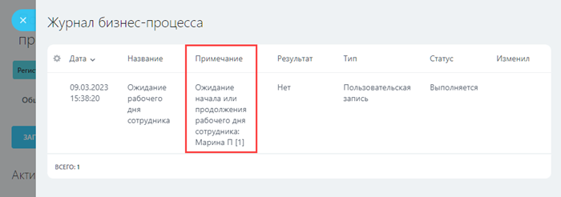

# Ожидание рабочего дня сотрудника

**Навигация**
- [← Оглавление курса](index.md)
- [← Предыдущий: 8551 — Исходящий Вебхук](lesson_8551.md)
- [Следующий: 3807 — Пауза в выполнении →](lesson_3807.md)

Официальная страница урока: https://dev.1c-bitrix.ru/learning/course/index.php?COURSE_ID=57&LESSON_ID=25812

Действие ставит бизнес-процесс на паузу в ожидании

			рабочего дня

                    Одним из важнейших показателей ответственности ваших коллег является рабочее время. Используйте инструмент Рабочий день и учитывайте рабочее время сотрудников, не отрываясь от собственных дел.

Подробнее на [helpdesk.bitrix24.ru](https://helpdesk.bitrix24.ru/open/5355941/).

		 указанного сотрудника.

Действие доступно с версии **22.400.0** модуля Бизнес-процессы.

#### Описание параметров

- **Сотрудник** – укажите сотрудника, чей рабочий день будет ожидать бизнес-процесс. Бизнес-процесс возобновит работу как только указанный сотрудник начнет или продолжит рабочий день.

#### Пример настройки

В шаблоне бизнес-процесса сделок в параметре действия указан **Ответственный** с помощью формы

			«Вставка значения»

                    При работе с бизнес-процессом в параметрах действий, параметрах шаблона и настройках статуса есть возможность указывать как собственный текст (заданный вручную), так и использовать различные переменные значения (поля документа и прочие данные, которые могут меняться и поэтому не задаются вручную). Для подстановки таких переменных значений используется специальная форма **Вставка значения**.

[Подробнее](lesson_12383.md)...

		.

Таким образом, бизнес-процесс будет ожидать рабочего дня ответственного за сделку сотрудника.

В

			журнал

                    При разработке и использовании уже готовых процессов бывает необходимо узнать подробности выполнения того или иного процесса / действия. Для этого в системе предусмотрен журнал выполнения бизнес-процессов (лог).

[Подробнее](lesson_3837.md)...

		 бизнес-процесса действие добавляет запись о паузе:

