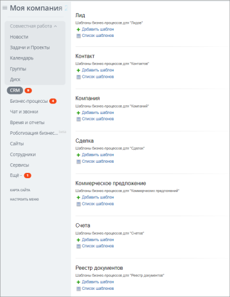
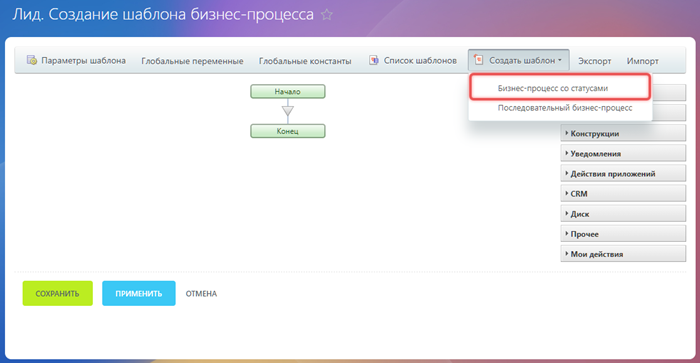
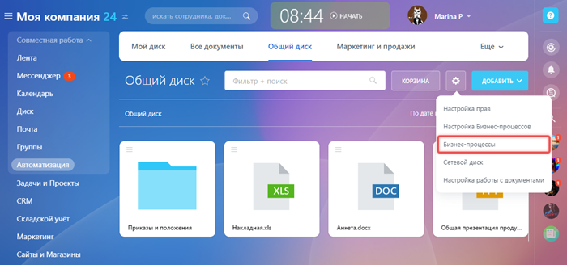
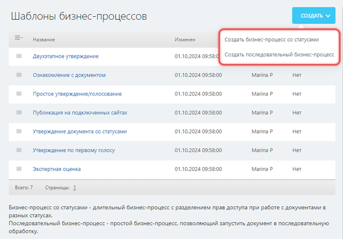
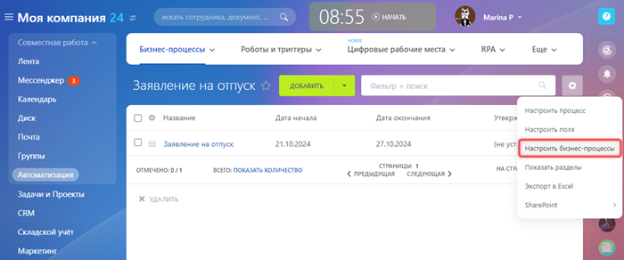
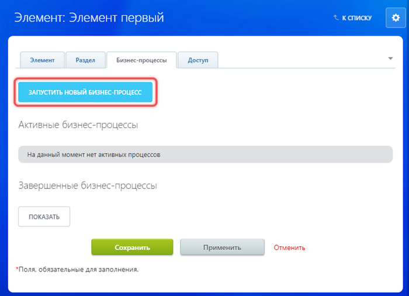
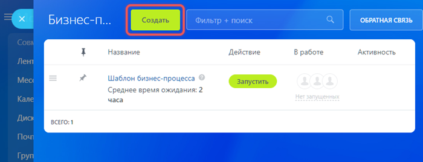
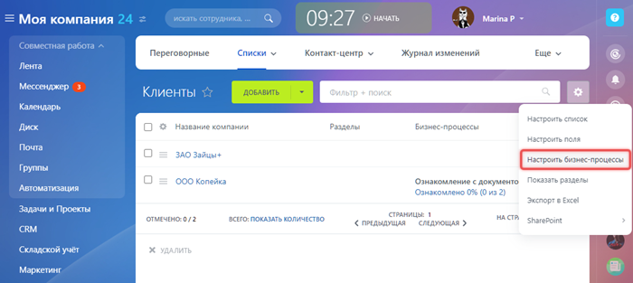
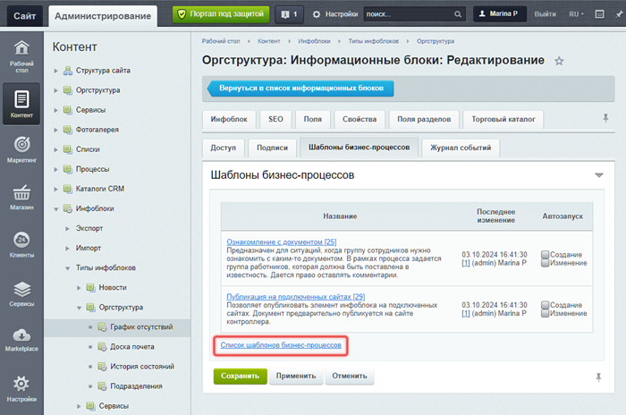
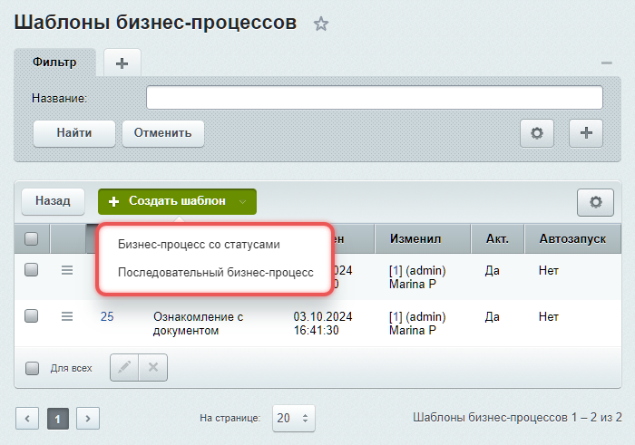

# Создать новый шаблон

**Навигация**
- [← Оглавление курса](index.md)
- [← Предыдущий: 5080 — Примечание для библиотеки документов](lesson_5080.md)
- [Следующий: 3816 — Настройка параметров шаблона →](lesson_3816.md)

Официальная страница урока: https://dev.1c-bitrix.ru/learning/course/index.php?COURSE_ID=57&LESSON_ID=26610

Процесс создания нового шаблона бизнес-процесса зависит от типа документа.

### CRM

**Типы документов:** лид, контакт, компания, сделка, коммерческое предложение, счет, смарт-процесс.

Чтобы открыть список шаблонов объектов [CRM](https://helpdesk.bitrix24.ru/open/1470510/), выберите один из следующих вариантов:

- *Автоматизация &gt; Бизнес-процессы &gt; Процессы в CRM*
- *CRM &gt; Настройки &gt; Настройки CRM &gt; Роботы и бизнес-процессы*

Для каждого объекта CRM, например лида или контакта, доступны две кнопки: Добавить шаблон и Список шаблонов.

Чтобы создать новый шаблон, нажмите Добавить шаблон. Откроется страница создания шаблона для

			последовательного

                    Последовательный бизнес-процесс — бизнес-процесс у которого действия выполняются одно за другим от точки входа до точки выхода.

		 бизнес-процесса. Если вам нужен бизнес-процесс

			со статусами

                    Бизнес-процесс со статусами — бизнес-процесс, не имеющий начала и конца, в процессе работы которого происходит переход из одного состояния в другое с разделением прав доступа.

		, выберите Создать шаблон в верхнем меню дизайнера и нужный тип.

### Диск

**Тип документа:** файл.

Бизнес-процессы  в Битрикс24 Диск работают для файлов [общего диска](https://helpdesk.bitrix24.ru/open/19228208/). Открыть их можно двумя способами:

- *Автоматизация &gt; Бизнес-процессы &gt; Процессы в Общем диске*
- *Диск &gt; Общий диск*

На странице общего диска нажмите Настройки (⚙️) и выберите вариант Бизнес-процессы.

Откроется слайдер со списком шаблонов бизнес-процессов. Нажмите Создать и выберите тип бизнес-процесса для создания нового шаблона.

### Процессы в ленте новостей

**Тип документа:** элемент процесса.

Перейдите в раздел *Автоматизация &gt; Бизнес-процессы &gt; Процессы в ленте новостей*. Чтобы открыть шаблоны, выберите процесс, нажмите на Настройки (⚙️) и Настроить бизнес-процессы.

На открывшейся странице со списком шаблонов нажмите кнопку Создать бизнес-процесс со статусами или Создать последовательный бизнес-процесс, чтобы создать новый шаблон.

Другой способ создать шаблон — открыть список шаблонов из формы редактирования элемента списка. На вкладке Бизнес-процессы нажмите кнопку *Запустить новый бизнес-процесс*.

Откроется слайдер со списком шаблонов бизнес-процессов. Нажмите кнопку Создать, чтобы добавить новый шаблон.

### Универсальные списки

**Тип документа:** элемент списка.

Универсальные списки

                    Универсальные списки — это инструмент хранения информации в виде списков с собственной структурой и полями. С использованием универсальных списков можно вести учет документов, составить реестр сертификатов, перечень корпоративных книг и так далее.

		 находятся в разделе *Сервисы &gt; Списки*.

Каждый универсальный список содержит свой набор шаблонов. Чтобы настроить бизнес-процессы, откройте нужный список, нажмите на Настройки (⚙️) и выберите Настроить бизнес-процессы.

На открывшейся странице со списком шаблонов нажмите кнопку Создать бизнес-процесс со статусами или Создать последовательный бизнес-процесс, чтобы создать новый шаблон.

Другой способ создать шаблон — открыть список шаблонов из формы редактирования элемента списка. На вкладке Бизнес-процессы нажмите кнопку *Запустить новый бизнес-процесс*.

Откроется слайдер со списком шаблонов бизнес-процессов. Нажмите кнопку Создать, чтобы добавить новый шаблон.

### Информационные блоки

**Тип документа:** элемент информационного блока.

Управлять шаблонами бизнес-процессов [инфоблоков](lesson_3122.md) можно только в коробочных продуктах через административный раздел сайта или портала.

Перейдите в административный раздел и откройте настройки информационного блока с включенными бизнес-процессами. На вкладке Шаблоны бизнес-процессов нажмите на ссылку Список шаблонов бизнес-процессов.

Откроется страница со списком шаблонов. Чтобы создать новый шаблон нажмите Создать шаблон и выберите тип бизнес-процесса.

