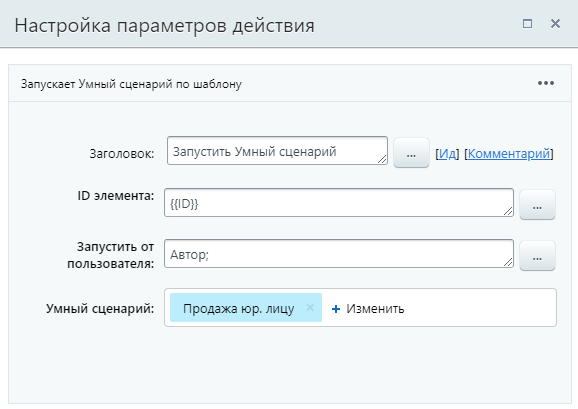
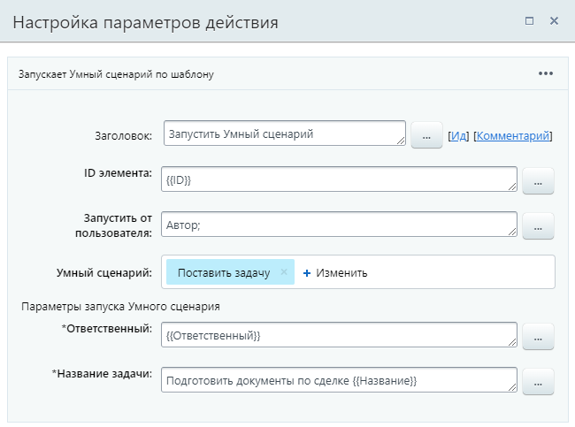
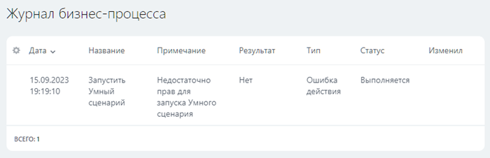
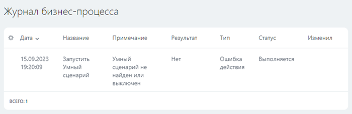

# Запустить умный сценарий

**Навигация**
- [← Оглавление курса](index.md)
- [← Предыдущий: 3780 — Блокировка документа](lesson_3780.md)
- [Следующий: 7721 — Запустить бизнес-процесс →](lesson_7721.md)

Официальная страница урока: https://dev.1c-bitrix.ru/learning/course/index.php?COURSE_ID=57&LESSON_ID=26760

Действие запускает

			Умный сценарий

                    Умные сценарии – это функция, с помощью которой вы можете использовать роботов CRM, чтобы автоматизировать рутинные операции внутри компании.

Подробнее на [helpdesk.bitrix24.ru](https://helpdesk.bitrix24.ru/open/13281632/)

		 по шаблону. Доступно с версии 23.300.0.

### Описание параметров и пример

- **ID элемента** – укажите ID элемента, для которого нужно запустить умный сценарий;
- **Запустить от пользователя** – выберите сотрудника, от имени которого будет запущен сценарий;
- **Умный сценарий** – выберите сценарий из списка. Доступен выбор только одного сценария в одном действии. Сценарии в списке группируются по типу сущности CRM: лид, контакт, сделка и т.д.
- **Параметры запуска Умного сценария** – секция отобразится, только если в выбранном умном сценарии имеются параметры запуска.
  > **Совет:** Используйте параметры для передачи данных из исходного бизнес-процесса в запускаемый сценарий.

### Примеры настройки

В примере в качестве идентификатора указан ID текущего элемента (сделки), для которого запущен БП. Сценарий будет запущен от имени сотрудника, запустившего бизнес-процесс.

При выборе сценария с параметрами запуска, будет показана соответствующая секция:

### Возможные ошибки

Ошибки в срабатывании действия выводится в [журнале бизнес-процесса](lesson_3837.md) в карточке сущности CRM. Частые ошибки:

- Недостаточно прав для запуска Умного сценария. Такая ошибка возникнет, если пользователю, от имени которого выполняется запуск, не выданы необходимые [права доступа в CRM](https://helpdesk.bitrix24.ru/open/6268091/).
  
- Умный сценарий не найден или выключен. Появится, если сценарий удалён или деактивирован.
  
