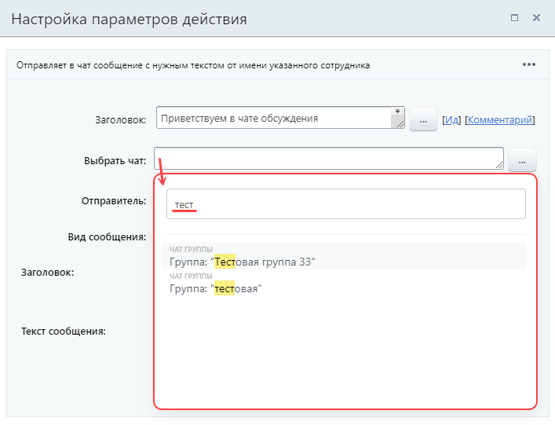
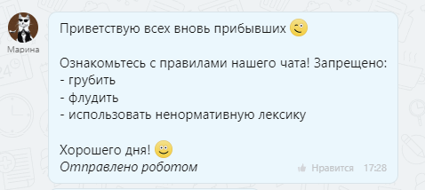
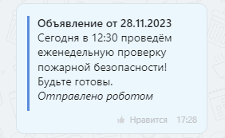
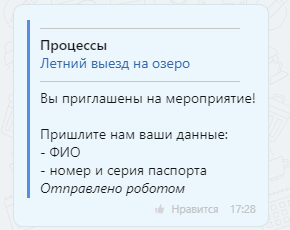
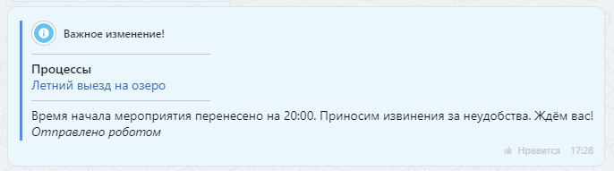
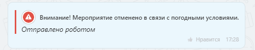
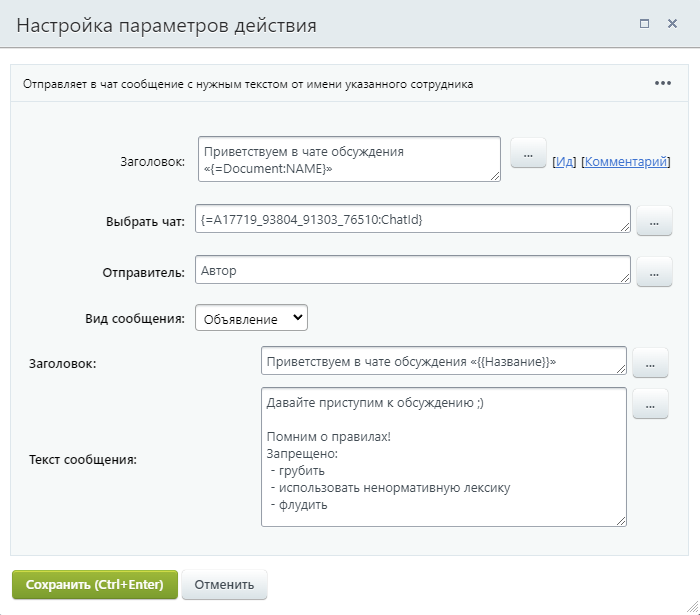
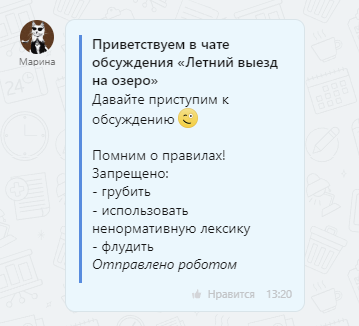

# Отправить сообщение в групповой чат

**Навигация**
- [← Оглавление курса](index.md)
- [← Предыдущий: 7395 — Добавить новость](lesson_7395.md)
- [Следующий: 26988 — Отправить сообщение в личный чат →](lesson_26988.md)

Официальная страница урока: https://dev.1c-bitrix.ru/learning/course/index.php?COURSE_ID=57&LESSON_ID=26982

Действие отправляет в чат сообщение с нужным текстом от имени указанного сотрудника.

### Описание параметров

- **Выбрать чат** – укажите, в какой чат выполнять отправку. Выбрать чат можно из
  			выпадающего списка
                      
  		 с поисковой строкой, который появляется по клику в поле. Другой вариант – подставить идентификатор чата, созданного ранее действием
  			Создать групповой чат
                      Действие создаёт групповой чат и добавляет в него указанных сотрудников.
  [Подробнее](lesson_26986.md)...
  		;
- **Отправитель** – укажите пользователя, который будет отображаться как отправитель;
- **Вид сообщения** – выберите из списка вид сообщения в зависимости от его важности. Каждый вид отличается форматированием;
- **Заголовок** – задайте заголовок сообщения. Это поле доступно только для видов «Объявление» и «Важное»;
- **Текст сообщения** – впишите текст сообщения.

### Виды сообщений

В параметрах действия доступен выбор из пяти видов сообщений:

- Базовое;
- Объявление;
- Уведомление;
- Важное;
- Авария.

> **«Отправлено роботом»**. Такую фразу вы увидите в любом сообщении, отправленном из бизнес-процесса, даже если для него указан отправитель.

Рассмотрим подробнее как меняется внешний вид сообщения.

#### Базовое

Сообщение выглядит как обычное, без форматирования.

#### Объявление

Объявление имеет заголовок жирного начертания и текст. Всё сообщение выделено синей вертикальной полосой.

#### Уведомление

Уведомление состоит из двух частей: ссылки на документ процесса и текста сообщения. Всё сообщение выделено синей вертикальной полосой.

#### Важное

Важное сообщение содержит заголовок жирного начертания с иконкой , ссылку на документ процесса и текст. Всё сообщение выделено синей вертикальной полосой.

#### Авария

Аварийное сообщение обозначается иконкой  и содержит текст. Всё сообщение выделено красной вертикальной полосой.

### Пример

Представим, что мы в бизнес-процессе создаём новый чат действием «Создать групповой чат» и хотим, чтобы в этот чат автоматически отправлялось сообщение для участников с приветствием и правилами чата. Заполним параметры действия:

В результате выполнения БП в созданный чат будет отправлено такое сообщение:

