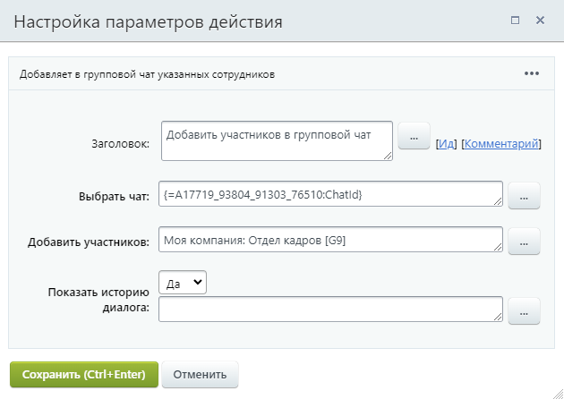

# Добавить участников в групповой чат

**Навигация**
- [← Оглавление курса](index.md)
- [← Предыдущий: 23564 — Выполнить математические операции](lesson_23564.md)
- [Следующий: 3810 — Запись в отчет →](lesson_3810.md)

Официальная страница урока: https://dev.1c-bitrix.ru/learning/course/index.php?COURSE_ID=57&LESSON_ID=26984

Действие добавляет в групповой чат указанных сотрудников.

#### Описание параметров

- **Выбрать чат** – укажите чат, созданный из ранее настроенного действия
  			Создать групповой чат
                      Действие создаёт групповой чат и добавляет в него указанных сотрудников.
  [Подробнее](lesson_26986.md)...
  		. Для этого в форме «Вставка значения» в дополнительных результатах выберите «ID чата»;
- **Добавить участников** – перечислите пользователей и группы пользователей, которые должны быть добавлены;
- **Показать историю диалога** – если выбрать «Да», добавленные участники увидят все предыдущие сообщения.

#### Пример настройки:

