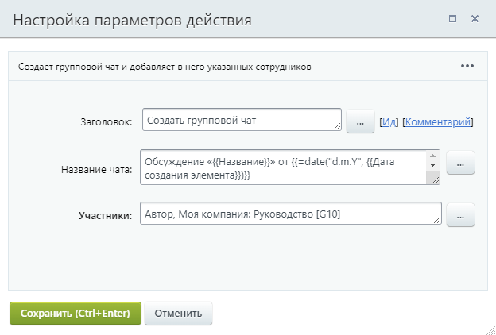
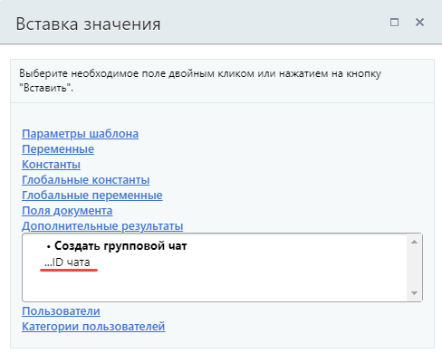

# Создать групповой чат

**Навигация**
- [← Оглавление курса](index.md)
- [← Предыдущий: 12605 — Создать QR-код](lesson_12605.md)
- [Следующий: 25348 — Установить результат бизнес-процесса →](lesson_25348.md)

Официальная страница урока: https://dev.1c-bitrix.ru/learning/course/index.php?COURSE_ID=57&LESSON_ID=26986

Действие создаёт групповой чат и добавляет в него указанных сотрудников.

#### Описание параметров

- **Название чата** – укажите, как будет называть создаваемый групповой чат;
- **Участники** – добавьте не меньше двух участников: пользователей и группы пользователей.

#### Пример настройки:

В результате в секции «Дополнительные результаты» формы «Вставка значения» станет доступен **ID чата**.

Он пригодится нам для действий

			Добавить участников в групповой чат

                    Действие добавляет в групповой чат указанных сотрудников.

[Подробнее](lesson_26984.md)...

		 и

			Отправить сообщение в групповой чат

                    Действие отправляет в чат сообщение с нужным текстом от имени указанного сотрудника.

[Подробнее](lesson_26982.md)...

		.
