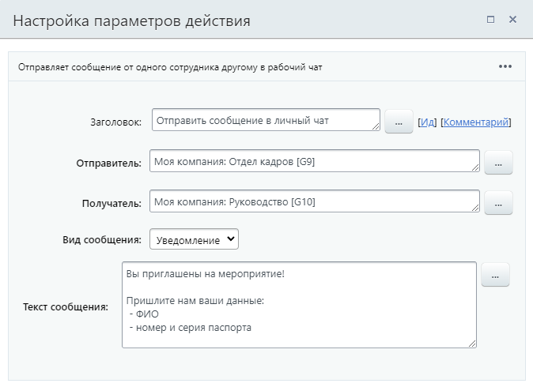
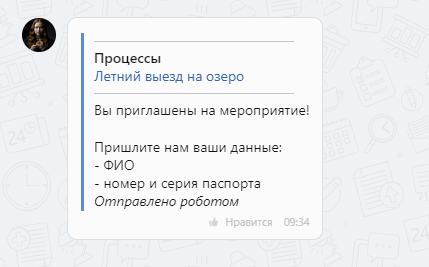

# Отправить сообщение в личный чат

**Навигация**
- [← Оглавление курса](index.md)
- [← Предыдущий: 26982 — Отправить сообщение в групповой чат](lesson_26982.md)
- [Следующий: 20754 — Отправить сообщение в чат →](lesson_20754.md)

Официальная страница урока: https://dev.1c-bitrix.ru/learning/course/index.php?COURSE_ID=57&LESSON_ID=26988

Действие отправляет сообщение от одного сотрудника другому в рабочий чат.

### Описание параметров

- **Отправитель** – укажите пользователя, который будет отображаться отправителем. Если указать в поле группу пользователей, то системой будет выбран в качестве отправителя пользователь с наименьшим ID;
- **Получатель** – укажите пользователей, которые получат сообщение в рабочем чате с отправителем;
- **Вид сообщения** – выберите из списка вид сообщения в зависимости от его важности. Каждый вид отличается форматированием;
- **Заголовок** – задайте заголовок сообщения. Это поле доступно только для видов «Объявление» и «Важное»;
- **Текст сообщения** – впишите текст сообщения.

### Виды сообщений

В параметрах действия доступен выбор из пяти видов сообщений:

- Базовое;
- Объявление;
- Уведомление;
- Важное;
- Авария.

> **«Отправлено роботом»**. Такую фразу вы увидите в любом сообщении, отправленном в чат из бизнес-процесса.

Рассмотрим подробнее как меняется внешний вид сообщения.

#### Базовое

Сообщение выглядит как обычное, без форматирования.

#### Объявление

Объявление имеет заголовок жирного начертания и текст. Всё сообщение выделено синей вертикальной полосой.

#### Уведомление

Уведомление состоит из двух частей: ссылки на документ процесса и текста сообщения. Всё сообщение выделено синей вертикальной полосой.

#### Важное

Важное сообщение содержит заголовок жирного начертания с иконкой , ссылку на документ процесса и текст. Всё сообщение выделено синей вертикальной полосой.

#### Авария

Аварийное сообщение обозначается иконкой  и содержит текст. Всё сообщение выделено красной вертикальной полосой.

### Пример

Отправим уведомление от отдела кадров всем пользователям группы «Руководство». Для этого выберем соответствующий вид и укажем текст:

В результате все сотрудники получат сообщение в чат с пользователем отдела кадров, имеющим наименьший ID.

