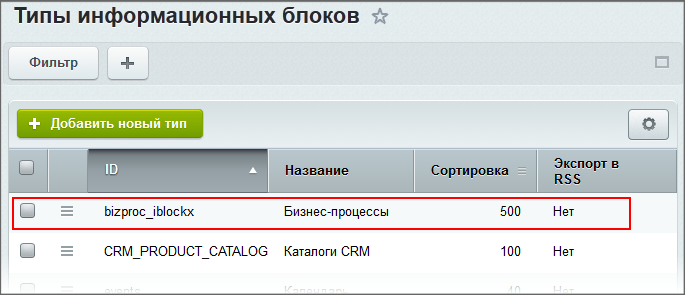
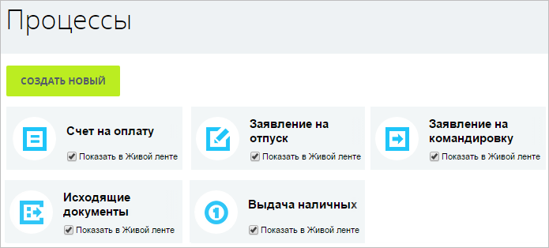

# Настройки для бизнес-процессов организации

**Навигация**
- [← Оглавление курса](index.md)
- [← Предыдущий: 23662 — Бизнес-процессы в CRM](lesson_23662.md)
- [Следующий: 2767 — Создание и редактирование бизнес-процесса организации →](lesson_2767.md)

Официальная страница урока: https://dev.1c-bitrix.ru/learning/course/index.php?COURSE_ID=57&LESSON_ID=2752

Для настройки и создания публичного интерфейса бизнес-процессов (БП) организации:

- В системе должен быть создан тип информационных блоков (например, **Бизнес-процессы**), инфоблоками которого будут бизнес-процессы организации:
  
- После того как создан необходимый тип инфоблоков, следует создать
  			новую страницу
                      
  		, разместить на ней комплексный компонент
  			Бизнес-процесс (**bitrix:bizproc.wizards**)
  Комплексный компонент служит для создания полноценного публичного интерфейса для работы с бизнес-процессами организации, позволяет создавать и изменять произвольные бизнес-процессы с помощью визуальных средств. Компонент стандартный и входит в дистрибутив модуля.
  						[Описание компонента «Бизнес-процесс (комплексный компонент)» в пользовательской документации.](http://dev.1c-bitrix.ru/user_help/detail.php?ID=232833)
  		 и в его настройках указать созданный тип инфоблоков.
  Данный компонент создает полноценный публичный интерфейс для работы с бизнес-процессами организации, позволяет создавать и изменять произвольные БП с помощью визуальных средств.
- В итоге в публичной части портала появится страница с БП организации.
  
  <!-- &lt;p&gt;&lt;div class="hint"&gt;&lt;b&gt;Обратите внимание,&lt;/b&gt; что создание новых шаблонов БП доступно только при наличии модуля &lt;a href="/learning/course/index.php?COURSE_ID=57&CHAPTER_ID=05058"&gt;Дизайнер бизнес-процессов&lt;/a&gt;, входящего в старшие редакции продукта &lt;a href="http://www.1c-bitrix.ru/products/intranet/editions/business.php" target="_blank" /&gt;Бизнес-процессы&lt;/a&gt; или &lt;a href="http://www.1c-bitrix.ru/products/intranet/editions/holding.php" target="_blank" /&gt;Холдинг&lt;/a&gt;.&lt;/div&gt;&lt;/p&gt; -->

**Примечание:**Работа с бизнес-процессами организации рассмотрена в статье на [helpdesk.bitrix24.ru](https://helpdesk.bitrix24.ru/open/6603593/)
