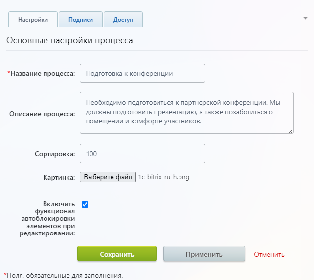
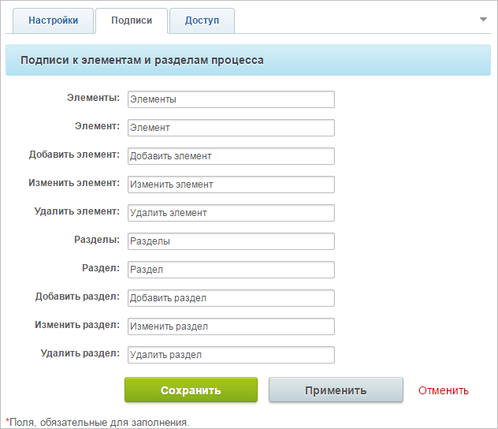
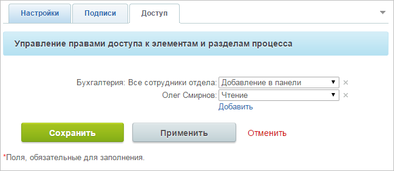
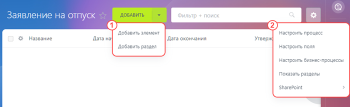

# Создание и редактирование бизнес-процесса организации

**Навигация**
- [← Оглавление курса](index.md)
- [← Предыдущий: 2752 — Настройки для бизнес-процессов организации](lesson_2752.md)
- [Следующий: 12385 — Дизайнер бизнес-процессов →](lesson_12385.md)

Официальная страница урока: https://dev.1c-bitrix.ru/learning/course/index.php?COURSE_ID=57&LESSON_ID=2767

Для создания нового бизнес-процесса ленты новостей нажмите на кнопку

			Создать новый

                    Кнопка доступна только при наличии прав доступа к типу
информационных блоков, содержащему [бизнес-процесс](lesson_2752.md#bizproc_wizards). По умолчанию кнопка доступна только
 Администратору системы.

		 и откроется форма создания нового бизнес-процесса.

- Вкладка Настройки содержит основные настройки БП.
  

  - Название процесса — название нового БП организации
  - Описание процесса — произвольное описание
  - Сортировка — индекс сортировки БП, определяющий его положение в общем списке. Чем он меньше, тем выше в списке будет располагаться БП
  - Картинка — изображение для БП
  - Включить функционал автоблокировки элементов при редактировании — если опция отмечена, то при редактировании элемента будет показано сообщение о том, что элемент заблокирован. Блокировка будет снята после сохранения изменений, либо же её можно снять вручную из меню действий
- Вкладка
  			Подписи
                       
  		 содержит подписи к элементам и разделам БП. Вы можете настраивать их для своего удобства и сделать их более подходящими содержанию вашего процесса.
- Во вкладке Управление правами доступа к элементам и разделам процесса вы можете
  			назначить права
                      Варианты прав доступа аналогичны таковым в настройках информационного блока (вкладка Доступ). Пояснения можно посмотреть в [пользовательской документации](https://dev.1c-bitrix.ru/user_help/content/iblock/iblock_edit.php).
  		 для работы с БП как для целых отделов и групп, так и персонально для отдельных пользователей.
  

Заполните все поля необходимым для вас образом и нажмите кнопку Сохранить. После сохранения ваш БП отразится в общем списке.

После того, как бизнес-процесс создан, можно его изменять и редактировать, щелкнув по нему в списке всех БП.

Здесь доступны два меню для работы с процессом и инструмент фильтрации и поиска.

Через меню 1 добавляйте новые элементы процесса или разделы для группировки элементов. **Добавить элемент** — запускает экземпляр этого процесса. По сути это действие идентично вызову бизнес-процесса из вкладки «Мои процессы».

В меню настроек 2:

- Настройки процесса — открывает форму редактирования процесса
- Настроить поля — открывает список полей процесса, где можно добавить новые поля или отредактировать существующие
- Настроить бизнес-процессы — переход к созданию/редактированию шаблонов бизнес-процесса с помощью [Дизайнера](/learning/course/index.php?COURSE_ID=57&CHAPTER_ID=05058)
- Показать/скрыть разделы — включает отображение разделов в списке элементов или скрывает их
- Экспорт в Excel — выполняет выгрузку списка в файл Excel
- SharePoint — об интеграции с MS Sharepoint рассказываем в статье на [helpdesk.bitrix24.ru](https://helpdesk.bitrix24.ru/open/5405517/)
