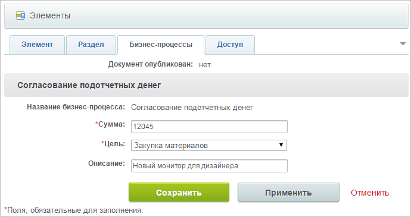

# Проверка работы

**Навигация**
- [← Оглавление курса](index.md)
- [← Предыдущий: 2793 — Создание шаблона бизнес-процесса. Часть 3.](lesson_2793.md)
- [Следующий: 6844 — Пример динамического назначения прав на документ →](lesson_6844.md)

Официальная страница урока: https://dev.1c-bitrix.ru/learning/course/index.php?COURSE_ID=57&LESSON_ID=2790

При создании элемента бизнес-процесса нужно настроить его параметры.

**Обратите внимание,** что параметр **Подотчетное лицо** не показывается. Параметр с кодом `TargetUser` устанавливается автоматически в значение, равное коду текущего пользователя.

После заполнения параметров и отправки формы запустится новый экземпляр БП (документ).

**Примечание**: Если по этому новому экземпляру БП для сотрудника, создавшего БП, сразу есть задание (т.е. он является одним из тех, кто осуществляет согласование на первом этапе), то он будет автоматически переправлен на страницу этого задания.

Далее экземпляр БП будет выполняться в соответствии с созданным БП:

- будут выставляться задания указанным пользователям;
- меняться статусы согласования подотчетных денег.

Конечным состоянием нашего экземпляра БП, которого он достигнет после выполнения определенного числа шагов, будет либо статус **Отклонено** (в случае отклонения заявки на одном из этапов согласования), либо статус **Завершено** (в случае одобрения заявки на обоих этапах согласования).

В случае изменения БП это изменение будет воздействовать только на вновь созданные экземпляры БП.
