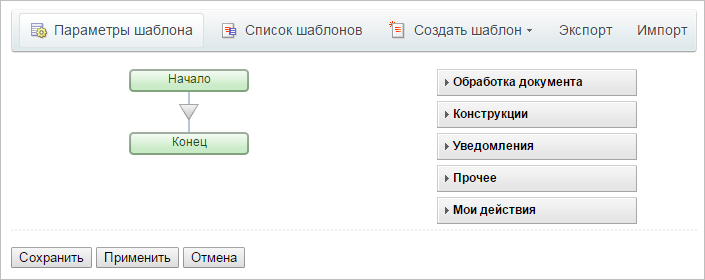
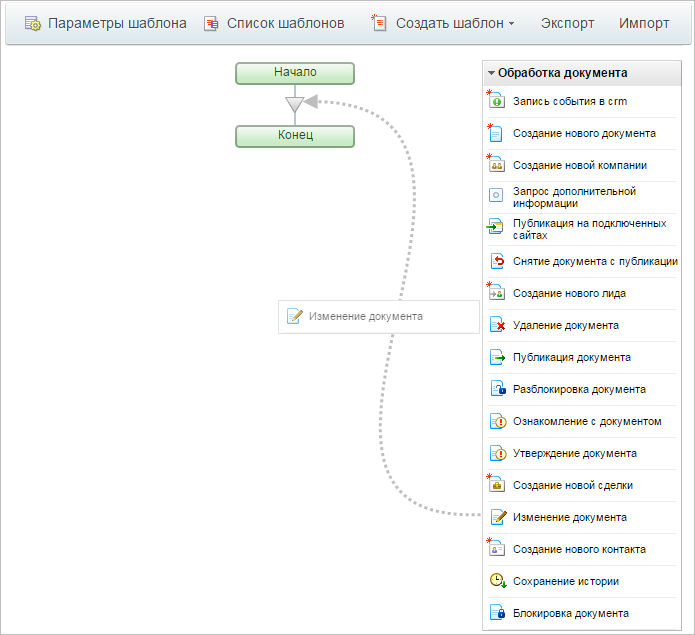
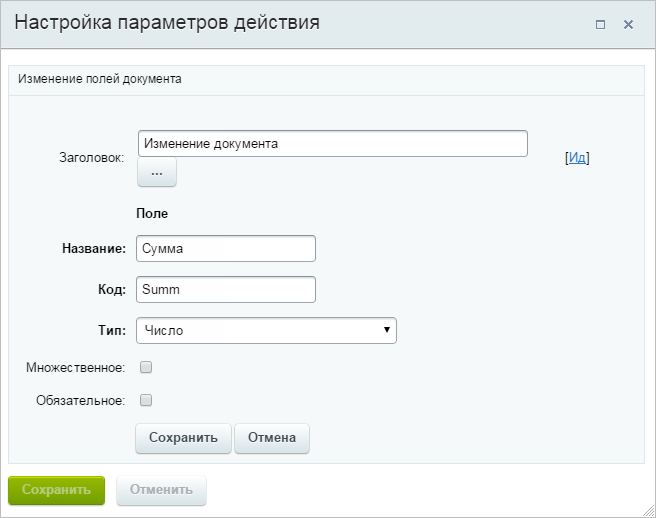
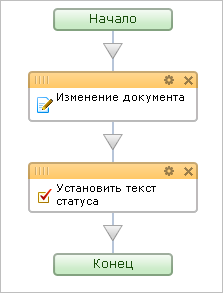

# Создание шаблона бизнес-процесса. Часть1.

**Навигация**
- [← Оглавление курса](index.md)
- [← Предыдущий: 2794 — Создание нового бизнес-процесса](lesson_2794.md)
- [Следующий: 2792 — Создание шаблона бизнес-процесса. Часть 2. →](lesson_2792.md)

Официальная страница урока: https://dev.1c-bitrix.ru/learning/course/index.php?COURSE_ID=57&LESSON_ID=2791

> **Шаблон БП** представляет собой последовательность шагов (действий) от начального к конечному, которые будут выполняться один за другим. Необходимо таким образом и в таком порядке составить шаги (действия), чтобы реализовать нужный нам алгоритм и получить необходимый результат.

**Примечание**: В данном типе документа, который используется компонентом "Бизнес-процесс", для каждого документа существует только один БП. Поэтому далее будем считать конкретный запущенный на выполнение экземпляр БП и документ эквивалентными терминами (за исключением того, что по завершении БП уничтожается, а документ сохраняется для истории).

- Сохраните в документе входящие параметры БП: сумму, цель и описание назначения подотчетных денег. Это необходимо для того, чтобы иметь возможность посмотреть и обработать эти параметры даже после завершения БП.
  Для сохранения параметров разместите в шаблоне БП действие **Изменение документа** (раздел
  **Обработка документа**). Это действие позволяет сохранить любую информацию в полях документа таким образом, что к ней всегда можно будет обратиться. Кроме того, это действие позволяет создавать для документа дополнительные поля.
  
- Настройте параметры действия (кнопка  в правом верхнем углу действия):

  - Измените название документа, которое выводится в списке документов. Допустим необходимо, чтобы документ назывался по шаблону: Подотчетное лицо, цель, сумма подотчетных денег. (Например: Иван Иванов, закупка оборудования, 3800).
    Для этого в окне настройки параметров действия выберите в выпадающем списке поле Название элемента и в качестве значения укажем строку `{=Template:TargetUser_printable}, {=Template:Purpose}, {=Template:Summ}`. Значения в фигурных скобках - это ссылки на значения входящих параметров БП. Они имеют вид `{=Template:КодВходящегоПараметра}`.
    Для вставки таких значений проще всего воспользоваться кнопкой   рядом с полем ввода. В открывшемся диалоге на закладке Параметры шаблона можно выбрать любой входящий параметр БП.
    **Примечание**: Обратите внимание, что для входящих параметров, содержащих коды пользователей, их реальные значения можно получить строкой `{=Template:КодПараметра}` (например, `user_1`), а их печатные значения - строкой `{=Template:КодПараметра_printable}` (например, Иван Иванов [1]).
  - Сохраните сразу в документ все входящие параметры БП. Для этого добавьте новое поле (ссылка Добавить условие). Выберите **Текст для предпросмотра** и в качестве значения укажите ссылку на входящий параметр БП **Описание**, т.е. строку `{=Template:Purpose_text}`. Для вставки этой строки нажмите на кнопку  рядом с полем ввода и в открывшемся диалоге на закладке **Параметры шаблона** выберите **Описание**.
  - Для сохранения параметра **Сумма** создайте новое поле (так как стандартного поля нет). Используйте ссылку Добавить поле и введите параметры нового поля. Задайте в качестве значения поля **Сумма** ссылку на входящий параметр БП **Сумма**, т.е. строку `{=Template:Summ}`.
    
- Сохраните параметры действия **Изменение документа**.
- Нажмите на кнопку **Применить** редактора БП. Теперь в случае возникновения каких-либо проблем не придется начинать конструировать БП с самого начала.

Вторым шагом выполнения БП задайте установку начального статуса БП. Этот статус выводится в списке документов и служит для указания, на каком этапе согласования подотчетных денег мы находимся.

- Установите статус с помощью действия **Установить текст статуса** из раздела **Уведомления**.
  
- Откройте диалог настройки параметров действия **Установить текст статуса** и укажите в качестве текста статуса значение **Согласование**.
