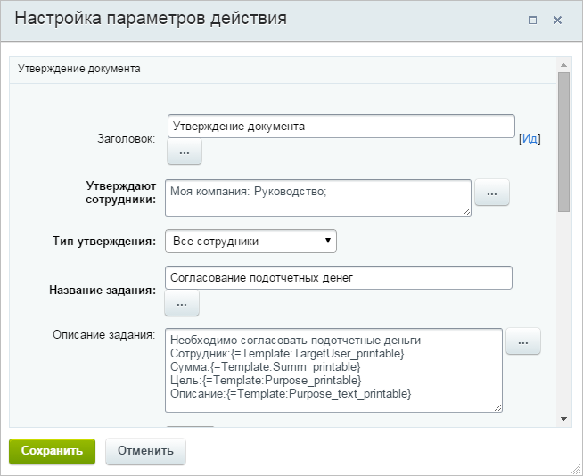
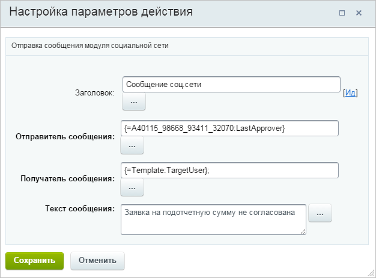
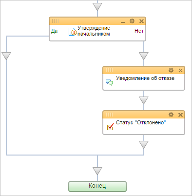

# Создание шаблона бизнес-процесса. Часть 2.

**Навигация**
- [← Оглавление курса](index.md)
- [← Предыдущий: 2791 — Создание шаблона бизнес-процесса. Часть1.](lesson_2791.md)
- [Следующий: 2793 — Создание шаблона бизнес-процесса. Часть 3. →](lesson_2793.md)

Официальная страница урока: https://dev.1c-bitrix.ru/learning/course/index.php?COURSE_ID=57&LESSON_ID=2792

Далее согласно алгоритму БП необходимо последовательно согласовать документ у двух руководителей.


- Для организации согласования перенесите действие **Утверждение документа** (раздел **Задания**) под действие **Установить текст статуса**.
- Откройте диалог настройки параметров действия и заполните необходимые поля:

  - в поле **Заголовок** запишете значение: Утверждение начальником отдела;
  - в поле **Утверждают сотрудники** выберите с помощью кнопки  пользователя или группу пользователей, которые первыми утверждают документ (например, группы **Администраторы** и **Руководство**);
  - в поле **Тип утверждения** выберите значение **Любой сотрудник** (любой сотрудник из указанных может утвердить документ);
  - в поле **Название задания** введите строку `Согласование подотчетных денег для {=Template:TargetUser_printable}, {=Template:Purpose}` (значения в фигурных скобках могут быть выбраны с помощью кнопки );
  - в поле Описание задания введите текст:
    ```
    Необходимо согласовать подотчетные деньги
    Сотрудник: {=Template:TargetUser_printable}
    Сумма: {=Template:Summ}
    Цель: {=Template:Purpose}
    Описание:
    {=Template:Purpose_text};
    ```
  - в поле **Устанавливать текст статуса** - значение Да;
  - в поле **Текст статуса** измените значение на: этап 1;
  - в поле **Период утверждения** введите значение **5** и выберите в выпадающем списке значение **дней** (в этом случае если в течение 5 дней документ не будет согласован, то он будет автоматически отвергнут).
    
- Сохраните внесенные изменения.


В момент обработки реальной заявки, когда конкретный экземпляр БП дойдет до шага Утверждение начальником отдела, будет сделано следующее:


- пользователям, указанным в действии **Утверждение начальником отдела**, будет выставлено задание утвердить или отклонить заявку;
- данный экземпляр БП будет поставлен в ожидание (приостановлен), пока кто-либо из указанных пользователей не выполнит задание (утвердит или отклонит заявку);
- после выполнения задания исполнение экземпляра БП будет продолжено в соответствии с алгоритмом БП.


В случае, если первый этап согласования не будет пройден (т.е. документ будет отвергнут), выполнение БП пойдет по ветке, обозначенной словом **Нет.**


- Разместите в этой ветке действие **Сообщение соц.сети** с сообщением для подотчетного лица об отклонении.

  - При заполнении поля **Отправитель сообщения** нажмите на кнопку   рядом с полем ввода и на закладке **Дополнительные результаты** открывшегося диалогового окна выберем подпункт **Последний голосовавший** пункта **Утверждение начальником отдела**. Таким образом сообщение будет отправлено от имени того пользователя, который отклонил согласование подотчетных денег.
  - В качестве получателя сообщения укажите подотчетное лицо, т.е. значение `{=Template:TargetUser}`.
    
- Установите в этой ветке текущий статус БП с помощью действия **Установить текст статуса** в значение **Отклонено**.
  
- Нажмите на кнопку **Применить** редактора БП. Теперь в случае возникновения каких-либо проблем нам не придется начинать конструировать БП с самого начала.


Если первый этап согласования будет успешно пройден, выполнение БП пойдет по ветке, обозначенной словом **Да**.


- Разместите в этой ветке действие **Утверждение документа** для второго этапа согласования.
- Настройте параметры действия аналогично первому этапу согласования с учетом того, что это – второй этап. В частности утверждать может уже другая группа пользователей или конкретный пользователь, скажем Главный бухгалтер.
- В ветке Нет второго этапа согласования разместите действие **Сообщение соц.сети** с сообщением для подотчетного лица об отклонении. Кроме того установим в этой ветке текущий статус БП с помощью действия **Установить текст статуса** в значение **Отклонено**.


Если выполнение БП пойдет по ветке Да второго этапа согласования, то это означает, что подотчетные деньги согласованы у обоих руководителей. В этом случае можно оформлять их в бухгалтерии.
