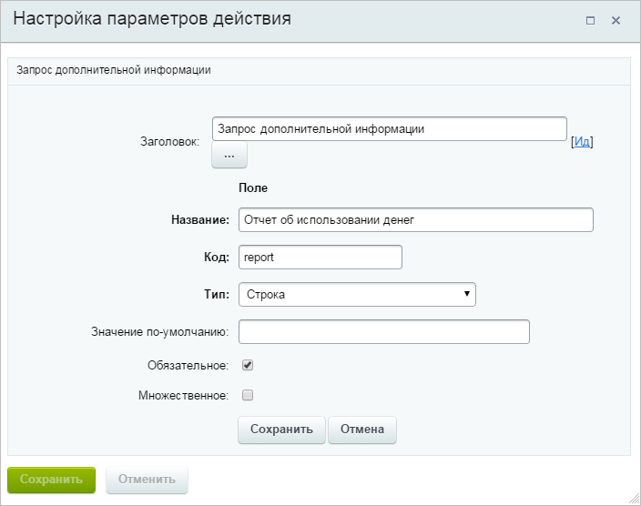
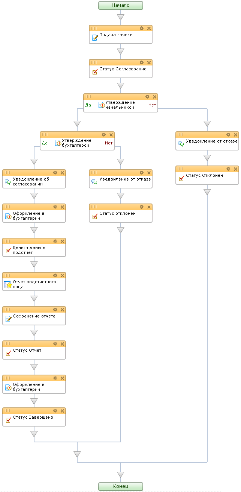

# Создание шаблона бизнес-процесса. Часть 3.

**Навигация**
- [← Оглавление курса](index.md)
- [← Предыдущий: 2792 — Создание шаблона бизнес-процесса. Часть 2.](lesson_2792.md)
- [Следующий: 2790 — Проверка работы →](lesson_2790.md)

Официальная страница урока: https://dev.1c-bitrix.ru/learning/course/index.php?COURSE_ID=57&LESSON_ID=2793

Обработка заявки в бухгалтерии.


- Разместим в ветке **Да** второго этапа согласования действие **Сообщение соц.сети** с сообщением для подотчетного лица об согласовании подотчетных денег.
- Установите текущий статус БП с помощью действия **Установить текст статуса** в значение **Согласовано**.


Далее согласно алгоритму нашего БП необходимо оформить заявку в бухгалтерии.


- Добавьте действие **Ознакомление с документом** из раздела **Задания**.
- Откройте свойства действия Ознакомление с документом и заполните необходимые поля:

  - в поле **Заголовок** запишите значение **Оформление в бухгалтерии**;
  - в поле **Ознакомить пользователей** выберите с помощью кнопки  пользователя или группу пользователей, которые являются бухгалтерами (например, группы Администраторы и Бухгалтерия);
  - в поле **Название задания** введите строку: `Оформление подотчетных денег для {=Template:TargetUser_printable}, {=Template:Purpose}`;
  - в поле **Описание задания** введите текст:
    ```
    Необходимо оформить согласованные подотчетные деньги
    Сотрудник: {=Template:TargetUser_printable}
    Сумма: {=Template:Summ}
    Цель: {=Template:Purpose}
    Описание:
    {=Template:Purpose_text}
    ```
  - в поле **Должны ознакомится** выберите значение **Любой сотрудник**;
  - в поле **Устанавливать текст статуса** выберите значение **Нет**;
  - в поле **Текст кнопки в задании** введите значение **Подотчетные деньги оформлены**;
  - в поле **Период утверждения** значение оставьте незаполненным (т.е. БП будет дожидаться ознакомления бесконечно долго).
- Установите текущий статус БП в значение **Деньги даны в подотчет** (действие **Установить текст статуса**).
- Нажмите на кнопку **Применить** редактора БП. Теперь в случае возникновения каких-либо проблем нам не придется начинать конструировать БП с самого начала.


Далее, согласно алгоритму нашего БП, необходимо запросить отчет у подотчетного лица.


- Используйте действие **Запрос дополнительной информации** (раздел **Задания**).
- Откройте параметры действия и заполните необходимые поля:

  - в поле **Заголовок** запишите значение **Отчет подотчетного лица**;
  - в поле **Заполняют сотрудники** выберите с помощью кнопки  подотчетное лицо из входящих параметров БП (`{=Template:TargetUser}`);
  - в поле **Название** задания введите строку `Отчет по подотчетным деньгам, {=Template:Purpose}`;
  - в поле Описание задания введите текст:
    ```
    Необходимо отчитаться по подотчетным деньгам
    Сумма: {=Template:Summ}
    Цель: {=Template:Purpose}
    Описание:
    {=Template:Purpose_text}.
    ```
  - Затем с помощью ссылки Добавить поле.. необходимо добавить поле, в которое подотчетное лицо введет отчет об использовании денег.
    
- Сохраните внесенные изменения.


Следующим шагом сохраним отчет подотчетного лица в документе.


- Воспользуйтесь действием **Изменение документа**.
- В окне настройки параметров действия выберите в выпадающем списке поле **Текст для просмотра** и в качестве значения укажите строку `{=Variable:report}`. Значение в фигурных скобках - это ссылка на переменную БП, которая устанавливается действием **Отчет подотчетного лица**.
- Сохраните внесенные изменения.
- Установите текущий статус БП в значение **Отчет** (действие **Установить текст статуса**).


Далее обеспечим возможность бухгалтерии ознакомиться с отчетом подотчетного лица.


- Добавьте действие **Ознакомление с документом**.
- Откройте свойства действия Ознакомление с документом и заполните необходимые поля:

  - в поле **Заголовок** запишем значение **Оформление в бухгалтерии**;
  - в поле **Ознакомить пользователей** выберем с помощью кнопки  пользователя или группу пользователей, которые являются бухгалтерами (например, группы Администраторы и Бухгалтерия);
  - в поле **Название задания** введем строку `Отчет подотчетного лица {=Template:TargetUser_printable}, {=Template:Purpose}`;
  - в поле Описание задания введем текст:
    ```
    "Отчет по подотчетным деньгам
    Сотрудник: {=Template:TargetUser_printable}
    Сумма: {=Template:Summ}
    Цель: {=Template:Purpose}
    Описание:
    {=Template:Purpose_text}
    Отчет:
    {=Document:DETAIL_TEXT}";
    ```
  - в поле **Должны ознакомиться** выберем значение **Любой сотрудник**;
  - в поле **Устанавливать текст статуса** выберем значение **Нет**;
  - в поле **Текст кнопки** в задании введем значение **Оформлено**;
  - в поле **Период утверждения** значение оставим незаполненным.
- Установите текущий статус БП в значение **Завершено**.


Получили готовый шаблон БП



