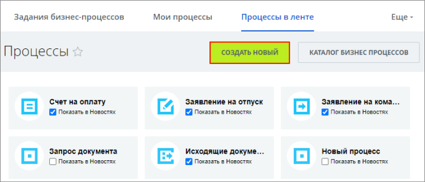
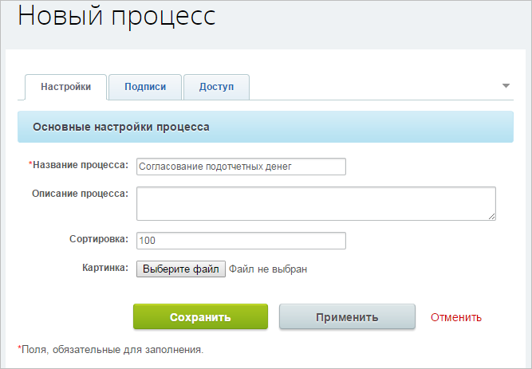
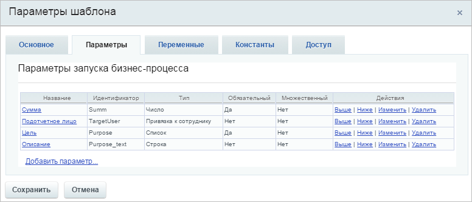

# Создание нового бизнес-процесса

**Навигация**
- [← Оглавление курса](index.md)
- [← Предыдущий: 3140 — Пример работы с бизнес-процессами](lesson_3140.md)
- [Следующий: 2791 — Создание шаблона бизнес-процесса. Часть1. →](lesson_2791.md)

Официальная страница урока: https://dev.1c-bitrix.ru/learning/course/index.php?COURSE_ID=57&LESSON_ID=2794

### Постановка задачи

Рассмотрим процедуру создания БП на примере алгоритма согласования подотчетных денег. С использованием компонента **Бизнес-процесс**. Создание БП с использованием других механизмов будет частично выглядеть иначе. Пусть в нашей условной организации согласование подотчетных денег осуществляется следующим образом:

1. Составляется заявка на выдачу подотчетных денег;
2. Заявка согласуется с руководителем (или несколькими руководителями). Пусть согласование производится по очереди с двумя заранее известными руководителями;
3. Оформление заявки в бухгалтерии;
4. Выдача денег;
5. Предоставление отчета;
6. Проверка отчета в бухгалтерии.

Пусть при этом подать заявление на подотчетные деньги может любой сотрудник, а видеть все заявления может только руководство.

### Создание бизнес-процесса

Для создания нового БП нажмите на кнопку **Создать новый** на странице Бизнес-процессы &gt; Процессы в ленте:

И заполните форму создания нового БП:

После сохранения БП автоматически запускается редактор БП и открывается окно основных настроек БП.

В основных параметрах БП на закладке **Параметры** с помощью команды Добавить параметр задайте входящие параметры БП: подотчетное лицо, сумма, цель и описание подотчетных денег. Эти параметры должно будет заполнить подотчетное лицо при оформлении заявки (т.е. при запуске экземпляра БП). Приведем ключевые значения полей формы, остальные поля заполните по собственным потребностям:

- **Подотчетное лицо**: идентификатор – `TargetUser`, тип – **Привязка к сотруднику**.
  **Примечание**: Создание этого параметра с таким идентификатором нужно для одной единственной цели: правильного отображения имени пользователя создавшего заявку. Технически БП будет работать и без этого параметра.
  В отличие от других параметров использование другого типа идентификатора невозможно, параметр не будет выполнять своей роли.
- **Сумма**: идентификатор – `Summ`, тип – **Число**, обязательный.
- **Цель**: идентификатор – `Purpose`, тип – **Список**, обязательный, заполнить поле Варианты значений (закупка материалов, представительские расходы и так далее).
- **Описание**: идентификатор – `Purpose_text`, тип – **Текст**.

В итоге имеем:

Зададим на закладке **Доступ** права на доступ к БП (Для выбора групп пользователей можно воспользоваться кнопкой  рядом с полем ввода):

- любой сотрудник может запустить экземпляр БП (т.е. подать заявление на подотчетные деньги), а так же может видеть свои заявки (группа **Автор**);
- администраторы могут видеть все экземпляры БП и могут управлять ими (группа **Администраторы**);
- руководство может видеть все экземпляры БП (группа **Руководство**).

После сохранения основных параметров запуска можно начинать создание шаблона БП.
