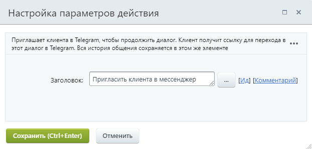

# Пригласить клиента в мессенджер

**Навигация**
- [← Оглавление курса](index.md)
- [← Предыдущий: 23586 — Получить информацию об элементе CRM](lesson_23586.md)
- [Следующий: 20770 — Поставить паузу →](lesson_20770.md)

Официальная страница урока: https://dev.1c-bitrix.ru/learning/course/index.php?COURSE_ID=57&LESSON_ID=28606

Действие приглашает клиента в Telegram, чтобы продолжить диалог.

У действия нет параметров.

Клиент получит ссылку для перехода в этот диалог в мессенджере Telegram. Вся история общения сохраняется в этом же элементе.

Действие (робот) автоматически выберет первую в списке Открытую линию, где подключен Бот Telegram, и начнёт новый диалог.

#### Дополнительно

- [Как подключить Telegram к Открытой линии](https://helpdesk.bitrix24.ru/open/18114500)
