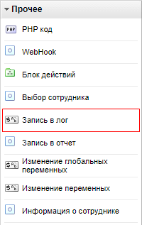
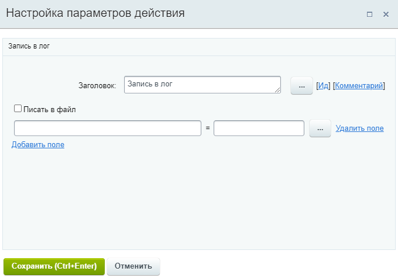
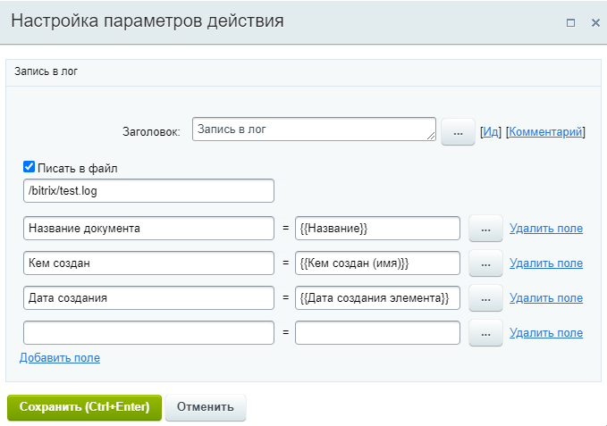
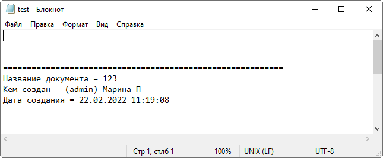
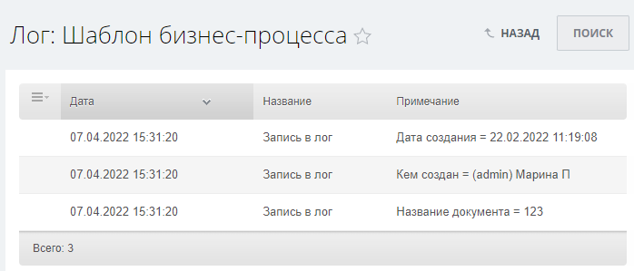

# Пример создания действия Запись в лог

**Навигация**
- [← Оглавление курса](index.md)
- [← Предыдущий: 23034 — Общий алгоритм](lesson_23034.md)
- [Следующий: 2904 — Пример создания действия Создать задачу →](lesson_2904.md)

Официальная страница урока: https://dev.1c-bitrix.ru/learning/course/index.php?COURSE_ID=57&LESSON_ID=2903

Создадим действие, которое будет писать указанные в действии данные в лог бизнес-процесса или текстовый файл. Действие назовем **Запись в лог**. Название активити в структуре – **write2logactivity**.


### Структура файлов


Создайте структуру файлов будущего **Activity**. Папка с Activity должна быть расположена в `/bitrix/activities/custom/`. Название папки с действием должно совпадать с именем файла, в котором находится класс с Activity, в данном случае папка должна называться `/write2logactivity`.


Структура в общем виде подобна структуре компонентов:


- **.description.php** – описание будущего действия;
- **properties_dialog.php** – форма настроек действия;
- **write2logactivity.php** – код действия;
- **icon.gif** – иконка, которая будет отображать действие в общем списке действий дизайнера БП;
- `/lang/` – содержит папки с языковыми сообщениями. Папки должны называться в соответствии с идентификаторами языков. Например, ru, en. В каждой папке содержатся файлы с фразами, одноименные соответствующим файлам действия из основной папки:

  - `/ru/`

    - **.description.php** – языковые сообщения описывающие действие (например, название действия);
    - **properties_dialog.php** – языковые сообщения для формы настроек действия;
    - **write2logactivity.php** – языковые сообщения, выводимые кодом действия (например, вывод ошибок).


Файлы активити, описанного в этом уроке, можно скачать в архиве: [write2logactivity.zip](/images/dev_full/biz_proc/write2logactivity.zip).


### Описание действия


Задайте описание будущего действия в файле **.description.php**:


```
<?
if (!defined("B_PROLOG_INCLUDED") || B_PROLOG_INCLUDED!==true) die();

$arActivityDescription = array(
	"NAME" => GetMessage("BPDDA_DESCR_NAME"),
	"DESCRIPTION" => GetMessage("BPDDA_DESCR_DESCR"),
	"TYPE" => "activity",  // Тип – действие
	"CLASS" => "Write2LogActivity", // Класс с Activity
	"JSCLASS" => "BizProcActivity",  // Стандартная JS библиотека, которая будет рисовать Activity
	"CATEGORY" => array(
		"ID" => "other", // Activity будет располагаться в категории "Прочее"
	),
);
?>
```


В визуальном редакторе получаем иконку своего действия в категории Прочее:





### Форма настроек действия


Запрограммируйте форму настроек действия и логику её работы в файле **properties_dialog.php**:


```
<?
if (!defined("B_PROLOG_INCLUDED") || B_PROLOG_INCLUDED!==true)die();

?>
<script>
var b_log_counter = -1;
function AddCondition(field, val)
{
	var addrowTable = document.getElementById('bwfvc_addrow_table1');

	b_log_counter++;
	var newRow = addrowTable.insertRow(-1);

	newRow.id = "delete_row_log_" + b_log_counter;

	var newCell = newRow.insertCell(-1);
	var newSelect = document.createElement("input");
		newSelect.type = 'text';
		newCell.align="left";
		newSelect.size = '40';
	newSelect.setAttribute('b_log_counter', b_log_counter);

	newSelect.id = "id_var_name_" + b_log_counter;
	newSelect.name = "fields[var_value_" + b_log_counter + "]";
	var i = -1;
	var i1 = -1;

	newSelect.value = BWFVCUnHtmlSpecialChars(field);
	newCell.appendChild(newSelect);

	var newCell = newRow.insertCell(-1);
	newCell.innerHTML = "=";

	var newCell = newRow.insertCell(-1);
	newCell.id = "id_row_value_" + b_log_counter;
		newCell.align="right";
		newCell.innerHTML = '<input size="30" type="text" id="id_var_value_' + b_log_counter + '" name="values[var_value_' + b_log_counter + ']" value="' + val + '">';

		var newCell = newRow.insertCell(-1);
		newCell.id = "id_dialog_" + b_log_counter;

		newCell.innerHTML = '<input type="button" value="..." onclick="BPAShowSelector(\'id_var_value_'+b_log_counter+'\', \'string\');">';

		var newCell = newRow.insertCell(-1);
	newCell.align="right";
	newCell.innerHTML = '<a href="#" onclick="BWFVCDeleteCondition(' + b_log_counter + '); return false;">Удалить поле</a>';

}

function BWFVCUnHtmlSpecialChars(string, quote)
{
	string = string.toString();

	if (quote)
		string = string.replace(/'/g, "'");
		string = string.replace(/"/g, "\"");
		string = string.replace(/>/g, ">");
		string = string.replace(/</g, "<");
		string = string.replace(/&/g, '&');
	return string;
}
function BWFVCDeleteCondition(ind)
{
	var addrowTable = document.getElementById('bwfvc_addrow_table1');

	var cnt = addrowTable.rows.length;
	for (i = 0; i < cnt; i++)
	{
		if (addrowTable.rows[i].id != 'delete_row_log_' + ind)
			continue;
			addrowTable.deleteRow(i);
			break;
	}
		// if (addrowTable.rows.length <= 0)
		//    addrowTable.style.display = 'none';
}
function Write2File()
{
	var f_table = document.getElementById('write2filetable');
	if (f_table.rows.length <= 0)
	{
		var newRow = f_table.insertRow(-1);
		var newCell = newRow.insertCell(-1);
		//newCell.align="right";
		//newCell.style.padding.left = '100px';
		newCell.innerHTML = '<input size="40" type="text" id="path2file" name="path2file" value="<?= ($arCurrentValues["path2file"])? $arCurrentValues["path2file"]: "/bitrix/test.log"?>">';
    }
	else
		f_table.deleteRow("-1");
}
</script>

<tr id="write_file_form" style="display:line">
	<td colspan="2">
		<input type="checkbox" id="write2file" name="write2file" onchange="Write2File();"><?= GetMessage("WRITE_2_LOG");?>
		<table width="100%" border="0" cellpadding="2" cellspacing="2" id="write2filetable">
		</table>
	</td>
</tr>

<tr id="pd_list" style="display:line">
	<td colspan="2">
		<table width="100%" border="0" cellpadding="2" cellspacing="2" id="bwfvc_addrow_table1">
		</table>
		<a href="#" onclick="AddCondition('', ''); return false;"><?= GetMessage("ADD_CONDITION");?></a>
	</td>
</tr>
<script>
<?
foreach ($arCurrentValues["MapFields"] as $fieldKey => $documentFieldValue)
{
	?>
	AddCondition('<?= CUtil::JSEscape($fieldKey) ?>', '<?= CUtil::JSEscape($documentFieldValue) ?>');
	<?
}
if (count($arCurrentValues) <= 0)
{
	?>AddCondition("", "");<?
}
?>
var check = '<?= $arCurrentValues["write2file"];?>';
if (check == "Y")
{
	document.getElementById("write2file").checked = "checked";
	Write2File();
}
</script>
```


В результате при открытии формы настроек действия получим:





Если опция **Писать в файл** отключена – данные запишутся в лог бизнес-процесса. При включении опции появится дополнительное поле для указания пути к файлу. В этот файл и запишутся логи. По умолчанию это /bitrix/test.log.


Далее в форме указываются поля для записи в лог. В левом поле вручную вносится название записи, а в правой – значение, для которого доступна подстановка через форму Вставка значения. Кнопка **Добавить поле** добавляет новую строку, а **Удалить поле** – удаляет строку.


### Основной код


Задайте код работы действия в файле **write2logactivity.php**.


```
<?
if (!defined("B_PROLOG_INCLUDED") || B_PROLOG_INCLUDED!==true)die();

class CBPWrite2LogActivity
	extends CBPActivity
{
	public function __construct($name)
	{
		parent::__construct($name);
		$this->arProperties = array(
			"Title" => "",
			"MapFields" => null,
			"write2file" => null,
			"path2file"=> null
		);
	}

	public function Execute()
	{
		if (is_array($this->MapFields) && count($this->MapFields))
		{
			$printVal = $this->__get("MapFields");
			$bFirst = true;

			foreach($printVal as $key => $val)
			{
				if ($this->write2file == "Y")
				{

					$f = fopen ($_SERVER["DOCUMENT_ROOT"].$this->path2file, "a+");
					if ($bFirst)
					fwrite ($f, print_r ("\n\n\n===========================================================\n",true));
					fwrite ($f, print_r ($key." = ".$val."\n",true));
					fclose($f);
					$bFirst = false;
				}
				else
					$this->WriteToTrackingService($key." = ".$val);
			}
		}
		return CBPActivityExecutionStatus::Closed;
    }

    public static function GetPropertiesDialog($documentType, $activityName, $arWorkflowTemplate, $arWorkflowParameters, $arWorkflowVariables, $arCurrentValues = null, $formName = "")
    {
		$runtime = CBPRuntime::GetRuntime();

		if (!is_array($arCurrentValues))
		{
			$arCurrentValues = array();

			$arCurrentActivity = &CBPWorkflowTemplateLoader::FindActivityByName($arWorkflowTemplate, $activityName);

			if (is_array($arCurrentActivity["Properties"])
			&& array_key_exists("MapFields", $arCurrentActivity["Properties"])
			&& is_array($arCurrentActivity["Properties"]["MapFields"]))
			{
				foreach ($arCurrentActivity["Properties"]["MapFields"] as $k => $v)
				{
					$arCurrentValues["MapFields"][$k] = $v;
				}
				$arCurrentValues["write2file"] = $arCurrentActivity["Properties"]["write2file"];
				$arCurrentValues["path2file"] = $arCurrentActivity["Properties"]["path2file"];
			}
		}

		$runtime = CBPRuntime::GetRuntime();
		return $runtime->ExecuteResourceFile(
			__FILE__,
			"properties_dialog.php",
			array(
				"arCurrentValues" => $arCurrentValues,
				"formName" => $formName,
			)
		);
    }

    public static function GetPropertiesDialogValues($documentType, $activityName, &$arWorkflowTemplate, &$arWorkflowParameters, &$arWorkflowVariables, $arCurrentValues, &$arErrors)
    {
		$runtime = CBPRuntime::GetRuntime();
		$arProperties = array("MapFields" => array());

		if (is_array($arCurrentValues) && count($arCurrentValues)>0)
		{
			if  (is_array($arCurrentValues["fields"]) && count($arCurrentValues["fields"]) > 0
			&& is_array($arCurrentValues["values"]) && count($arCurrentValues["values"]) > 0)
			{
				foreach($arCurrentValues["fields"] as $key => $value)
				if (strlen($value) > 0 && strlen($arCurrentValues["values"][$key]) > 0)
				$arProperties["MapFields"][$value] = $arCurrentValues["values"][$key];
			}
			$arProperties ["write2file"] = $arCurrentValues["write2file"] == "Y" ? "Y" : "N";
			$arProperties ["path2file"] = $arCurrentValues["path2file"];
		}

		$arCurrentActivity = &CBPWorkflowTemplateLoader::FindActivityByName($arWorkflowTemplate, $activityName);
		$arCurrentActivity["Properties"] = $arProperties;

		return true;
	}

    public static function ValidateProperties($arTestProperties = array(), CBPWorkflowTemplateUser $user = null)
	{
		$arErrors = array();
		$path = "";
		if ($arTestProperties["path2file"])
		{
			$path = $_SERVER["DOCUMENT_ROOT"].$arTestProperties["path2file"];
			if (!file_exists($path) && !is_writable(GetDirPath($path)))
			$arErrors[] = array("code" => "DirNotWritable", "parameter" => "path2file", "message" => GetMessage("DIR_NOT_WRITABLE"));
			if (file_exists($path) && !!is_writable(GetDirPath($path)))
			$arErrors[] = array("code" => "FileNotWritable", "parameter" => "path2file", "message" => GetMessage("FILE_NOT_WRITABLE"));
		}

		return array_merge($arErrors, parent::ValidateProperties($arTestProperties, $user));
	}
}
```


Разъясним чуть подробнее отдельные части этого кода, на которые надо обратить внимание разработчикам.


- Зададим заголовок класса и конструктор. В конструкторе определяются параметры действия:
  ```
  class CBPWrite2LogActivity
  	extends CBPActivity
  {
  	public function __construct($name)
  	{
  		parent::__construct($name);
  		$this->arProperties = array(
  			"Title" => "",
  			"MapFields" => null,
  			"write2file" => null,
  			"path2file"=> null
  		);
  	}
  ```
- Выводим диалог настройки параметров действия. Если параметры уже были заданы, то они инициализируются:
  ```
      public static function GetPropertiesDialog($documentType, $activityName, $arWorkflowTemplate, $arWorkflowParameters, $arWorkflowVariables, $arCurrentValues = null, $formName = "")
      {
  		$runtime = CBPRuntime::GetRuntime();
  		if (!is_array($arCurrentValues))
  		{
  			$arCurrentValues = array();
  			$arCurrentActivity = &CBPWorkflowTemplateLoader::FindActivityByName($arWorkflowTemplate, $activityName);
  			if (is_array($arCurrentActivity["Properties"])
  			&& array_key_exists("MapFields", $arCurrentActivity["Properties"])
  			&& is_array($arCurrentActivity["Properties"]["MapFields"]))
  			{
  				foreach ($arCurrentActivity["Properties"]["MapFields"] as $k => $v)
  				{
  					$arCurrentValues["MapFields"][$k] = $v;
  				}
  				$arCurrentValues["write2file"] = $arCurrentActivity["Properties"]["write2file"];
  				$arCurrentValues["path2file"] = $arCurrentActivity["Properties"]["path2file"];
  			}
  		}
  		$runtime = CBPRuntime::GetRuntime();
  		return $runtime->ExecuteResourceFile(
  			__FILE__,
  			"properties_dialog.php",
  			array(
  				"arCurrentValues" => $arCurrentValues,
  				"formName" => $formName,
  			)
  		);
      }
  ```
- Сохранение настроек, сделанных в диалоге настройки действия:
  ```
      public static function GetPropertiesDialogValues($documentType, $activityName, &$arWorkflowTemplate, &$arWorkflowParameters, &$arWorkflowVariables, $arCurrentValues, &$arErrors)
      {
  		$runtime = CBPRuntime::GetRuntime();
  		$arProperties = array("MapFields" => array());
  		if (is_array($arCurrentValues) && count($arCurrentValues)>0)
  		{
  			if  (is_array($arCurrentValues["fields"]) && count($arCurrentValues["fields"]) > 0
  			&& is_array($arCurrentValues["values"]) && count($arCurrentValues["values"]) > 0)
  			{
  				foreach($arCurrentValues["fields"] as $key => $value)
  				if (strlen($value) > 0 && strlen($arCurrentValues["values"][$key]) > 0)
  				$arProperties["MapFields"][$value] = $arCurrentValues["values"][$key];
  			}
  			$arProperties ["write2file"] = $arCurrentValues["write2file"] == "Y" ? "Y" : "N";
  			$arProperties ["path2file"] = $arCurrentValues["path2file"];
  		}
  		$arCurrentActivity = &CBPWorkflowTemplateLoader::FindActivityByName($arWorkflowTemplate, $activityName);
  		$arCurrentActivity["Properties"] = $arProperties;
  		return true;
  	}
  ```
- Проверка параметров действия:
  ```
      public static function ValidateProperties($arTestProperties = array(), CBPWorkflowTemplateUser $user = null)
  	{
  		$arErrors = array();
  		$path = "";
  		if ($arTestProperties["path2file"])
  		{
  			$path = $_SERVER["DOCUMENT_ROOT"].$arTestProperties["path2file"];
  			if (!file_exists($path) && !is_writable(GetDirPath($path)))
  			$arErrors[] = array("code" => "DirNotWritable", "parameter" => "path2file", "message" => GetMessage("DIR_NOT_WRITABLE"));
  			if (file_exists($path) && !!is_writable(GetDirPath($path)))
  			$arErrors[] = array("code" => "FileNotWritable", "parameter" => "path2file", "message" => GetMessage("FILE_NOT_WRITABLE"));
  		}
  		return array_merge($arErrors, parent::ValidateProperties($arTestProperties, $user));
  	}
  }
  ```


### Языковые сообщения


Осталось прописать языковые сообщения, которые отобразятся в публичной части. Переходим в папку `/lang/ru` и заполняем файлы:


- Файл **.description.php**:
  ```
  <?
  $MESS ['BPDDA_DESCR_DESCR'] = "Запись в лог";
  $MESS ['BPDDA_DESCR_NAME'] = "Запись в лог";
  ?>
  ```
- Файл **properties_dialog.php**:
  ```
  <?
  $MESS ['WRITE_2_LOG'] = "Писать в файл";
  $MESS ['ADD_CONDITION'] = "Добавить поле";
  ?>
  ```
- Файл **write2logactivity.php**:
  ```
  <?
  $MESS ['DIR_NOT_WRITABLE'] = "Папка, в которую сохраняется файл, не доступна для записи";
  $MESS ['FILE_NOT_WRITABLE'] = "Файл недоступен для записи";
  ?>
  ```


### Результаты


Заполненная форма действия может выглядеть так:





При включенной опции **Писать в файл**, лог будет записан в указанный файл. Если указанный файл не существует – он будет создан. Пример записанного лога в файле:





При отключенной опции **Писать файл**, вывод мы получим в [логе](lesson_3837.md) бизнес-процесса:



