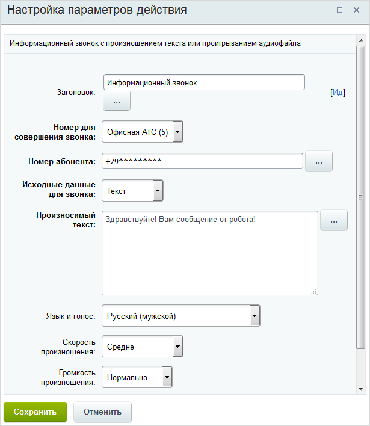

# Совершить звонок

**Навигация**
- [← Оглавление курса](index.md)
- [← Предыдущий: 5796 — Событие календаря](lesson_5796.md)
- [Следующий: 3804 — Сообщение соц.сети →](lesson_3804.md)

Официальная страница урока: https://dev.1c-bitrix.ru/learning/course/index.php?COURSE_ID=57&LESSON_ID=3032

Действие позволяет совершить информационный звонок на указанный номер с произношением текста или проигрыванием аудиофайла.

**Внимание**!

1. Действие работает только при работающей
  			телефонии
                      Сервис Битрикс24 даёт возможность использовать телефонию для решения производственных задач. Телефония в Битрикс24 реализована с помощью технологии WebRTC позволяющей совершать/принимать звонки прямо из браузера.
  Подробнее в курсе [Администратор сервиса Битрикс24 (коробочная версия)](https://dev.1c-bitrix.ru/learning/course/index.php?COURSE_ID=48&CHAPTER_ID=02699)
  		.
2. Существует ограничение на 10 неудачных попыток инфозвонка. По достижению этого числа номер, на который он выполнялся, блокируется на постоянной основе, статус по звонку перестает передаваться. В бизнес-процессе это выглядит, как зависание на стадии "Ожидает результата обзвона". Необходимо избегать зацикливаний инфозвонков в рамках бизнес-процесса.

#### Описание параметров

- **Номер абонента** – указывается конкретный номер или строковое поле в документе, в котором указан номер телефона.
- **Ожидать результата** – Приостановить или нет действие Бизнес-процесса пока не будет завершено выполнение информационного звонка.

Смысл большинства полей ясен из их названия, поэтому их описание будет пропущено.

#### Результаты выполнения действия

Результаты выполнения этого действия можно использовать в других действиях с помощью формы **Вставка значения**. Они будут доступны сразу после добавления действия в шаблон в секции **Дополнительные результаты**.

Доступные результаты:

- Результат звонка
                      Результат звонка может принимать одно из двух значений: **Y** если успешно и **N** если не успешно.
  		;
- Результат звонка (текст)
                      Результатом звонка в виде текста является описание результата и его код, вида:
  Успешно (200).
  		;
- Код завершения звонка.

#### Документация

- [Справочник кодов и типов](https://dev.1c-bitrix.ru/api_help/telephony/codes_and_types.php) для телефонии
