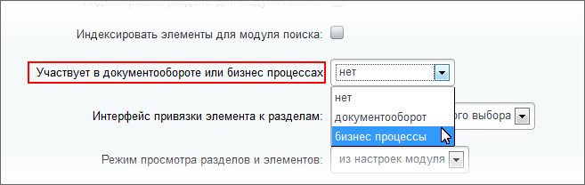
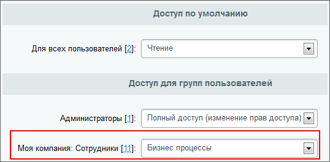
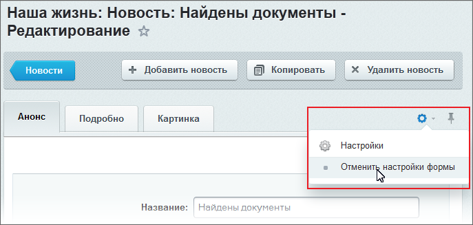

# Настройка инфоблоков на работу с бизнес-процессами

**Навигация**
- [← Оглавление курса](index.md)
- [← Предыдущий: 2750 — Настройка библиотек документов на работу с бизнес-процессами](lesson_2750.md)
- [Следующий: 4516 — Бизнес-процессы в Универсальных списках →](lesson_4516.md)

Официальная страница урока: https://dev.1c-bitrix.ru/learning/course/index.php?COURSE_ID=57&LESSON_ID=3122

Информация в уроке актуальна только для продуктов «1С-Битрикс: управление сайтом» и коробочной версии «Битрикс24».
Для настройки

			работы

                    Один и тот же информационный блок не может работать и в режиме **Документооборота** и в режиме **Бизнес-процессов**.

		 бизнес-процессов (БП) с инфоблоками необходимо выполнить ряд действий.

### Настройка инфоблоков

Для участия инфоблока в **Бизнес-процессах**:

- Перейдем на страницу настройки свойств инфоблока (Контент &gt; Инфоблоки &gt; Типы инфоблоков &gt; [Нужный_тип_инфоблока]) в административном разделе.
- На вкладке **Инфоблок** в поле **Участвует в документообороте или бизнес-процессах** выбираем **Бизнес-процессы**:
  
  Если в системе не установлен модуль **Документооборот**, то поддержка бизнес-процессов включается с помощью опции **Участвует в бизнес-процессах**.

### Настройка прав доступа

Для работы с бизнес-процессами необходимо дать права для групп пользователей. Перейдем на вкладку **Доступ** настраиваемого инфоблока и назначим для соответствующих групп уровень доступа не ниже **Бизнес-процессы**:

**Внимание!** Уровень доступа **Бизнес-процессы** позволяет указанным группам пользователей только участвовать в бизнес-процессах. Чтобы пользователи смогли сами запускать БП, необходимо выставить более высокий уровень прав доступа для инфоблока – например, **Изменение**.

### Настройка автозапуска

Модуль **Бизнес-процессы** позволяет

			автоматически запускать

                    **Примечание:** Автоматический запуск БП рекомендуется для часто повторяющихся бизнес-процессов, для которых не требуется смена настроек.

		 выбранные БП при создании/изменении элемента инфоблока. Есть два варианта включения автозапуска:

Автозапуск работает только при создании/изменении элементов из административного раздела.

- В форме настроек информационного блока:

  - Перейдем на вкладку **Шаблоны бизнес-процессов** настраиваемого инфоблока.
  - В строке с названием нужного бизнес-процесса установим флаг в поле **Автозапуск**: Создание и/или
    			Изменение
                        **Внимание!** Не используйте режим **Изменение** для БП, которые могут вызывать сами себя. Это приведет к цикличности.
    		.  Если оба флажка сняты, запуск БП возможен только вручную.
- В настройках [шаблона бизнес-процесса](lesson_3816.md).

Для запуска бизнес-процесса вручную используйте пункт меню действий

			Запустить бизнес-процесс

                    

		 желаемого элемента инфоблока.

### Настройка формы создания/изменения элемента инфоблока

При создании/изменении элемента инфоблока пользователь указывает не только название и другие параметры, относящиеся к контенту, но и все параметры запускаемого бизнес-процесса. Для этого настроим саму форму редактирования элемента инфоблока. Перейдем на страницу со списком элементов инфоблока, а затем к форме редактирования некоторого элемента. По умолчанию вкладка **Бизнес-процессы**, на которой производится управление бизнес-процессами, отключена.
 Для её включения есть

			два способа

                    

		:

1. Выбираем команду **Отменить настройки формы** и все доступные вкладки появятся перед вами. Этот способ не удобен тем, что из всего, что появится, требуется только одна вкладка, остальные мешаются;
2. Выберите команду **Настройки**. Откроется окно **Настройка формы редактирования**. В секции **Доступные вкладки** выберите **Бизнес-процессы** и нажмите кнопку , чтобы в форме создания/редактирования элемента была доступна вкладка **Бизнес-процессы** с соответствующими полями.

Теперь, например, в форме добавления новости в публичной части сайта будет доступна вкладка

			Бизнес-процессы

                    

		.
