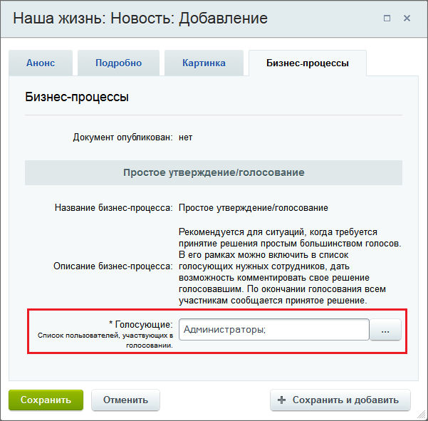
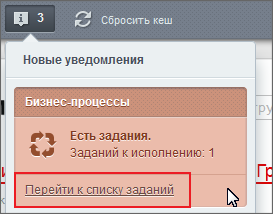
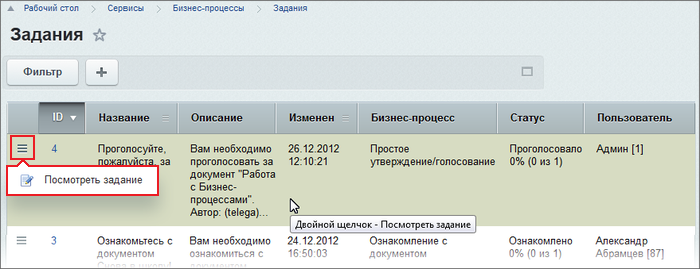
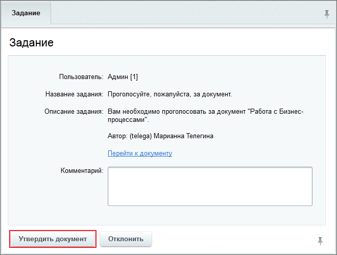

# Пример работы с бизнес-процессами

**Навигация**
- [← Оглавление курса](index.md)
- [← Предыдущий: 7125 — Список шаблонов для импорта](lesson_7125.md)
- [Следующий: 2794 — Создание нового бизнес-процесса →](lesson_2794.md)

Официальная страница урока: https://dev.1c-bitrix.ru/learning/course/index.php?COURSE_ID=57&LESSON_ID=3140

Рассмотрим работу с бизнес-процессами на примере создания новости контент-менеджером и утверждение ее администратором информационного портала.

### Администратор

#### Действия для пользователей группы "Администраторы"

- Включить в группу **Контент-менеджеры** желаемых пользователей;
- Настроить инфоблок
                      Для того, чтобы выбранный инфоблок участвововал в Бизнес-процессах, его необходимо настроить.
  [Подробнее](lesson_3122.md#iblock_settings)...
  		 **Новости** на работу с бизнес процессами;
- Настроить права доступа
                      Для работы с бизнес-процессами необходимо дать нужные права для групп пользователей.
  [Подробнее](lesson_3122.md#iblock_ac)...
  		 для группы **Контент-менеджеры**. В нашем случае необходимо выбрать право
  			Изменение
                      Не забудьте убедиться, чтобы к этому инфоблоку был доступ у группы **Администраторы информационного портала** не ниже уровня **Бизнес процессы**
  		, чтобы менеджеры могли создавать и редактировать элементы инфоблока (новости);
- На закладке **Шаблоны бизнес-процессов**
  			настроить автозапуск
                      Модуль Бизнес-процессы позволяет автоматически запускать выбранные бизнес-процессы при создании/изменении элемента инфоблока.[Подробнее](lesson_3122.md#iblock_autorun)...
  		 бизнес-процесса
  			Простое утверждение/голосование
                      При необходимости можно отредактировать или создать новый шаблон процесса (если установлен модуль **Дизайнер Бизнес-процессов**) [Подробнее](https://dev.1c-bitrix.ru/learning/course/index.php?COURSE_ID=57&CHAPTER_ID=05058&LESSON_PATH=3911.4549.5058)...
  		 на **Создание** и **Изменение**;
- Настроить форму создания/изменения элемента инфоблока
                      При создании/изменении элемента инфоблока пользователь должен указать не только название и другие параметры, относящиеся к контенту, но и все параметры запускаемого бизнес-процесса. Для этого нужно настроить саму форму редактирования элемента инфоблока.
  [Подробнее](lesson_3122.md#iblock_form_set)...
  		, если требуется, чтобы в публичной части сайта контент-менеджер смог указать параметры запуска бизнес-процесса.

### Контент-менеджер

#### Действия для пользователей группы "Контент-менеджеры"

При создании новости на сайте контент-менеджер должен будет указать список пользователей или групп пользователей, участвующих в голосовании. Делаем это на закладке **Бизнес-процессы** в поле **Голосующие**. В нашем случае это будут **Администраторы информационного портала**. Пока пользователь группы не одобрит новость, она не будет опубликована на сайте.

### Администратор инф. портала

#### Действия для пользователей группы "Администраторы информационного портала"

Для публикации новости, созданной контент-менеджером, воспользуемся ссылкой

			Перейти к списку заданий

                    

		 в центре уведомлений или перейдем на страницу **Задания** (Сервисы &gt; Бизнес-процессы &gt; Задания).

Посмотрим задание с помощью пункта

			меню действий

                    

		 или дважды кликнув по строке с заданием. В открывшейся форме нажмем кнопку **Утвердить документ**:

Задание пропадет из очереди, а новость будет опубликована на сайте.

### Дополнительно

- [Пример создания бизнес-процесса](https://dev.1c-bitrix.ru/learning/course/index.php?COURSE_ID=57&CHAPTER_ID=04762)
