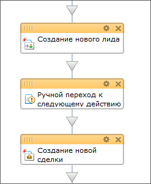
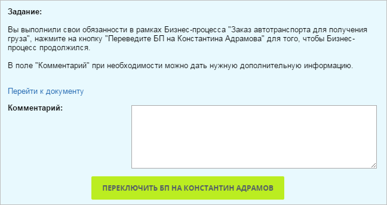

# Ручной переход по действиям процесса с помощью "Ознакомления с документом"

**Навигация**
- [← Оглавление курса](index.md)
- [← Предыдущий: 5060 — Пример использования действия "Выбор сотрудника"](lesson_5060.md)
- [Следующий: 7143 — Пример использования действия "Утверждение документа" →](lesson_7143.md)

Официальная страница урока: https://dev.1c-bitrix.ru/learning/course/index.php?COURSE_ID=57&LESSON_ID=3383

В ряде случаев полезно включить в шаблон ручной переход от задания к заданию (например, в целях обучения пользователей работе с созданным бизнес-процессом). С помощью действия

			Ознакомление с документом

                    Действие позволяет создать для выбранных пользователей задание по ознакомлению с документом и возможностью оставить отзыв на него. В ходе выполнения задания ведется вычисление процента ознакомившихся.
[Подробнее](lesson_3783.md)...

		, создадим обязательный шаг переключения бизнес-процесса вручную к следующему исполнителю.

## Как это выглядит в публичной части

В публичной части это будет выглядеть так:

Маленький минус использования этого действия в том, что ссылку Перейти к документу удалить нельзя.
