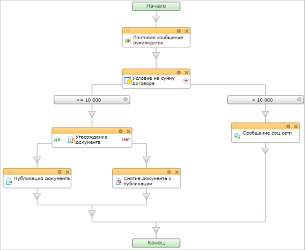

# Последовательный бизнес-процесс

**Навигация**
- [← Оглавление курса](index.md)
- [← Предыдущий: 4678 — Настройка модуля Бизнес-процессы](lesson_4678.md)
- [Следующий: 3467 — Бизнес-процесс со статусами →](lesson_3467.md)

Официальная страница урока: https://dev.1c-bitrix.ru/learning/course/index.php?COURSE_ID=57&LESSON_ID=3466

|  | ### Шаг за шагом |
| --- | --- |

> **Последовательный бизнес-процесс** – действия выполняются одно за другим от точки входа до точки выхода.

Последовательный бизнес-процесс представляет собой бизнес-процесс как набор шагов, которые следует выполнять по порядку до тех пор, пока они все не завершатся. Он похож на обычную блок-схему, описывающую алгоритм решения задачи.

Последовательный бизнес-процесс начинает работу, выполняя находящееся в нем первое дочернее действие, и продолжается до тех пор, пока не выполнит все остальные дочерние действия.
