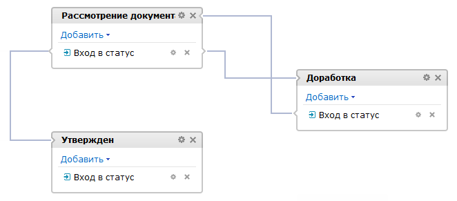

# Бизнес-процесс со статусами

**Навигация**
- [← Оглавление курса](index.md)
- [← Предыдущий: 3466 — Последовательный бизнес-процесс](lesson_3466.md)
- [Следующий: 3468 — Выбор типа бизнес-процесса →](lesson_3468.md)

Официальная страница урока: https://dev.1c-bitrix.ru/learning/course/index.php?COURSE_ID=57&LESSON_ID=3467

Если нужно настроить более сложную логику работы процесса, с произвольными действиями и состояниями, а также гибкой настройкой прав доступа к документу.

### Бизнес-процесс со статусами

> **Бизнес-процесс со статусами** – бизнес-процесс, не имеющий начала и конца, в процессе работы которого происходит переход из одного
>
> 			состояния
>
>
>
>                     Такой бизнес-процесс так же называют **машиной состояний** или **автоматом на состояниях**.
>
>
>
> 		 (статуса) в другое с разделением прав доступа.

Бизнес-процесс со статусами представляет собой набор состояний, переходов и действий. Одно из состояний обязательно обозначается как начальное состояние. Далее, по мере выполнения, процесс переходит из одного состояния в другое. Переходы выполняются на основе событий.

Посмотрим на

			пример

                    Пример создания этого бизнес-процесса рассматриваем [в отдельном уроке](lesson_3861.md).

		 такого шаблона:

На скриншоте видим бизнес-процесс с тремя связанными статусами: Рассмотрение документа, Доработка и Утвержден.

### Общая логика работы

Посмотрим общую логику работы бизнес-процессов со статусами.

**Обратите внимание:** о том, как создать такой бизнес-процесс, подробно рассматривается [в отдельном уроке](lesson_3860.md).

Для каждого статуса могут быть настроены 4 действия. А для каждого действия доступно создание

			последовательного

                    **Последовательный бизнес-процесс** – действия выполняются одно за другим от точки входа до точки выхода.

[Подробнее](lesson_3466.md)...

		 подпроцесса.

При переходе бизнес-процесса в любой из статусов выполняется последовательный подпроцесс для инициализации этого статуса (**обработчик входа в статус**). После чего бизнес-процесс становится в ожидание события, по которому выполнится смена статуса (**выполнение команды**, **выполнение через заданное время**). При возникновении события выполняется последовательный подпроцесс, соответствующий принятому событию (связанный с ним).

<!-- Список возможных событий и их названия могут быть получены для отображения в пользовательском интерфейсе. На каждое событие может быть получен список групп пользователей, которые имеют право отправлять данное событие. -->

Обязательно должна быть предусмотрена смена статуса. У действия статуса **Команда** есть специальный параметр, осуществляющий такую смену. Или уже среди действий последовательных подпроцессов удобно использовать действие

			Установить статус

                    Действие изменяет статус текущего документа на заданный.

[Подробнее](lesson_3859.md)...

		. Если смена статуса не определена каким-либо способом, то текущий статус считается конечным и бизнес-процесс завершается.

Если для статуса определен последовательный подпроцесс для финализации этого статуса (обработчик выхода из статуса), то он автоматически выполняется непосредственно перед выходом из данного статуса (перед переходом в другой статус).

**Примечание:** Не обязательно настраивать все действия для каждого статуса. Настраивайте только те действия, которые подходят для вашего конкретного бизнес-процесса.

### Документация по теме

- [Создание шаблона бизнес-процесса со статусами](lesson_3860.md)
- [Пример использования бизнес-процесса со статусами для организации обработки и доработки документа](lesson_3861.md)
