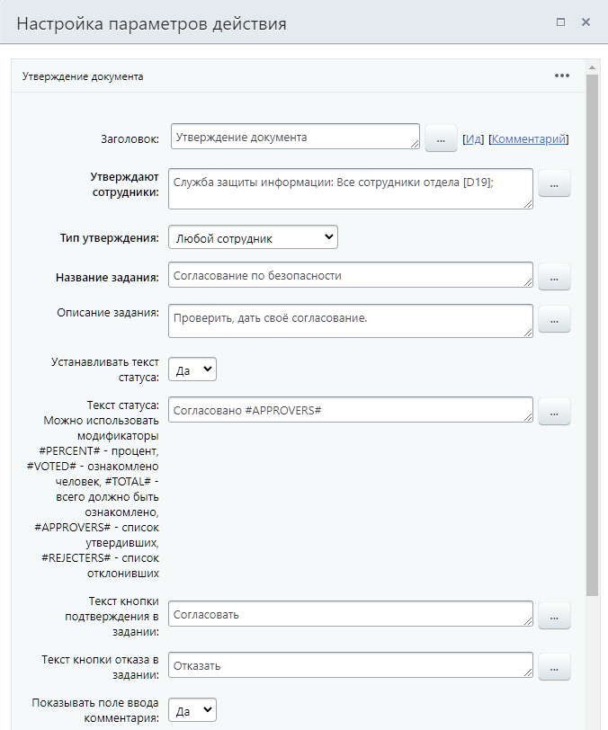
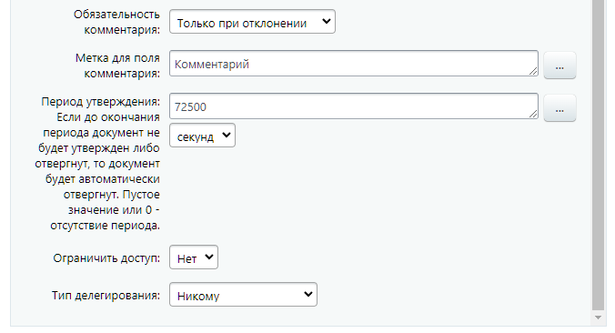
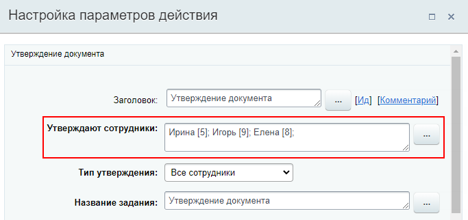
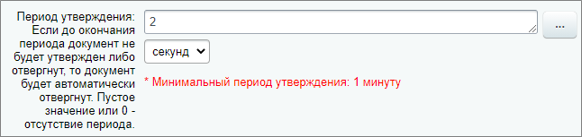
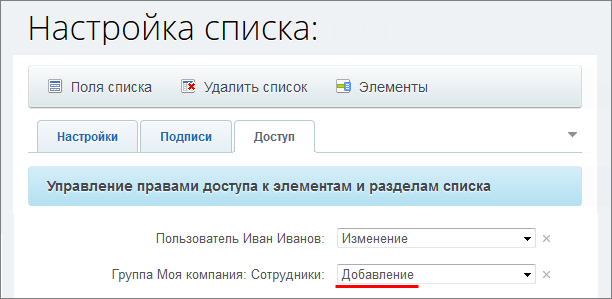
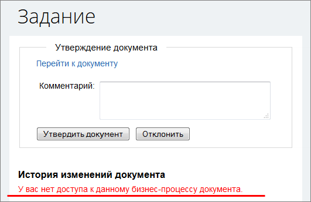

# Утверждение документа

**Навигация**
- [← Оглавление курса](index.md)
- [← Предыдущий: 3783 — Ознакомление с документом](lesson_3783.md)
- [Следующий: 10481 — Итератор →](lesson_10481.md)

Официальная страница урока: https://dev.1c-bitrix.ru/learning/course/index.php?COURSE_ID=57&LESSON_ID=3771

Действие позволяет произвести

			утверждение документа

                    **Примечание:** Бизнес-процесс будет поставлен в ожидание (приостановлен), пока кто-либо из указанных пользователей не выполнит задание (утвердит или отклонит заявку) или не выйдет время (см. опцию **Период утверждения**).

		, для которого запущен бизнес-процесс. В зависимости от результата (утвержден документ или нет) возможны 2 варианта развития дальнейших действий.

### Описание параметров

## Пример заполнения параметров действия

- **Утверждают сотрудники** – указываются
  			пользователи / группы пользователей
                      Для указания списка пользователей или групп используйте перечисление через **;**.
  
  		, которые должны утвердить документ.
- **Тип утверждения**:

  - **Все сотрудники** – утвердить должны все пользователи указанные выше;
  - **Любой сотрудник** – утвердить должен любой из пользователей, указанных выше;
  - **Голосование сотрудников** – утверждение производится методом голосования среди указанных выше пользователей.
    ## дополнительные поля
    Для варианта **Голосование сотрудников** доступны поля **Более скольки процентов голосов необходимо для принятия решения** и **Ожидать, чтобы проголосовали все указанные сотрудники**.
    Последнее поле можно использовать для автоматизации передавая в него значения `Y` или `N`. Если выбран вариант **да**, то действие будет ожидать, пока не проголосуют все указанные выше сотрудники. Если выбран вариант **нет**, то действие будет ожидать, пока не наберется указанный процент голосов.
- **Название задания** – задается название, которое будет отображаться в интерфейсе для пользователей.
- **Описание задания** – указывается описание или пояснения к заданию. Содержимое данного поля будет отображаться в интерфейсе для пользователей. Рекомендуется в этом поле указывать полную информацию о действии, которое необходимо выполнить пользователю. Это поможет избежать путаницы в случае нескольких однотипных действий.
- **Устанавливать текст статуса** – позволяет изменить текст статуса документа на произвольный. Это может, например, позволить отслеживать на каком этапе сейчас находится бизнес-процесс.
- **Текст статуса** – задается текст статуса.
  ## Модификаторы
  Можно использовать следующие модификаторы в тексте статуса: `#PERCENT#` – процент, `#VOTED#` – ознакомлено человек, `#TOTAL#` – всего должно быть ознакомлено, `#APPROVERS#` – список утвердивших, `#REJECTERS#` – список отклонивших.
- **Текст кнопки подтверждения в задании** и **Текст кнопки отказа в задании** позволяют задать собственный текст для соответствующих кнопок.
- **Показывать поле ввода комментария** – опция позволяет разрешить пользователям оставлять собственные комментарии к назначенному заданию. Например, какие-либо замечания касаемо утверждаемого документа. Содержимое поля можно получить после выполнения действия с помощью соответствующей опции в форме **Вставка значения** – **Дополнительные результаты** (см. ниже).
- **Обязательность комментария** – опция позволяет назначить добавление комментария при выполнении действия обязательным. Можно включить обязательность комментария только для утверждения или отклонения документа.
- **Метка для поля комментария** – подпись для поля с комментарием.
- **Период утверждения** – задаётся период, за время которого требуется утвердить либо отклонить документ. По истечении этого времени документ будет автоматически отвергнут. Пустое значение или 0 – отсутствие периода. Период можно задать в секундах, минутах, часах или днях. Минимальное значение периода зависит от настроек модуля Бизнес-процессы, параметр [Минимальное время ожидания для действий](https://dev.1c-bitrix.ru/user_help/service/bizproc/settings.php). Если в настройках действия указать период меньше этого минимального значения – появится соответствующее
  			предупреждение
                      
  		.
- **Ограничить доступ** – делает текст задания видимым только для исполнителя задания и не показывает его в живой ленте. Это очень полезная опция, если нужно, например, передать исполнителю конфиденциальную информацию: пароли, пин-коды и т.п.
  **Примечание:** При выполнении задания по утверждению несколькими сотрудниками в публичной части история изменения документа, включая комментарии других утверждающих, будет отображена в зависимости от прав на документ.
  ## Например
  Eсли в Списке для определенной группы пользователей задать право только на **добавление**, то историю изменения (и комментарии соответственно), пользователь  этой группы при выполнении задания не увидит:
  
  
- **Тип делегирования** – кому может быть делегировано утверждение документа. Доступны варианты: Только подчиненным, Всем сотрудникам и Никому. При выборе первых двух вариантов в форме утверждения документа появится кнопка **Делегировать**.
  **Примечание**: Администратор может делегировать действие, даже если это запрещено настройками.

### Результаты выполнения действия

Результаты выполнения этого действия можно получить с помощью формы **Вставка значения** – **Дополнительные результаты**, в которой они будут доступны  сразу после добавления действия в шаблон.

Доступно следующее:

- ID;
- Комментарии;
- Сколько проголосовало;
- Сколько должно проголосовать;
- Процент проголосовавших;
- Процент утвердивших;
- Процент отклонивших;
- Количество утвердивших;
- Количество отклонивших;
- Последний голосовавший;
- Комментарий последнего голосовавшего;
- Утвердили пользователи;
- Утвердили пользователи (текст) – получение списка пользователей;
- Отклонили пользователи;
- Отклонили пользователи (текст) – получение списка пользователей;
- Автоматическое отклонение – поле будет содержать `1`, если документ был автоматически отклонен (см. параметр **Период утверждения**).
