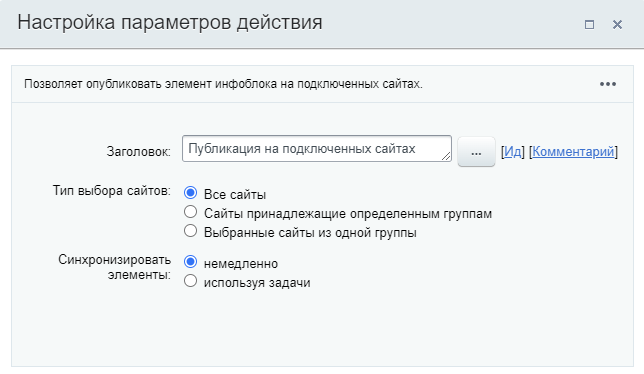

# Публикация на подключенных сайтах

**Навигация**
- [← Оглавление курса](index.md)
- [← Предыдущий: 3781 — Публикация документа](lesson_3781.md)
- [Следующий: 3786 — Разблокировка документа →](lesson_3786.md)

Официальная страница урока: https://dev.1c-bitrix.ru/learning/course/index.php?COURSE_ID=57&LESSON_ID=3772

Действие

			Публикация на подключенных сайтах

                    Действие относится к модулю **Контроллер**.
[Подробнее](/learning/course/index.php?COURSE_ID=41&CHAPTER_ID=737)...

		 позволяет опубликовать элемент инфоблока на подключенных сайтах.

#### Описание Параметров

**Тип выбора сайтов** – указывается, где будет опубликован элемент инфоблока

- **Все сайты**;
- **Сайты, принадлежащие определенным группам**;
- **Выбранные сайты из одной группы**.

**Синхронизировать элементы:**

- **немедленно** – элементы будут синхронизированы немедленно;
- **используя задачи** – синхронизация будет происходить с использованием
  			задач
                      **Планировщик задач** – это специализированный инструмент, который накапливает задания, формируемые остальным функционалом контроллера, и выполняет их в ручном или автоматическом режиме.[Подробнее](/learning/course/index.php?COURSE_ID=41&LESSON_ID=2888)...
  		.

**Важно**! С версии 15.5.0 **Дизайнера бизнес-процессов** данное действие включено только для модуля **Инфоблоки**.
