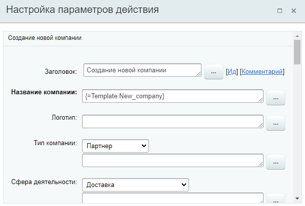
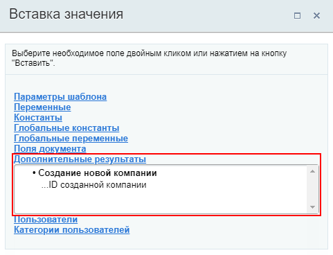

# Создание новой компании

**Навигация**
- [← Оглавление курса](index.md)
- [← Предыдущий: 3776 — Создание нового лида](lesson_3776.md)
- [Следующий: 3775 — Создание новой сделки →](lesson_3775.md)

Официальная страница урока: https://dev.1c-bitrix.ru/learning/course/index.php?COURSE_ID=57&LESSON_ID=3773

Действие создаёт новую **Компанию**.

**Примечание:** Этот урок о создании компании в CRM с помощью действия бизнес-процесса. О том как создать компанию обычным способом вы найдете в статьях поддержки Битрикс24 на [helpdesk.bitrix24.ru](https://helpdesk.bitrix24.ru/open/5493421/).

#### Описание параметров

Список параметров полностью состоит из полей

			карточки

                    Карточка CRM — полезный инструмент для повседневной работы менеджеров. Вы сэкономите много время сотрудникам и сделаете их работу намного приятнее, если настроите для них карточку CRM.

Подробнее на [helpdesk.bitrix24.ru](https://helpdesk.bitrix24.ru/open/6560471/).

		 Компании, таких как Название компании, Логотип, Тип компании и т.д. Других особенных параметров действие не имеет.

#### Пример

Ниже пример заполнения параметров действия. В качестве Названия компании подставляется значение из параметра шаблона:

#### Результаты выполнения действия

Результаты выполнения этого действия можно получить с помощью формы **Вставка значения** – **Дополнительные результаты**.

Доступно:

- ID созданной компании.

#### Дополнительно

Также новую Компанию можно создать с помощью более универсального действия [Создать элемент CRM](lesson_23582.md).
