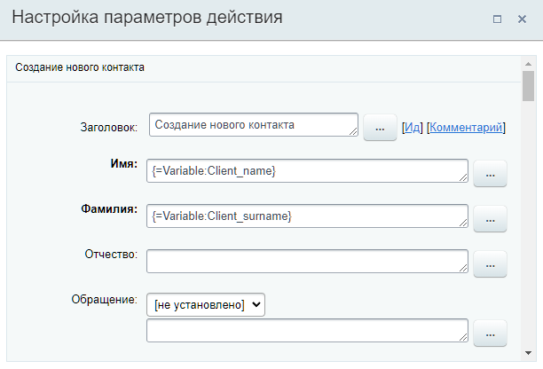
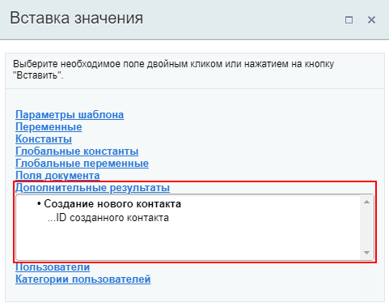

# Создание нового контакта

**Навигация**
- [← Оглавление курса](index.md)
- [← Предыдущий: 9011 — Сменить стадию](lesson_9011.md)
- [Следующий: 3776 — Создание нового лида →](lesson_3776.md)

Официальная страница урока: https://dev.1c-bitrix.ru/learning/course/index.php?COURSE_ID=57&LESSON_ID=3774

Действие создаёт новый **Контакт**.

**Примечание:** Этот урок о создании Контакта в CRM с помощью действия бизнес-процесса. О том как создать Контакт обычным способом вы найдете в статьях поддержки Битрикс24 на [helpdesk.bitrix24.ru](https://helpdesk.bitrix24.ru/open/5493251).

#### Описание параметров

Список параметров полностью состоит из полей

			карточки

                    Карточка CRM — полезный инструмент для повседневной работы менеджеров. Вы сэкономите много время сотрудникам и сделаете их работу намного приятнее, если настроите для них карточку CRM.

Подробнее на [helpdesk.bitrix24.ru](https://helpdesk.bitrix24.ru/open/6560471/).

		 Контакта, таких как Имя, Фамилия, Обращение, Дата Рождения и т.д. Других особенных параметров действие не имеет.

#### Пример

Ниже пример заполнения параметров действия. В качестве Имени и Фамилии контакта подставляются значения из переменных:

#### Результаты выполнения действия

Результаты выполнения этого действия можно получить с помощью формы **Вставка значения** - **Дополнительные результаты**.

Доступно:

- ID созданного контакта.

#### Дополнительно

Также новый Контакт можно создать с помощью более универсального действия [Создать элемент CRM](lesson_23582.md).
