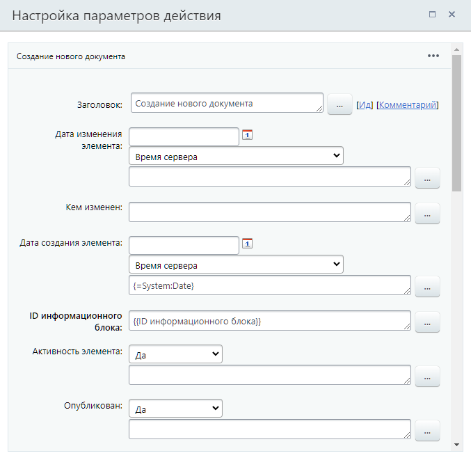

# Создание нового документа

**Навигация**
- [← Оглавление курса](index.md)
- [← Предыдущий: 3787 — Снятие документа с публикации](lesson_3787.md)
- [Следующий: 7122 — Создать элемент списка →](lesson_7122.md)

Официальная страница урока: https://dev.1c-bitrix.ru/learning/course/index.php?COURSE_ID=57&LESSON_ID=3777

Действие создаёт новый документ.

> **Вспомним:** В системе все бизнес-процессы работают с **документами** (таким документом может быть файл, элемент инфоблока, элемент CRM) и их версиями. Для каждого документа (из инфоблока, списков или др.) существуют свои шаблоны бизнес-процессов. Подробнее об этом было в уроке [Общая информация](lesson_1708.md).

#### Описание параметров

Набор параметров действия зависит от того типа документа, для которого создаётся шаблон бизнес-процесса. Так, если это шаблон бизнес-процесса для Сделок (CRM), то набор параметров будет соответствовать полям сделки (как если бы вы создавали её вручную из публичного раздела). Если же это шаблон бизнес-процесса для информационного блока, то параметры – это поля формы элемента этого информационного блока.

## Пример заполнения параметров действия

Пример приведём для шаблона БП процесса ленты новостей.

Здесь обязательными полями являются **ID информационного блока** и **Название**. Идентификатор мы подставили через форму «Вставка значения», а именно взяли ID инфоблока текущего документа. Остальные поля заполняются по желанию. Например, мы указали «Дату создания», «Активность» и «Опубликован». Полей в форме много, поэтому на скриншоте видна лишь часть.

**Внимание**: Действие есть и в шаблонах бизнес-процессов Диска. Его доступно использовать, но оно не создаёт полноценный файл. Для работы с файлами Диска используйте специально предназначенные для этого [действия](https://dev.1c-bitrix.ru/learning/course/index.php?COURSE_ID=57&CHAPTER_ID=07723).

#### Результаты выполнения действия

Действие имеет единственный результат (с версии 23.200.0):

- Текст ошибки создания

Результат вернет ошибку, если не получилось создать документ. При успешном создании документа, значение результата будет пустым.

Где такой результат может пригодится? Например для отправки уведомления, если документ не создался. Удобно использовать совместно с конструкцией

			Условие

                    Конструкция позволяет направить бизнес-процесс по разным сценариям в зависимости от заданного типа условия.

[Подробнее](lesson_3789.md)...

		 смешанного типа, где в качестве источника выбран доп. результат, а условием является «заполнено». Тогда для ветки, где результат с ошибкой заполнен, добавьте действие отправки уведомления, а другую оставьте пустой. Так уведомление будет отправлено только в случае возникновения проблем с созданием документа.

#### Дополнительно

Действие **Создание нового документа** имеет широкий набор полей при создании документа, что не всегда удобно. Например, если вы хотите создать элемент универсального списка, то текущее действие предложит заполнить полный набор полей как для элемента информационного блока. Поэтому рекомендуем использовать это действие в шаблонах бизнес-процессов информационных блоков, а для шаблонов остальных типов документов более узко-специализированные действия:

- [Создать элемент списка](lesson_7122.md);
- [Создание нового контакта](lesson_3774.md);
- [Создание нового лида](lesson_3776.md);
- [Создание новой компании](lesson_3773.md);
- [Создание новой сделки](lesson_3775.md);
- [Создать элемент CRM](lesson_23582.md).
