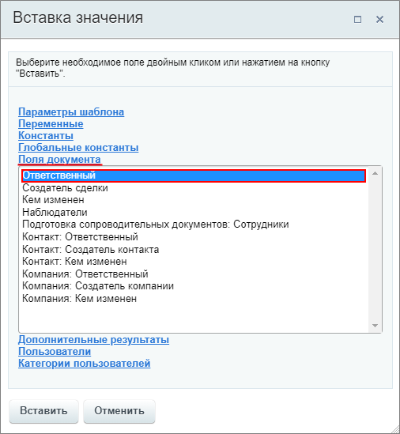
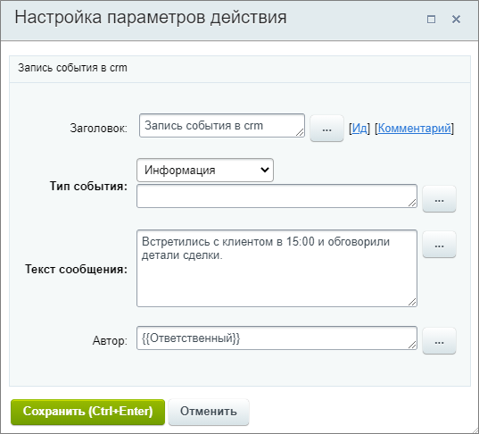
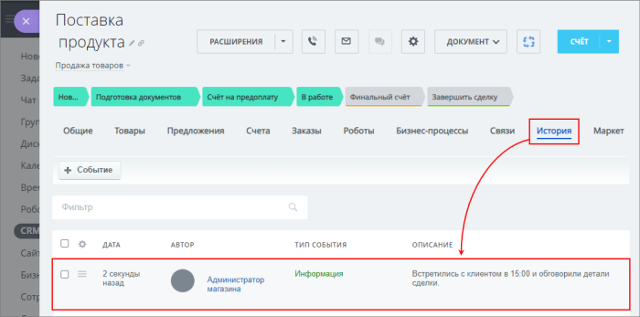

# Запись события в crm

**Навигация**
- [← Оглавление курса](index.md)
- [← Предыдущий: 24418 — Завершить задачу](lesson_24418.md)
- [Следующий: 25718 — Запланировать дело →](lesson_25718.md)

Официальная страница урока: https://dev.1c-bitrix.ru/learning/course/index.php?COURSE_ID=57&LESSON_ID=3778

Действие добавляет запись в историю элемента, чтобы руководитель мог следить за процессом работы с клиентом. Запись добавляется в журнал во вкладке **История**

			карточки CRM

                    На вкладке **История** расположен журнал доступа с подробной информацией о том, кто, когда и как изменял текущий элемент.

Подробнее на [helpdesk.bitrix24.ru](https://helpdesk.bitrix24.ru/open/6560471/).

		.

Действие выполняется только в контексте бизнес-процессов, работающих в CRM.

#### Описание параметров

- **Тип события** – выберите из списка тип события: Информация, Телефонный звонок или Отправлен email;
- **Текст сообщения** – в поле укажите текст, который отобразится в **Описании** записи в журнале;
- **Автор** – укажите автора записи.

#### Пример

Пусть в примере действие используется в шаблоне БП для сделок. Укажем тип события и текст, а в качестве автора записи - ответственного за сделку, в которой запущен БП (через форму

			«Вставка значения»

                    

		):

При запуске БП в сделке, во вкладке **История** в журнале добавится запись:

