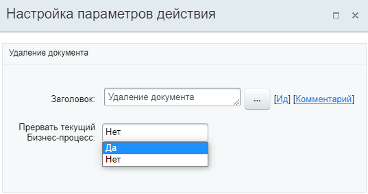
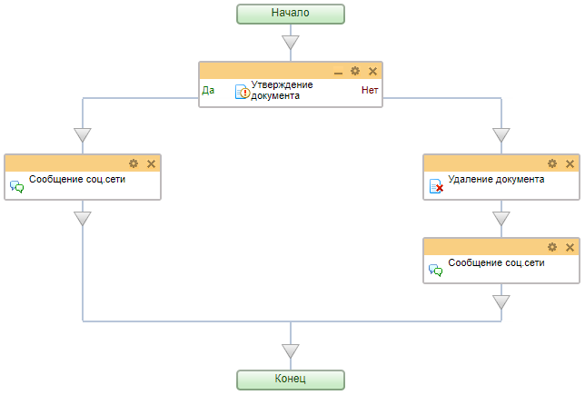

# Удаление документа

**Навигация**
- [← Оглавление курса](index.md)
- [← Предыдущий: 3784 — Сохранение истории](lesson_3784.md)
- [Следующий: 7839 — Запрос доп.информации (с отклонением) →](lesson_7839.md)

Официальная страница урока: https://dev.1c-bitrix.ru/learning/course/index.php?COURSE_ID=57&LESSON_ID=3779

Действие удаляет документ,

			запустивший

                    Этим действием нельзя удалить другой документ (элемент списка). Только тот, в котором запущен бизнес-процесс.

		 бизнес-процесс.

#### Параметры

- **Прервать текущий Бизнес-процесс** – при выборе варианта **Да** процесс выполнения бизнес-процесса будет прерван после удаления документа.

## Простой пример использования действия "Удаление документа"

Создадим просто шаблон бизнес-процесса, который позволит отправить созданный документ на согласование (например, Администратору магазина). Бизнес-процесс запускается при добавлении нового документа сотрудником. Если новый документ не согласован – он автоматически удаляется. В любом варианте автор документа получает уведомление о результате.

Так выглядит шаблон:

В шаблоне использованы действия

			Утверждение документа

                    Действие позволяет произвести утверждение документа, для которого запущен бизнес-процесс. В зависимости от результата (утвержден или нет) возможны 2 варианта развития дальнейших действий.

[Подробнее](lesson_3771.md)...

		,

			Сообщение соц. сети

                    Действие отправляет уведомление модуля социальной сети.

[Подробнее](lesson_3804.md)...

		 и Удаление документа.

В таком примере параметру **Прервать текущий Бизнес-процесс** действия **Удаление документа** установлено значение **Нет**, т.к. после удаления элемента ещё выполняется отправка уведомления автору. Бизнес-процесс в таком случае завершится полностью, без прерывания.
