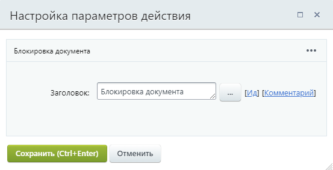
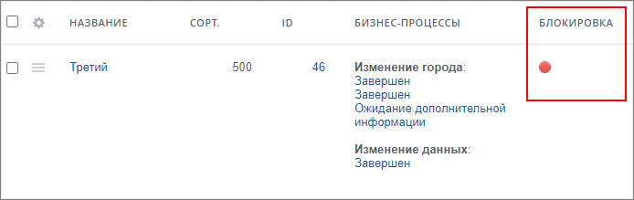

# Блокировка документа

**Навигация**
- [← Оглавление курса](index.md)
- [← Предыдущий: 12321 — Общие моменты](lesson_12321.md)
- [Следующий: 26760 — Запустить умный сценарий →](lesson_26760.md)

Официальная страница урока: https://dev.1c-bitrix.ru/learning/course/index.php?COURSE_ID=57&LESSON_ID=3780

Действие блокирует документ, чтобы другие бизнес-процессы (БП) не смогли произвести в него запись. Таким образом сохраняется целостность данных – несколько БП не смогут одновременно изменить документ и сохранить его. При этом документ доступен для изменения пользователями, если они обладают соответствующими правами.

Блокировка продлится до завершения текущего бизнес-процесса или пока не выполнится действие

			Разблокировка

                    Действие разблокирует документ для других БП.
[Подробнее](lesson_3786.md)...

		.

Действие доступно в инфоблоках, списках и процессах. Параметров не имеет и запускается для текущего документа (для которого запущен бизнес-процесс). Когда элемент заблокирован – в списке элементов в административном разделе видна красная отметка о блокировке:

**Важно**! С версии 15.5.0 **Дизайнера бизнес-процессов** данное действие исключено для модуля **Диск**.
