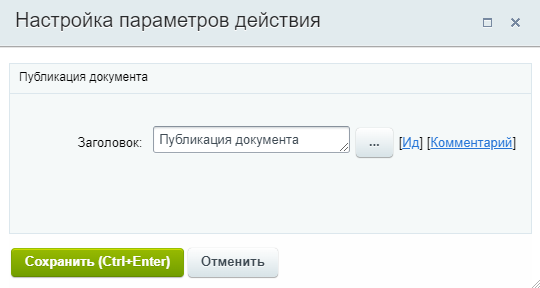
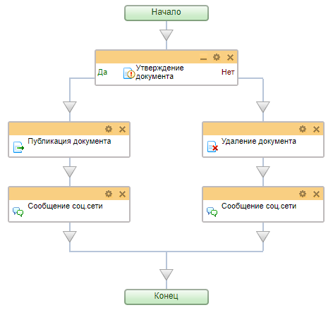

# Публикация документа

**Навигация**
- [← Оглавление курса](index.md)
- [← Предыдущий: 20750 — Получить информацию об элементе списка](lesson_20750.md)
- [Следующий: 3772 — Публикация на подключенных сайтах →](lesson_3772.md)

Официальная страница урока: https://dev.1c-bitrix.ru/learning/course/index.php?COURSE_ID=57&LESSON_ID=3781

Действие переводит документ в статус **опубликован**.

**Примечание:** Действие используется только для бизнес-процессов **информационных блоков** в *1С-Битрикс: управление сайтом* и *коробочной версии Битрикс24*.

#### Описание параметров

Действие не имеет параметров. Запускается для текущего документа (для которого запущен бизнес-процесс) и переводит его в статус **опубликован**.

#### Пример

**Задача**: пусть на сайте есть новостной раздел, реализованный на инфоблоке Новости. Созданная в инфоблоке новая новость должна быть направлена администратору на проверку (утверждение), и только после проверки публиковаться на сайте.

Создадим такой простой шаблон бизнес-процесса для инфоблока Новости:

Шаблон должен запускаться

			при создании

                    Бизнес-процесс имеет два варианта автоматического запуска: при создании и/или при изменении элемента.

[Подробнее](lesson_3816.md#main)...

		 новости. Непосредственно после создания новость будет иметь статус

			Не опубликован

                    

		. Администратор получит задачу на утверждение новости. Если утвердит — запустится действие **Публикация документа** и новость появится на сайте. Если нет — новость будет

			удалена

                    Действие **Удаление документа** удаляет документ, запустивший бизнес-процесс.

[Подробнее](lesson_3779.md)...

		. В любом варианте автору будет направлено уведомление.
