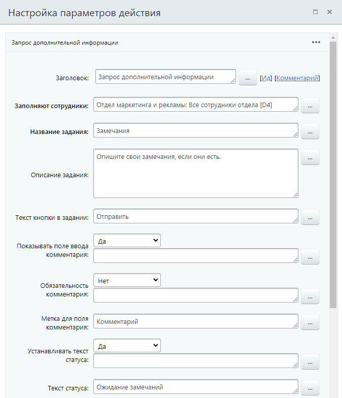
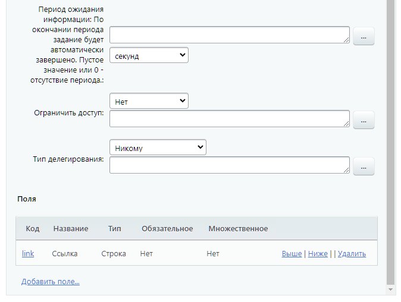

# Запрос дополнительной информации

**Навигация**
- [← Оглавление курса](index.md)
- [← Предыдущий: 7839 — Запрос доп.информации (с отклонением)](lesson_7839.md)
- [Следующий: 3783 — Ознакомление с документом →](lesson_3783.md)

Официальная страница урока: https://dev.1c-bitrix.ru/learning/course/index.php?COURSE_ID=57&LESSON_ID=3782

Действие запрашивает дополнительную информацию у пользователя в виде [задания](lesson_5276.md).

### Описание параметров

## Пример заполнения параметров действия

- **Заполняют сотрудники** — указываются пользователи, один из которых (
  			первый
                      Другими словами задание будет доступно всем указанным пользователям до тех пор, пока кто-то один не начнет его выполнять. После этого оно автоматически отменится у всех остальных сотрудников.
  		 кто приступит к его выполнению) должен указать дополнительную информацию.
- **Название задания** — задается название, которое будет отображаться в интерфейсе для пользователей.
- **Описание задания** — указывается описание или пояснения к заданию. Содержимое данного поля будет отображаться в интерфейсе для пользователей. Рекомендуется в этом поле указывать полную информацию о действии, которое необходимо выполнить пользователю. Это поможет избежать путаницу в случае нескольких однотипных действий.
- **Текст кнопки в задании** — позволяют задать собственный текст для соответствующей кнопки.
- **Показывать поле ввода комментария** — опция позволяет разрешить пользователям оставлять собственные комментарии к назначенному заданию. Например, какие-либо примечания касаемо задания. Содержимое поля можно получить после выполнения действия с помощью соответствующей опции в форме Вставка значения &gt; Дополнительные результаты (см. ниже).
- **Обязательность комментария** — опция позволяет назначить добавление комментария при выполнении действия обязательным.
- **Метка для поля комментария** — подпись для поля с комментарием.
- **Устанавливать текст статуса** — позволяет изменить текст статуса документа на произвольный. Это может, например, позволить отслеживать на каком этапе сейчас находится бизнес-процесс.
- **Текст статуса** — задается текст статуса.
- **Период ожидания информации: По окончании периода задание будет автоматически завершено. Пустое значение или 0 - отсутствие периода.** — позволяет установить время, в течение которого действие будет ожидать выполнения.
- **Ограничить доступ** — делает текст задания видимым только для исполнителя задания и не показывает его в живой ленте. Это очень полезная опция, если нужно, например, передать исполнителю конфиденциальную информацию: пароли, пин-коды и т.п.
- **Тип делегирования** – выбирается из списка кому доступно делегировать запрос:

  - **Только подчиненным**;
  - **Всем сотрудникам**;
  - **Никому**.
- Раздел **Поля** позволяет добавить собственные поля, которые будет необходимо заполнить пользователям в ходе выполнения задания.
  Содержимое полей после выполнения действия можно получить в форме Вставка значения &gt; Переменные.

### Дополнительные результаты

Результаты выполнения этого действия можно получить с помощью формы Вставка значения &gt; Дополнительные результаты. Они станут доступны сразу после добавления действия в шаблон. Список результатов:

- ID —
  			порядковый
                      Начинается с единицы. Далее увеличивается на 1 для каждого нового задания бизнес-процесса.
  		 числовой идентификатор задания;
- Комментарий — текст из поля «Комментарий»;
- Автоматическое завершение — отдаёт значение 1 при автоматическом завершении задания и 0, если задание было выполнено сотрудником;
- Пользователь, предоставивший информацию — возвращает пользователя в формате user_ID (например, user_26). Если задание завершено автоматически — вернётся пустое значение;
- Измененные поля — список названий полей, которые были изменены при выполнении задания.
