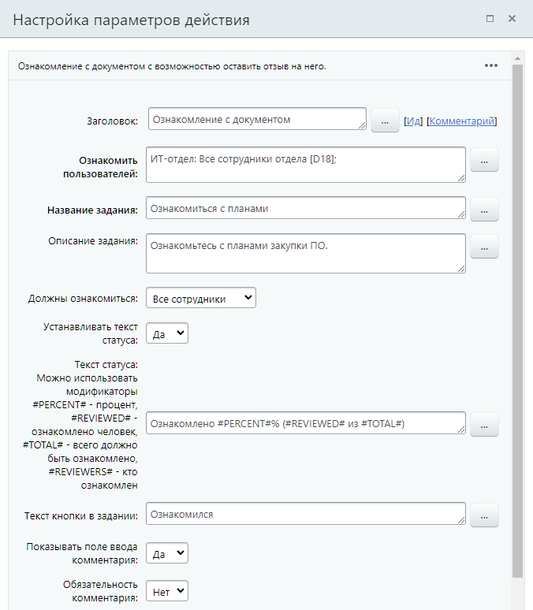
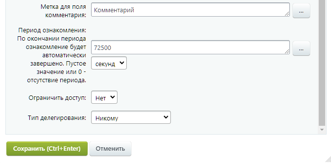

# Ознакомление с документом

**Навигация**
- [← Оглавление курса](index.md)
- [← Предыдущий: 3782 — Запрос дополнительной информации](lesson_3782.md)
- [Следующий: 3771 — Утверждение документа →](lesson_3771.md)

Официальная страница урока: https://dev.1c-bitrix.ru/learning/course/index.php?COURSE_ID=57&LESSON_ID=3783

Действие позволяет создать для выбранных пользователей задание по ознакомлению с документом и возможностью оставить отзыв на него. В ходе выполнения задания ведется вычисление процента ознакомившихся.

### Описание параметров

## Пример заполнения параметров действия

**Ознакомить пользователей** – указываются пользователи, которые должны ознакомиться с документом.

**Название задания** – задается название, которое будет отображаться в интерфейсе для пользователей.

**Описание задания** – указывается описание или пояснения к заданию. Содержимое данного поля будет отображаться в интерфейсе для пользователей. Рекомендуется в этом поле указывать полную информацию о действии, которое необходимо выполнить пользователю. Это поможет избежать путаницу в случае нескольких однотипных действий.

**Должны ознакомиться**:

- **Все сотрудники** – задача не будет выполнена пока с документом не ознакомятся все пользователи, указанные выше;
- **Любой сотрудник** – с документом должен ознакомиться любой из пользователей, указанных выше.

**Устанавливать текст статуса** – позволяет изменить текст статуса документа на произвольный. Это может, например, позволить отслеживать на каком этапе сейчас находится бизнес-процесс.

**Текст статуса** – задается текст статуса.

## Модификаторы

Можно использовать следующие модификаторы в тексте статуса: `#PERCENT#` – процент, `#REVIEWED#` – ознакомлено человек, `#TOTAL#` – всего должно быть ознакомлено, `#REVIEWERS#` – кто ознакомлен.

**Текст кнопки в задании** – позволяют задать собственный текст для соответствующей кнопки.

**Показывать поле ввода комментария** – опция позволяет разрешить пользователям оставлять собственные комментарии к назначенному заданию. Например, какие-либо примечания касаемо задания. Содержимое поля можно получить после выполнения действия с помощью соответствующей опции в форме **Вставка значения** – **Дополнительные результаты** (см. ниже).

**Обязательность комментария** – опция позволяет назначить добавление комментария при выполнении действия обязательным.

**Метка для поля комментария** – подпись для поля с комментарием.

**Период ознакомления** – можно задать период, если до окончания которого пользователи не будут ознакомлены с документом, то задание по ознакомлению будет автоматически завершено. Пустое значение или 0 – отсутствие периода.

**Ограничить доступ** – делает текст задания видимым только для исполнителя задания и не показывает его в живой ленте. Это очень полезная опция, если нужно, например, передать исполнителю конфиденциальную информацию: пароли, пин-коды и т.п.

### Результаты выполнения действия

Результаты выполнения этого действия можно получить с помощью формы **Вставка значения** – **Дополнительные результаты**, в которой они будут доступны  сразу после добавления действия в шаблон.

Доступно следующее:

- Комментарий;
- Сколько ознакомлено;
- Сколько должно быть ознакомлено;
- Автоматическое ознакомление – поле будет содержать `1`, если задание по ознакомлению было автоматически завершено (см. **Период ознакомления**);
- Последний ознакомившийся – **ID** последнего пользователя ознакомившегося с документом.
