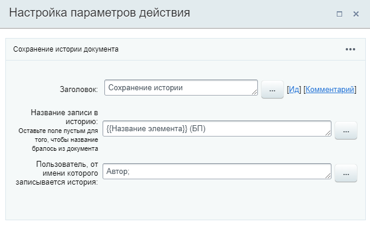
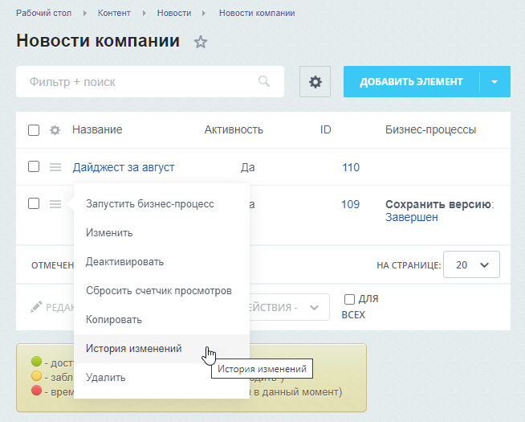
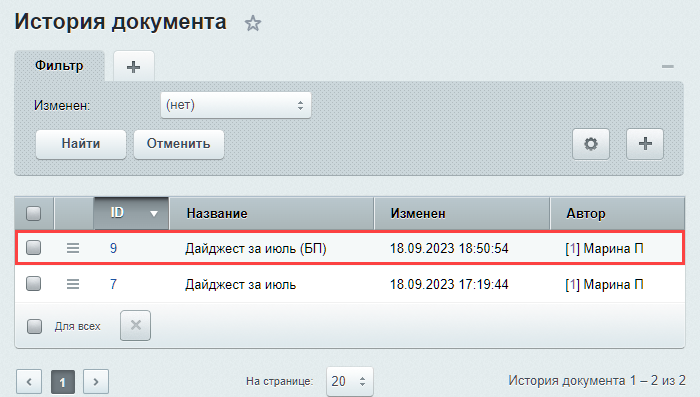

# Сохранение истории

**Навигация**
- [← Оглавление курса](index.md)
- [← Предыдущий: 7122 — Создать элемент списка](lesson_7122.md)
- [Следующий: 3779 — Удаление документа →](lesson_3779.md)

Официальная страница урока: https://dev.1c-bitrix.ru/learning/course/index.php?COURSE_ID=57&LESSON_ID=3784

Действие сохраняет историю документа. Другими словами позволяет создать «слепок» документа со всеми изменениями, внесёнными в него на момент запуска действия.

**Внимание**! Действие доступно только в *«1С-Битрикс: Управление сайтом»* и в *коробочной версии «Битрикс24»* для шаблонов бизнес-процессов в [информационных блоках](lesson_3122.md). Работа с шаблонами бизнес-процессов инфоблоков выполняется в административном разделе.

### Параметры

- **Название записи в историю** – указывается название версии документа с которым он будет сохранен в истории. Это позволит легко отличить его от других версий. Оставьте поле пустым, если хотите, чтобы название записи было таким же, как и название документа;
- **Пользователь, от имени которого записывается история** – укажите пользователя, от имени которого будет сделана запись.

Действие позволяет отслеживать изменения в документах и создавать копии с записью в историю. Вы можете настроить шаблон бизнес-процесса, который будет автоматически запускаться при изменении документа. И в этом шаблоне задать условие, при котором будет срабатывать действие "Сохранение истории", например, если изменения вносят определенные сотрудники (новые менеджеры). Таким образом, вы сможете просмотреть историю изменений и восстановить документ с предыдущими данными, если это необходимо.

### Пример

В примере ниже мы добавили к названию документа подпись `(БП)`, чтобы понимать, что версия была сохранена при помощи бизнес-процесса. В качестве пользователя указываем Автора, т.е. того, кто запустил бизнес-процесс.

После запуска и завершения бизнес-процесса над элементом (в нашем случае новостью), откроем

			историю изменений

                    История изменений элемента доступна, если в настройках информационного блока отмечено его участие в документообороте или бизнес-процессах. В нашем случае, инфоблок участвует в бизнес-процессах, иначе бы мы не смогли запустить для него БП.

		:

В истории видим две записи, одна из которых создана действием «Сохранить историю». При необходимости через меню вы можете просмотреть документ, восстановить его или удалить запись.

