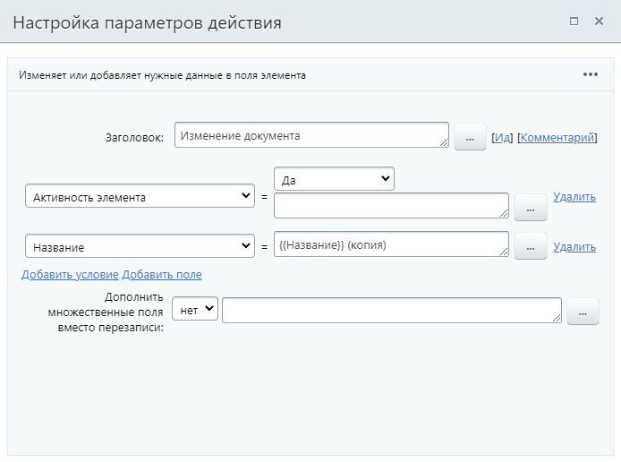

# Изменение документа

**Навигация**
- [← Оглавление курса](index.md)
- [← Предыдущий: 7721 — Запустить бизнес-процесс](lesson_7721.md)
- [Следующий: 20748 — Изменить элемент списка →](lesson_20748.md)

Официальная страница урока: https://dev.1c-bitrix.ru/learning/course/index.php?COURSE_ID=57&LESSON_ID=3785

Действие изменяет указанные поля документа.

> **Вспомним:** В системе все бизнес-процессы работают с **документами** (таким документом может быть файл, элемент инфоблока, элемент CRM) и их версиями. Для каждого документа (из инфоблока, списков или др.) существуют свои шаблоны бизнес-процессов. Подробнее об этом было в уроке [Общая информация](lesson_1708.md).

#### Описание параметров

- Выберите поле документа, которое вы хотите изменить, и введите новое значение. Чтобы изменить несколько полей нажмите Добавить условие.
  Набор параметров действия зависит от того типа документа, для которого создаётся шаблон бизнес-процесса. Так, если это шаблон бизнес-процесса для Сделок (CRM), то набор параметров будет соответствовать полям сделки (как если бы вы создавали её вручную из публичного раздела). Если же это шаблон бизнес-процесса для информационного блока, то параметры – это поля формы элемента этого информационного блока.
  Ссылка Добавить поле создает новое поле в документе.
  **Пример:** Для документов типа инфоблоки это приведет к созданию
  			дополнительных полей элемента инфоблока
                      При добавлении нового элемента в информационном блок вы сможете установить значения полей, которые будут выводится при создании элемента, а также задать обязательность для заполнения того или иного поля.
  [Подробнее](/user_help/content/iblock/iblock_edit.php#prop)...
  		.
- **Дополнить множественные поля вместо перезаписи** – если поле является множественным, выберите **Да** для дополнения списка вариантов новым значением. Иначе старое значение будет перезаписано;
- **Изменять от имени** – укажите Пользователя, от имени которого будет выполнено изменение полей.

## Пример заполнения параметров действия

Пример приведём для шаблона БП процесса ленты новостей.

Здесь мы меняем активность элемента и его название.

#### Результаты выполнения действия

Действие имеет единственный результат (с версии 23.200.0):

- Текст ошибки изменения

Результат вернет ошибку, если не получилось изменить документ. При успешном изменении документа, значение результата будет пустым.

Где такой результат может пригодится? Например для отправки уведомления, если не получилось внести изменения в документ. Удобно использовать совместно с конструкцией

			Условие

                    Конструкция позволяет направить бизнес-процесс по разным сценариям в зависимости от заданного типа условия.

[Подробнее](lesson_3789.md)...

		 смешанного типа, где в качестве источника выбран доп. результат, а условием является «заполнено». Тогда для ветки, где результат с ошибкой заполнен, добавьте действие отправки уведомления, а другую оставьте пустой. Так уведомление будет отправлено только в случае возникновения проблем с изменением документа.

#### Дополнительно

Действие **Изменение документа** подходит для внесения изменений в текущий документ, для которого запущен бизнес-процесс. Также для изменения документов есть более узкоспециализированные действия:

- [Изменить элемент списка](lesson_20748.md);
- [Изменение компании](lesson_20764.md);
- [Изменение контакта](lesson_20766.md);
- [Изменить элемент смарт-процесса](lesson_23580.md);
- [Изменить привязанный элемент](lesson_23590.md).
