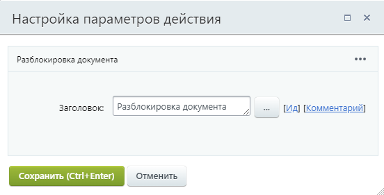

# Разблокировка документа

**Навигация**
- [← Оглавление курса](index.md)
- [← Предыдущий: 3772 — Публикация на подключенных сайтах](lesson_3772.md)
- [Следующий: 3787 — Снятие документа с публикации →](lesson_3787.md)

Официальная страница урока: https://dev.1c-bitrix.ru/learning/course/index.php?COURSE_ID=57&LESSON_ID=3786

Действие разблокирует документ для других бизнес-процессов (БП). Используется для снятия блокировки после применения действия

			Блокировка документа

                    Блокирует документ, чтобы другие процессы не смогли произвести в него запись.

[Подробнее](lesson_3780.md)...

		.

Действие параметров не имеет и запускается для текущего документа (для которого запущен бизнес-процесс).

**Примечание:** Если не разблокировать документ в текущем бизнес-процессе, то он будет недоступен для действий других БП до тех пор, пока не будет завершен.

**Важно**! С версии 15.5.0 **Дизайнера бизнес-процессов** данное действие исключено для модуля **Диск**.
