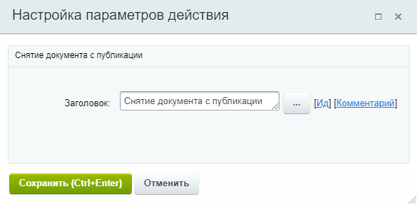
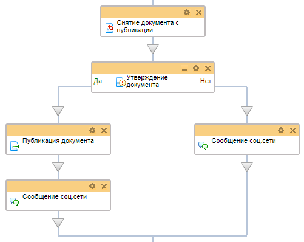

# Снятие документа с публикации

**Навигация**
- [← Оглавление курса](index.md)
- [← Предыдущий: 3786 — Разблокировка документа](lesson_3786.md)
- [Следующий: 3777 — Создание нового документа →](lesson_3777.md)

Официальная страница урока: https://dev.1c-bitrix.ru/learning/course/index.php?COURSE_ID=57&LESSON_ID=3787

Действие снимает документ с публикации. Противоположно действию

			Публикация документа

                    Действие переводит документ в статус опубликован.

[Подробнее](lesson_3781.md)...

		.

**Примечание:** Действие используется только для бизнес-процессов **информационных блоков** в *1С-Битрикс: управление сайтом* и коробочной версии *Битрикс24*.

#### Описание параметров

Действие не имеет параметров. Запускается для текущего документа (для которого запущен бизнес-процесс) и переводит его в статус **Не опубликован**.

#### Пример

Примером применения действия может быть необходимость запуска шаблона бизнес-процесса автоматически при изменении документа (к примеру, элемента в инфоблоке **Новости**) для снятия его с публикации с последующей проверкой. Если документ проходит проверку, он снова публикуется. Часть процесса может выглядеть так:

