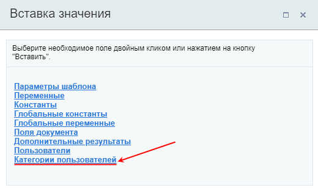
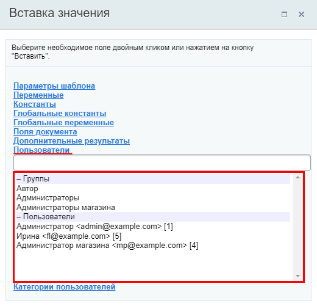
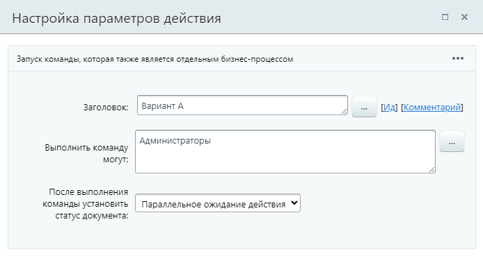
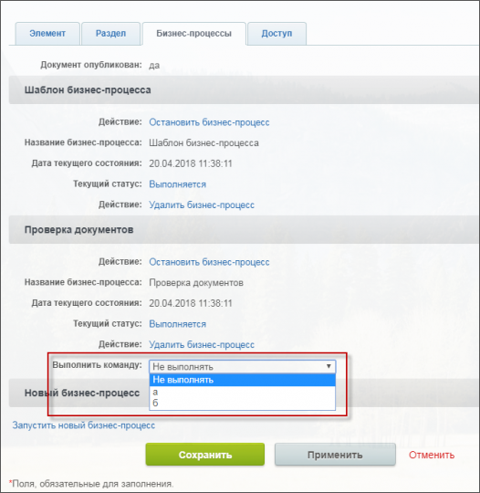
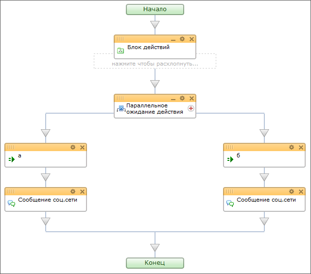

# Команда

**Навигация**
- [← Оглавление курса](index.md)
- [← Предыдущий: 10481 — Итератор](lesson_10481.md)
- [Следующий: 3791 — Параллельное выполнение →](lesson_3791.md)

Официальная страница урока: https://dev.1c-bitrix.ru/learning/course/index.php?COURSE_ID=57&LESSON_ID=3788

Действие, выполнение которого зависит от

			пользователей

                    Команда останавливает бизнес-процесс и ожидает действий от пользователя.

		. Для пользователя создается соответствующий элемент управления, в котором он выбирает какую команду выполнить.

Тип и вид элемента управления зависит от документа и места, где был запущен бизнес-процесс. Выполнение команды доступно пользователю в [задании](lesson_5276.md) и в документе для которого запущен бизнес-процесс.

**Примечание**: Наиболее часто действие Команда используется совместно с конструкцией

			Параллельное ожидание действия

                    Конструкция, которая позволяет направить бизнес-процесс по разным сценариям в зависимости от того, какое из событий наступит раньше.

[Подробнее](lesson_3790.md)...

		.

#### Описание параметров

- Выполнить команду могут — позволяет ограничить круг пользователей, которым будет доступна эта команда.
  Параметр не работает с группами из раздела *Вставка значения &gt;
  			Категории пользователей
                      *. В поле могут быть добавлены только пользователи из раздела *Вставка значения &gt;
  			Пользователи
                      *. Требуемые группы и пользователи будут отображаться в этом разделе при наличии прав на доступ к типу документа (конкретному инфоблоку, универсальному списку и т.д.), для которого создаётся шаблон бизнес-процесса.
- После выполнения команды установить статус документа — если после выполнения нужно установить статус, выберите статус из выпадающего списка. В дизайнере Бизнес-процесса система автоматически добавит действие [Установить статус](lesson_3859.md).

#### Пример настройки:

#### Результаты выполнения действия

Результаты выполнения этого действия можно получить с помощью формы **Вставка значения** - **Дополнительные результаты**, в которой они будут доступны сразу после добавления действия в шаблон:

- Пользователь, отправивший команду.

## Пример использования действия

В примере показана совместная работа действий **Команды** и **Параллельное ожидание действия**. После выполнения **блока действий**, бизнес процесс остановится и будет ждать до тех пор, пока пользователь

			с помощью команды

                    

		 не решит, по какой ветке запустить выполнение бизнес-процесса:

