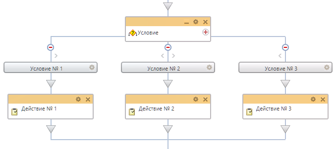
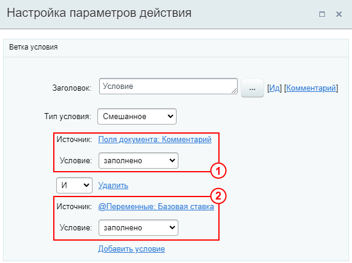
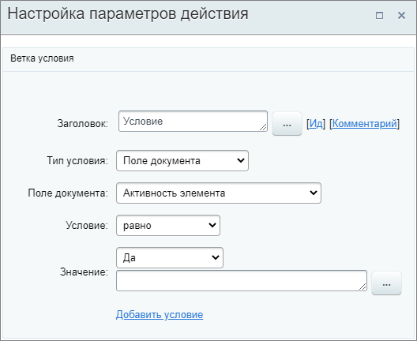
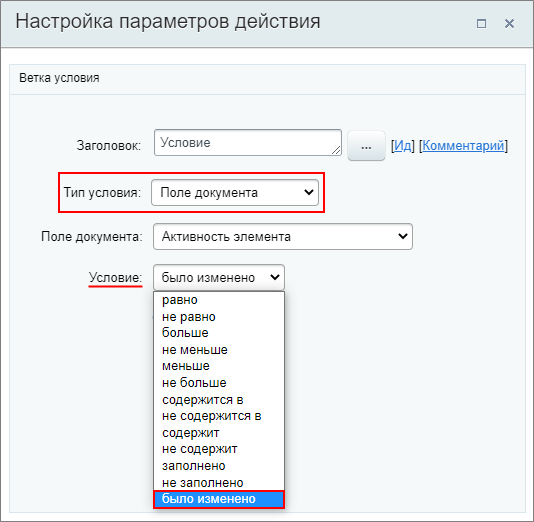
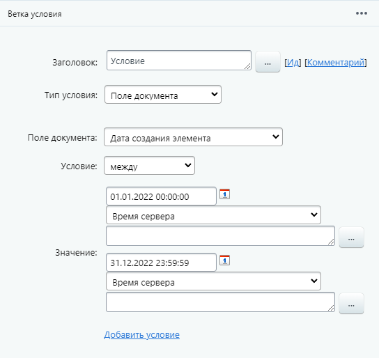
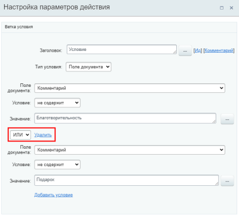
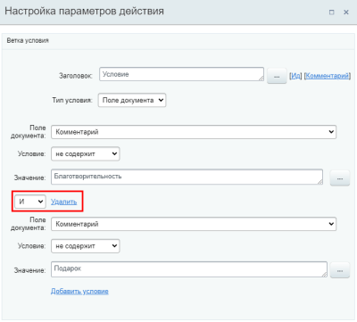

# Условие

**Навигация**
- [← Оглавление курса](index.md)
- [← Предыдущий: 3790 — Параллельное ожидание действия](lesson_3790.md)
- [Следующий: 3859 — Установить статус →](lesson_3859.md)

Официальная страница урока: https://dev.1c-bitrix.ru/learning/course/index.php?COURSE_ID=57&LESSON_ID=3789

Конструкция позволяет направить бизнес-процесс по разным сценариям в зависимости от заданного типа условия.


### Структура конструкции





При добавлении конструкции Условие в шаблон бизнес-процесса автоматически создаются две ветки (минимальное количество). С помощью знака 
 добавляется новая ветка, а знак  на ветке — удаляет её. Других настроек у основного действия нет. В каждой ветке настраиваются условия выполнения этой ветки .


С версии 22.400.0 модуля Бизнес-процессы ветки условий можно легко менять местами и копировать с помощью стрелок  и . По клику на стрелку ветка переместится в соответствующую сторону, а при зажатой клавише Ctrl ветка скопируется.


Для экономии места на схеме можно свернуть всю конструкцию с помощью кнопки .


Проверка условий выполняется слева направо. Если условие выполняется, то действия, расположенные в ветке под ним, будут исполнены. Если же условие не выполняется, то происходит переход к условию, расположенному правее, и так до тех пор, пока какое-либо условие не будет выполнено.


### Типы условий


В списке типов могут отображаться не все типы условий, перечисленные ниже (зависит от самого бизнес-процесса и наличия переменных/параметров).


Если ни одно из условий не выполнится, то, бизнес-процесс продолжит выполнять действия расположенные под конструкцией Условие. Другими словами он ее «перескочит».


- **Смешанное**
  Тип даёт возможность указать условие одновременно по параметрам, переменным, константам, глобальным константам, глобальным переменным, полям документа и дополнительным результатам без необходимости создавать разные ветки и дополнительные переменные. При это условия объединяются по правилу И / ИЛИ. При выборе И ветка условий будет исполняться при выполнении обоих условий, а при ИЛИ — любого из указанных.
  
  На скриншоте под номером 1 выбрано условие типа Поле документа, а под номером 2 — Глобальная переменная. Условия объединены правилом И.
- **PHP код**
  В качестве условия указывается
  			код
                      Задавать PHP-код может только пользователь с правами администратора.
  		. В случае если указанный PHP код вернет значение `true`, то будет выполнена ветка действий условия, если возвратится `false`, то будет произведен переход к следующему условию.
  Для этого типа условия можно использовать только PHP-код. Параметры типа `{=Variable:Variable2_printable}` не поддерживаются. Также результатом выполнения кода в условии должно быть логическое выражение (`true` или `false`).
- **Значение переменной**
  Ветка действий условия будет выполнена, если совпадут значения, связанные с переменными бизнес-процесса.
  Для этого необходимо выбрать Переменную/Параметр, указать оператор условия из списка и значение.
  В этом типе могут быть использованы значения переменных или параметров шаблона. Константы, глобальные константы и глобальные переменные доступны только в типе Смешанное условие.
- **Поле документа**
  Ветка действий условия будет выполнена, если совпадут параметры, связанные с полями документа.
  Для этого необходимо выбрать Поле документа, указать оператор условия из списка и значение. Варианты доступных полей значения меняются в зависимости от выбранного поля документа.
  
  Для типа условия Поле документа есть полезный оператор условия
  			Было изменено
                      
  		 (только для Универсальных списков и бизнес-процессов Новостей). Если бизнес-процесс настроен на запуск при изменении документа, то становится возможно определять внутри него измененные поля. Ветка условий в таком случае будет выполняться, если в выбранном в настройках поле документа были внесены какие-то изменения.
  ## Как настроить условие Было изменено в универсальных списках до версии 16.0.2 (для разработчика)
  В старых версиях модуля (bizproc до версии 16.0.2) данное условие может быть применимо только после дополнительных настроек модуля и только для Универсальных списков и бизнес-процессов Новостей.
  **Важно**: указанный ниже способ не подходит для бизнес-процессов CRM и Диска.
  Для того, чтобы можно было использовать данный тип условия, нужна реализация на стороне модуля, который работает с процессом. При старте процесса необходимо передавать массив изменившихся полей через параметр `CBPDocument::PARAM_MODIFIED_DOCUMENT_FIELDS`:
  ```
  CBPDocument::StartWorkflow(
     $arDocumentState["TEMPLATE_ID"],
     BizProcDocument::getDocumentComplexId($arParams["IBLOCK_TYPE_ID"], $arResult["ELEMENT_ID"]),
     array_merge($arBizProcParametersValues[$arDocumentState["TEMPLATE_ID"]], array(
        CBPDocument::PARAM_TAGRET_USER => "user_".intval($GLOBALS["USER"]->GetID()),
        CBPDocument::PARAM_MODIFIED_DOCUMENT_FIELDS => $modifiedFields
     )),
     $arErrorsTmp
  );
  ```
  А для того, чтобы новое условие появилось в редакторе для настройки, необходимо реализовать в документе его поддержку:
  ```
  public static function isFeatureEnabled($documentType, $feature)
  {
     return in_array($feature, array(\CBPDocumentService::FEATURE_MARK_MODIFIED_FIELDS));
  }
  ```
- **Истина**
  Ветка действий будет выполнена сразу. Это условие выполняется всегда.


### Описание условий


В таблице приведено описание всех вариантов условий с примерами.


| - [Равно](#equal)<br>- [Не равно](#not_equal) | - [Больше](#more)<br>- [Не меньше](#not_less) | - [Меньше](#less)<br>- [Не больше](#not_more) | - [Содержится в](#cont_in)<br>- [Не содержится в](#not_cont_in) | - [Содержит](#contains)<br>- [Не содержит](#not_contain) | - [Заполнено](#fill)<br>- [Не заполнено](#not_fill) | - [Было изменено](#changed)<br>- [Между](#between) |
| --- | --- | --- | --- | --- | --- | --- |


| \| Условие \| Описание \| Пример \|<br>\| --- \| --- \| --- \|<br>\| Равно \| Проверяет, являются ли указанные значения одинаковыми. Если они равны, то выполняется ветка условия. \| С помощью условия проверим, совпадает ли пользователь, запустивший бизнес-процесс, с ответственным в сделке:
<br>```<br>Тип условия: Поле документа
<br>Поле документа: Ответственный
<br>Условие: равно
<br>Значение: Автор
<br>``` \|<br>\| Не равно \| Проверяет, являются ли указанные значения разными. Если они не равны, то выполняется ветка условия. \| С помощью условия проверим не равна ли текущая стадия сделки стадии «Финальный счёт»:
<br>```<br>Тип условия: Поле документа
<br>Поле документа: Стадия сделки
<br>Условие: не равно
<br>Значение: Финальный счёт
<br>``` \|<br>\| Больше \| Сравнивает указанные значения между собой. Если первое значение больше второго, то выполняется ветка условия.<br>Это аналогично записи Var1 &gt; Var2. \| Предположим, что при сумме товаров в сделке более 100 тыс. рублей (включительно) мы хотим менять ответственного на ведущего менеджера. Проверим соответствие суммы условием:
<br>```<br>Тип условия: Поле документа
<br>Поле документа: Сумма
<br>Условие: больше
<br>Значение: 99999
<br>``` \|<br>\| Не меньше \| Сравнивает указанные значения между собой. Если первое значение больше или равно второму, то выполняется ветка условия. <br>Это аналогично записи Var1 &gt;= Var2. \| Решим предыдущую задачу другим способом:
<br>```<br>Тип условия: Поле документа
<br>Поле документа: Сумма
<br>Условие: не меньше
<br>Значение: 100000
<br>``` \|<br>\| Меньше \| Сравнивает указанные значения между собой. Если первое значение меньше второго, то выполняется ветка условия.<br>Это аналогично записи Var1 &lt; Var2. \| Представим, что с 01.06.23 мы изменили правила подготовки документов по сделке. Какие документы готовить, старые или новые, проверим условием по дате начала сделки. Готовим по старому алгоритму, если:
<br>```<br>Тип условия: Поле документа
<br>Поле документа: Дата начала
<br>Условие: меньше
<br>Значение: 01.06.23
<br>``` \|<br>\| Не больше \| Сравнивает указанные значения между собой. Если первое значение меньше или равно второму, то выполняется ветка условия.<br>Это аналогично записи Var1 &lt;= Var2. \| Решим предыдущую задачу другим способом:
<br>```<br>Тип условия: Поле документа
<br>Поле документа: Дата начала
<br>Условие: не больше
<br>Значение: 31.05.23
<br>``` \|<br>\| Содержится в \| Проверяет, содержится ли первое значение во втором. Если содержится, то выполняется ветка условия.<br>Когда значение переменной или поля — единственное, условие будет верным и в случае с подстрокой (например, «Ябл» содержится в «Яблоко»). Но для множественных переменных, учитывается только полное совпадение. К примеру для множественной переменной Var1 с тремя значениями: Яблоко, Груша, Персик:<br>
<br>- Условие «Персик» содержится в Var1 — верное;<br>- Условие «Пер» содержится в Var1 — неверное.<br>
<br>
<br>Условие чувствительно к регистру. Если переменная содержит «Персик» с большой буквы, а в условии указано «персик» с маленькой, то такое условие будет считаться неверным. \| Представим, что мы хотим реализовать отдельную ветку бизнес-процесса если в сделке есть определённый товар. Тогда мы можем записать в переменную Variable1 название этого товара и проверить, содержится ли он в товарах сделки:
<br>```<br>Тип условия: Смешанное
<br>Источник: Переменные: Variable1
<br>Условие: cодержится в
<br>Значение: {{Товарные позиции (текст)}}
<br>``` \|<br>\| Не содержится в \| Проверяет, не содержится ли первое значение во втором. Если не содержится, то выполняется ветка условия.<br>Особенности работы аналогичны условию [Содержится в](#cont_in). \| Пусть нам понадобилось проверять, является ли наблюдателем за сделкой пользователь, запустивший бизнес-процесс. И если нет — то его надо добавить в наблюдатели. Перед конструкцией «Условие» сохраним в переменную Author этого <br>пользователя<br>Значение «Автор» из формы «Вставка значения».<br>. А затем зададим параметры условия:
<br>```<br>Тип условия: Значение переменной
<br>Свойство или переменная: Author
<br>Условие: не cодержится в
<br>Значение: {{Наблюдатели}}
<br>``` \|<br>\| Содержит \| Проверяет, содержится ли второе значение в первом. Если содержится, то выполняется ветка условия.<br>Оно работает в том числе по подстроке. Если у вас есть множественная переменная с тремя значениями: Яблоко, Груша, Персик, то условие «содержит» для слова «Пер» будет считаться верным.<br>Условие чувствительно к регистру. Если переменная содержит «Персик» с большой буквы, а в условии указано «пер» с маленькой, то такое условие будет считаться неверным. \| Предположим, вы настроили [интеграцию](https://dev.1c-bitrix.ru/learning/course/index.php?COURSE_ID=42&CHAPTER_ID=04999) интернет-магазина на *«1С-Битрикс: Управление сайтом»* с *Битрикс24*. Теперь заказы из магазина приходят в Б24 в виде сделок с автоматически формируемыми названиями Eshop0 #1, Eshop0 #2 и т.д. Создадим условие, которое будет проверять содержится ли в названии сделки слово «Eshop», чтобы потом переносить такие сделки в другую воронку:
<br>```<br>Тип условия: Поле документа
<br>Поле документа: Название
<br>Условие: содержит
<br>Значение: Eshop
<br>``` \|<br>\| Не содержит \| Проверяет, не содержится ли второе значение в первом. Если не содержится, то выполняется ветка условия.<br>Особенности работы аналогичны условию [Содержит](#contains). \| Вы постоянно тестируете разные сценарии на специально созданных тестовых сделках. В названиях таких сделок есть слова «тест» или «тестовая». Чтобы шаблон пропускал такие сделки используем условие:
<br>```<br>Тип условия: Поле документа
<br>Поле документа: Название
<br>Условие: не содержит
<br>Значение: тест
<br>``` \|<br>\| Заполнено \| Ветка выполнится, если значение заполнено (не пустое). \| В сделках есть поле Комментарий. Представим, что мы хотим отправлять текст этого комментария в уведомлении, если в этом поле есть текст. Если оно пустое — то комментарий не должен быть отправлен. Используем условие, в ветке которого затем настроим уведомление:
<br>```<br>Тип условия: Поле документа
<br>Поле документа: Комментарий
<br>Условие: заполнено
<br>``` \|<br>\| Не заполнено \| Ветка выполнится, если значение не заполнено (пустое). \| Допустим, в карточке сделки добавлено специальное пользовательское поле для отметок об особенностях сделки «Важно». Если поле не заполнено — сделка обрабатывается автоматически и переходит на следующую стадию, а если заполнено — отправляется на ручную обработку старшему менеджеру. Можно разветвить процесс таким условием:
<br>```<br>Тип условия: Поле документа
<br>Поле документа: Важно
<br>Условие: не заполнено
<br>``` \|<br>\| Было изменено \| Если бизнес-процесс настроен на запуск при изменении документа, то становится возможно определять внутри него измененные поля. Если поле изменено — ветка условия выполняется.
<br>Работает только для типа условия «Поле документа» в бизнес-процессах Универсальных списков и Новостей. \| Пусть список клиентов на портале ведётся с помощью универсальных списков (Сервисы &gt; Списки). Мы хотим получать уведомление, если кто-то изменит название компании. Для этого создадим шаблон бизнес-процесса, запускающийся при изменении элемента списка, и в условии укажем проверку на изменение этого поля:
<br>```<br>Тип условия: Поле документа
<br>Поле документа: Название компании
<br>Условие: было изменено
<br>``` \|<br>\| Между \| Условие выполнится, если значение попадает в заданный промежуток / период времени (включая крайние значения).
<br>Доступно с версии модуля 23.400.0 для полей / переменных типа «Число» или «Дата и время». \| Например, в шаблоне бизнес-процесса необходимо учесть отдельный сценарий для всех сделок, созданных в 2022 году. Используем условие <br>между<br><br>:
<br>```<br>Тип условия: Поле документа
<br>Поле документа: Дата создания элемента
<br>Условие: между
<br>Значение 1: 01.01.2022 00:00:00
<br>Значение 2: 31.12.2022 23:59:59
<br>``` \| |
| --- |


### Подробнее об И/ИЛИ


> **Повторим:** При выборе И ветка условий будет исполняться при выполнении обоих условий, а при ИЛИ — любого из указанных.


## Простое пояснение логики без привязки к бизнес-процессам

- Условие сработает, если в корзине есть яблоко И груша.
  | \| Что в корзине? \| Условие сработает? \| Почему? \|<br>\| --- \| --- \| --- \|<br>\| Персик, яблоко \| Нет \| Нет груши \|<br>\| Персик, яблоко, груша \| Да \| Есть и яблоко, и груша \|<br>\| Груша \| Нет \| Нет яблока \| |
  | --- |
- Условие сработает, если в корзине есть яблоко ИЛИ груша.
  | \| Что в корзине? \| Условие сработает? \| Почему? \|<br>\| --- \| --- \| --- \|<br>\| Персик, яблоко \| Да \| Есть яблоко \|<br>\| Персик, яблоко, груша \| Да \| Есть яблоко/груша \|<br>\| Груша \| Да \| Есть груша \|<br>\| Персик, виноград \| Нет \| Нет ни груши, ни яблока \| |
  | --- |


Посмотрим пример для конструкции Условие. Допустим у нас есть шаблон бизнес-процесса, в котором по условию определяется предоставить услугу платно или бесплатно. Услуга будет предоставлена платно если поле Комментарий
сделки не содержит слова: Благотворительность и Подарок. При составлении условия возникает вопрос что использовать: И или ИЛИ.


| \| Условие **ИЛИ** \| Условие **И** \|<br>\| --- \| --- \|<br>\|  \|  \| |
| --- |


В зависимости от того, что будет установлено в условии, результаты получатся разными:


| \| Как заполнено поле Комментарий? \| Результат **ИЛИ** \| Результат **И** \|<br>\| --- \| --- \| --- \|<br>\| Не содержит оба слова \| Платно \| Платно \|<br>\| Содержит одно слово из указанных \| Платно \| Бесплатно \|<br>\| Есть оба слова \| Бесплатно \| Бесплатно \| |
| --- |


Как видим, разница между условиями проявляется когда в комментарии содержится одно слово из двух. В случае с условием ИЛИ — для выполнения условия достаточно, чтобы не содержалось только одно из двух слов, что не соответствует нашей задаче. Аналогично происходит с любым количеством слов.


Отдельное внимание обратим на условие **не равно**. Если вы хотите сделать проверку неравенства поля нескольким значениям, то есть смысл использовать только **И**. В случае использования **ИЛИ**, условие всегда будет истинным, так как поле окажется всегда не равно одному из значений.


#### Если несколько условий


При использовании нескольких условий и одновременно сравнений **И** и **ИЛИ**, приоритет будет у **И**. В виде формулы это можно представить так:


`(УСЛ1 И УСЛ2) ИЛИ (УСЛ3 И УСЛ4)`
