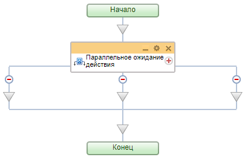
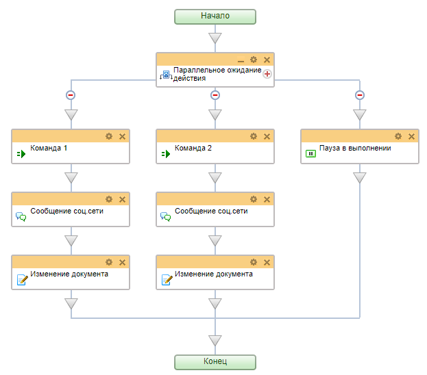
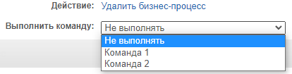

# Параллельное ожидание действия

**Навигация**
- [← Оглавление курса](index.md)
- [← Предыдущий: 3791 — Параллельное выполнение](lesson_3791.md)
- [Следующий: 3789 — Условие →](lesson_3789.md)

Официальная страница урока: https://dev.1c-bitrix.ru/learning/course/index.php?COURSE_ID=57&LESSON_ID=3790

Конструкция, которая позволяет направить бизнес-процесс по разным сценариям в зависимости от того, какое из событий наступит раньше.

### Структура конструкции

При добавлении конструкции в шаблон бизнес-процесса автоматически создаются две ветки (минимальное количество). С помощью знака 
 добавляется новая ветка, а знак  на ветке - удаляет её. Других настроек у действия нет.

Далее мы расскажем об особенностях использования конструкции.

### Как использовать

В работе конструкции есть два важных момента:

- В ветках конструкции первыми должны быть обязательно расположены действия
  			Команда
                      Действие, выполнение которого зависит от пользователей. Для них будет создан соответствующий элемент управления.
  [Подробнее](lesson_3788.md)...
  		 или
  			Задача
                      Действие позволяет создать задачу.
  [Подробнее](lesson_3805.md)...
  		. То, по какой ветке действий направится выполнение бизнес-процесса, зависит от того, какое из этих действий выполнится раньше. Под выполнением действия понимается:
  **Примечание**: Как только выполнится первое действие одной из веток, другие ветки бизнес-процесса полностью исключаются. Даже если процесс первой ветки остановится на
  			ожидании
                      Например, для запроса дополнительной информации у пользователя.
  		. Главный критерий для выбора ветки - это только завершение первого действия.

  - выполнение команды пользователем в запущенном бизнес-процессе для действия **Команда**
  - завершение созданной задачи для действия **Задача**
  - истечение периода времени или наступление даты / времени, указанного в действии **Пауза в выполнении** (об этом в следующем пункте)
- Всегда используйте действие
  			Пауза в выполнении
                      Действие позволяет отложить выполнение следующего действия на заданное время.
  [Подробнее](lesson_3807.md)...
  		 в одной из веток конструкции (в качестве первого действия). Оно позволит продолжить выполнение бизнес-процесса по истечении указанного в нем времени, если ни одна из **команд** не будет выполнена. Иначе процесс зависнет и исполняться дальше не будет. Такие процессы накапливаются и
  			увеличивают нагрузку на проект
                      **Бизнес процессы** - важнейший инструмент, который позволяет автоматизировать рабочие процессы компании. Однако их использование требует определенного навыка и осторожности. В противном случае бизнес-процессы создадут значительную нагрузку на проект.
  [Подробнее](lesson_8445.md)...
  		.

### Пример

Посмотрим на простой пример правильного использования конструкции в шаблоне бизнес-процесса:

В примере показаны три ветки. В двух из них используется команда, в третьей - пауза. Пользователь должен

			выбрать команду

                    

		. И в зависимости от выбранной команды - исполнится дальнейшая ветка БП. Если выбор не будет осуществлен, через указанное время сработает окончание Паузы (третья ветка) и бизнес-процесс завершится.
