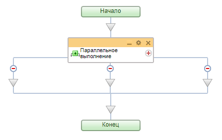
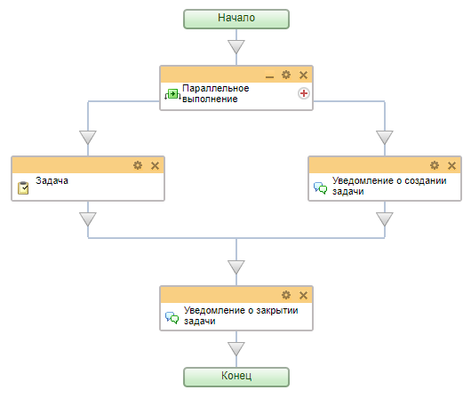
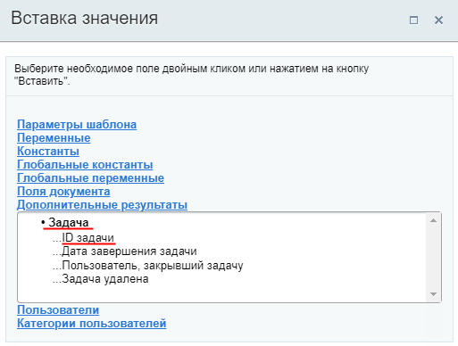
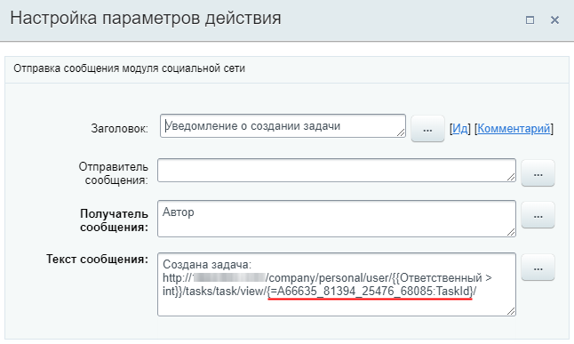

# Параллельное выполнение

**Навигация**
- [← Оглавление курса](index.md)
- [← Предыдущий: 3788 — Команда](lesson_3788.md)
- [Следующий: 3790 — Параллельное ожидание действия →](lesson_3790.md)

Официальная страница урока: https://dev.1c-bitrix.ru/learning/course/index.php?COURSE_ID=57&LESSON_ID=3791

Конструкция, позволяющая выполнять параллельные сценарии бизнес-процесса.

### Структура конструкции

При добавлении конструкции в шаблон бизнес-процесса автоматически создаются две ветки (минимальное количество). С помощью знака 
 добавляется новая ветка, а знак  на ветке - удаляет её. Других настроек у действия нет.

Важно правильно использовать эту конструкцию.

### Особенности и пример использования

В каждой ветке размещаются действия. Ветки выполняются слева направо. При этом если какая-то из веток останавливается в выполнении (пауза или ожидание действия), другие ветки продолжают выполняться. Бизнес-процесс не будет продолжен, пока не будут выполнены все ветки конструкции.

Посмотрим такой **пример**: пусть требуется шаблон для создания новой Задачи для Сделки (CRM). При этом бизнес-процесс должен быть остановлен, пока задача не будет выполнена. Дополнительно требуется уведомить Ответственного о создании задачи и дать ссылку на неё. После завершения задачи также должно прийти уведомление.

Задача сначала кажется простой. И со вторым уведомлением действительно сложностей нет. А вот где разместить действие с уведомлением ответственному о создании задачи?

- Если разместить до действия
  			Задача
                      Действие позволяет создать задачу.
  [Подробнее](lesson_3805.md)...
  		, то мы ещё не знаем идентификатора новой задачи (задача не создана на этом этапе);
- Если разместить после действия **Задача**, то на этом этапе задача уже будет выполнена и уведомление о создании новой задачи нам не требуется, только о завершении.

Тут поможет конструкция **Параллельное выполнение**. Оформим шаблон таким образом:

Поясним как отработает процесс:

- Левая ветка выполняется первой, поэтому в ней размещено действие **Задача**. Выполнение ветки
  			остановится
                      В настройках действия должна быть отмечена опция **Остановить процесс на время выполнения задачи**.
  		 на время выполнения задачи, но нам станут доступны
  			дополнительные результаты
                      
  		 этого действия.
- Продолжает выполнение правая ветка, в которой размещено действие
  			Сообщение соц. сети
                      Действие отправляет уведомление модуля социальной сети.
  [Подробнее](lesson_3804.md)...
  		. В описании действия мы используем
  			ID новой задачи
                      
  		. Правая ветка выполнится полностью сразу и ответственный получит уведомление.
- Как только задача будет завершена, т.е. все ветки конструкции выполнятся, сработает второе уведомление и процесс завершится полностью.
